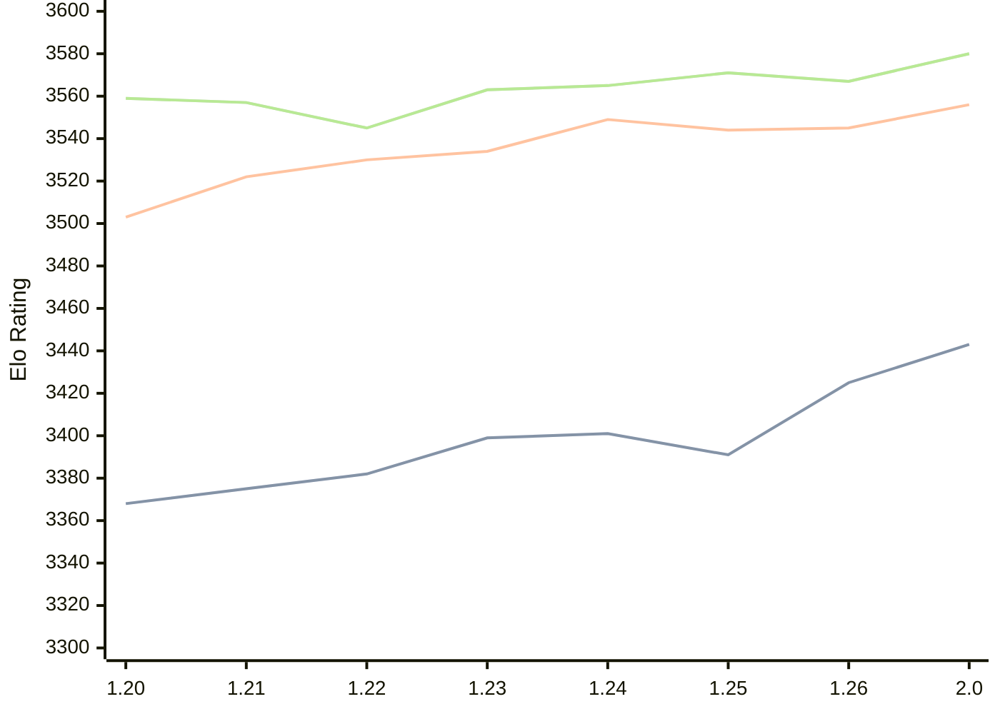

# Engine: Caissa

Author: Michał Witanowski

Home: https://github.com/Witek902/Caissa

## Elo Ratings E1

| Version | Published | STC 8.0+0.08s  | LTC 60.0+0.60s | VLTC 2m24s+1.12s | Comment |
| --- | --- | --- | --- | --- | --- |
| 1.26 | 2026-08-09 | 3330 | 3529 | 3576 |  |
 | | | cElo (∆ prev) | cElo (∆ prev) | cElo (∆ prev) | 

## Elo Ratings P1

| Version | Published | STC 8.0+0.08s  | LTC 60.0+0.60s | VLTC 2m24s+1.12s | Comment |
| --- | --- | --- | --- | --- | --- |
| 1.26 | 2026-08-09 | 3542 | 3758 | 3788 |  |
 | | | cElo (∆ prev) | cElo (∆ prev) | cElo (∆ prev) | 

## Elo Ratings T1

| Version | Published | STC 8.0+0.08s  | LTC 60.0+0.60s | VLTC 2m24s+1.12s | Comment |
| --- | --- | --- | --- | --- | --- |
| 2.0 | 2026-09-19 | 3443(+18) | 3556(+11) | 3580(+13) |  |
| 1.26 | 2026-08-09 | 3425(+34) | 3545(+1) | 3567(-4) |  |
| 1.25 | 2026-04-05 | 3391(-10) | 3544(-5) | 3571(+6) |  |
| 1.24 | 2025-12-03 | 3401(+2) | 3549(+15) | 3565(+2) |  |
| 1.23 | 2025-08-21 | 3399(+17) | 3534(+4) | 3563(+18) |  |
| 1.22 | 2025-04-30 | 3382(+7) | 3530(+8) | 3545(-12) |  |
| 1.21 | 2024-10-27 | 3375(+7) | 3522(+19) | 3557(-2) |  |
| 1.20 | 2024-07-28 | 3368 | 3503 | 3559 |  |
 | | | cElo (∆ prev) | cElo (∆ prev) | cElo (∆ prev) | 

<a href="https://github.com/computer-chess-index/cci/issues/new?template=submit-version.yml&title=[VERSION]+Caissa+<version>&body=###%20Engine%20name%0ACaissa%0A%0A###%20Version%0A2.0" target="_blank">Submit new version</a>

 Test Conditions:

GUI/CLI: <a href=https://github.com/cutechess/cutechess target="_blank">Cute-Chess</a> 
Elo Calculation: <a href=https://www.remi-coulom.fr/Bayesian-Elo/ target="_blank">Bayesian-Elo</a> 
CPU for P1: Intel(R) Core(TM) Ultra 7 265T (1.50 GHz) - P-Core 
CPU for E1: Intel(R) Core(TM) Ultra 7 265T (1.50 GHz) - E-Core 
CPU for T1: Intel(R) Core(TM) i5-7500T 2.70GHz 
Opening book: 8_moves_v3 
\* STC: 8.0+0.08s, LTC: 60.0+0.60s, VLTC: 2m24s+1.12s

 Lists:
Ratings: <a href=https://github.com/computer-chess-index/cci/blob/main/lists/CCIRatings.csv target="_blank">Complete list</a>

Generated: 2026-10-09 14:09:24

## Ratings Verlauf

```mermaid
%%{init: {"theme":"base","themeVariables":{"seriesColors:['#a3a3a3','#222221','#faa371']}}}%%
xychart-beta
  x-axis ["1.20", "1.21", "1.22", "1.23", "1.24", "1.25", "1.26", "2.0"]
  y-axis "Elo Rating" 3300 --> 3600
  line "" [3368, 3375, 3382, 3399, 3401, 3391, 3425, 3443]
  line "STC (8.0+0.08s)" [3368, 3375, 3382, 3399, 3401, 3391, 3425, 3443]
  line "LTC (60.0+0.60s)" [3503, 3522, 3530, 3534, 3549, 3544, 3545, 3556]
  line "" [3559, 3557, 3545, 3563, 3565, 3571, 3567, 3580]
  line "VLTC (2m24s+1.12s)" [3559, 3557, 3545, 3563, 3565, 3571, 3567, 3580]
```

## Detailed Evaluation Results

| Version | Time Control | Elo  | Range +/- | Matches | Score | Average Opponent Elo | Draws |
| --- | --- | --- | --- | --- | --- | --- | --- |
| 2.0 | VLTC (2m24s+1.12s) | 3580 | 40 | 144 | 51% | 3573 | 88% |
| 2.0 | LTC (60.0+0.60s) | 3556 | 41 | 130 | 50% | 3553 | 96% |
| 2.0 | STC (8.0+0.08s) | 3443 | 41 | 138 | 50% | 3441 | 81% |
| --- | --- | --- | --- | --- | --- | --- | --- |
| 1.26 | VLTC (2m24s+1.12s) | 3567 | 31 | 242 | 50% | 3567 | 85% |
| 1.26 | VLTC (2m24s+1.12s) | 3576 | 36 | 172 | 50% | 3575 | 88% |
| 1.26 | VLTC (2m24s+1.12s) | 3788 | 48 | 98 | 51% | 3785 | 89% |
| 1.26 | LTC (60.0+0.60s) | 3758 | 45 | 112 | 50% | 3758 | 88% |
| 1.26 | LTC (60.0+0.60s) | 3545 | 27 | 318 | 51% | 3541 | 85% |
| 1.26 | LTC (60.0+0.60s) | 3529 | 35 | 194 | 49% | 3532 | 79% |
| 1.26 | STC (8.0+0.08s) | 3542 | 34 | 216 | 47% | 3560 | 70% |
| --- | --- | --- | --- | --- | --- | --- | --- |
| 1.26 | STC (8.0+0.08s) | 3425 | 28 | 302 | 50% | 3422 | 76% |
| --- | --- | --- | --- | --- | --- | --- | --- |
| 1.26 | STC (8.0+0.08s) | 3330 | 29 | 302 | 48% | 3348 | 73% |
| --- | --- | --- | --- | --- | --- | --- | --- |
| 1.25 | VLTC (2m24s+1.12s) | 3571 | 23 | 420 | 50% | 3569 | 91% |
| 1.25 | LTC (60.0+0.60s) | 3544 | 23 | 440 | 50% | 3542 | 86% |
| 1.25 | STC (8.0+0.08s) | 3391 | 23 | 460 | 48% | 3403 | 73% |
| --- | --- | --- | --- | --- | --- | --- | --- |
| 1.24 | VLTC (2m24s+1.12s) | 3565 | 28 | 296 | 52% | 3555 | 91% |
| 1.24 | LTC (60.0+0.60s) | 3549 | 29 | 272 | 50% | 3546 | 92% |
| 1.24 | STC (8.0+0.08s) | 3401 | 21 | 534 | 50% | 3399 | 75% |
| --- | --- | --- | --- | --- | --- | --- | --- |
| 1.23 | VLTC (2m24s+1.12s) | 3563 | 28 | 288 | 51% | 3557 | 91% |
| 1.23 | LTC (60.0+0.60s) | 3534 | 29 | 280 | 51% | 3532 | 87% |
| 1.23 | STC (8.0+0.08s) | 3399 | 23 | 468 | 48% | 3411 | 73% |
| --- | --- | --- | --- | --- | --- | --- | --- |
| 1.22 | VLTC (2m24s+1.12s) | 3545 | 24 | 388 | 50% | 3545 | 85% |
| 1.22 | LTC (60.0+0.60s) | 3530 | 25 | 356 | 49% | 3534 | 87% |
| 1.22 | STC (8.0+0.08s) | 3382 | 25 | 380 | 50% | 3380 | 76% |
| --- | --- | --- | --- | --- | --- | --- | --- |
| 1.21 | VLTC (2m24s+1.12s) | 3557 | 18 | 724 | 51% | 3551 | 92% |
| 1.21 | LTC (60.0+0.60s) | 3522 | 15 | 1096 | 51% | 3503 | 86% |
| 1.21 | STC (8.0+0.08s) | 3375 | 15 | 1136 | 50% | 3376 | 74% |
| --- | --- | --- | --- | --- | --- | --- | --- |
| 1.20 | VLTC (2m24s+1.12s) | 3559 | 36 | 176 | 51% | 3553 | 84% |
| 1.20 | LTC (60.0+0.60s) | 3503 | 37 | 168 | 50% | 3471 | 89% |
| 1.20 | STC (8.0+0.08s) | 3368 | 30 | 267 | 48% | 3382 | 75% |
| --- | --- | --- | --- | --- | --- | --- | --- |