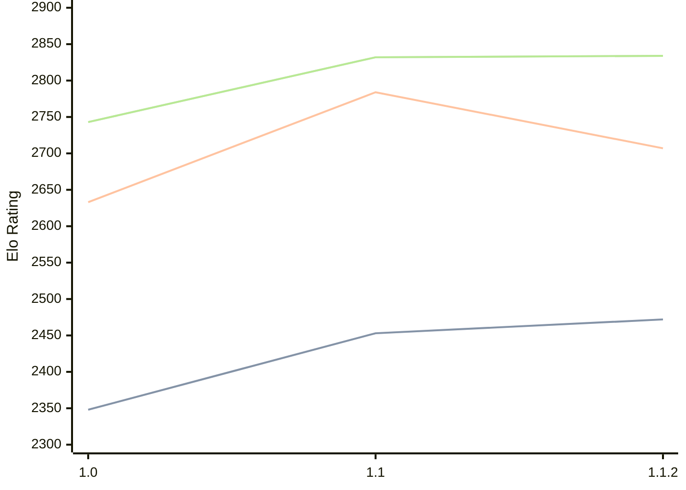

# Engine: Casanchess

Author: Carlos Sanchez Mayordomo

Home: https://github.com/casanche/casanchess

## Elo Ratings

| Version | Published | STC 8.0+0.08s  | LTC 60.0+0.60s | VLTC 2m24s+1.12s | Comment |
| --- | --- | --- | --- | --- | --- |
| 2.0 | 2026-09-24 |  |  |  |  |
| 1.1.2 | 2026-09-06 | 2472(+19) | 2707(-77) | 2834(+2) |  |
| 1.1 | 2026-08-15 | 2453(+105) | 2784(+151) | 2832(+89) |  |
| 1.0 | 2026-07-14 | 2348 | 2633 | 2743 |  |
 | | | cElo (∆ prev) | cElo (∆ prev) | cElo (∆ prev) | 

<a href="https://github.com/computer-chess-index/cci/issues/new?template=submit-version.yml&title=[VERSION]+Casanchess+<version>&body=###%20Engine%20name%0ACasanchess%0A%0A###%20Version%0A2.0" target="_blank">Submit new version</a>

 Test Conditions:

GUI/CLI: <a href=https://github.com/cutechess/cutechess target="_blank">Cute-Chess</a> 
Elo Calculation: <a href=https://www.remi-coulom.fr/Bayesian-Elo/ target="_blank">Bayesian-Elo</a> 
CPU: Intel(R) Core(TM) i5-7500T 2.70GHz 
Opening book: 8_moves_v3 
\* STC: 8.0+0.08s, LTC: 60.0+0.60s, VLTC: 2m24s+1.12s

 Lists:
Ratings: <a href=https://github.com/computer-chess-index/cci/blob/main/lists/CCIRatings.csv target="_blank">Complete list</a>

Generated: 2026-09-26 04:36:36

## Ratings Verlauf

## Detailed Evaluation Results

| Version | Time Control | Elo  | Range +/- | Matches | Score | Average Opponent Elo | Draws |
| --- | --- | --- | --- | --- | --- | --- | --- |
| 1.1.2 | VLTC (2m24s+1.12s) | 2834 | 37 | 218 | 50% | 2832 | 40% |
| 1.1.2 | LTC (60.0+0.60s) | 2707 | 35 | 248 | 50% | 2709 | 46% |
| 1.1.2 | STC (8.0+0.08s) | 2472 | 36 | 236 | 51% | 2466 | 41% |
| --- | --- | --- | --- | --- | --- | --- | --- |
| 1.1 | VLTC (2m24s+1.12s) | 2832 | 34 | 256 | 51% | 2830 | 47% |
| 1.1 | LTC (60.0+0.60s) | 2784 | 32 | 284 | 51% | 2770 | 49% |
| 1.1 | STC (8.0+0.08s) | 2453 | 29 | 356 | 48% | 2472 | 43% |
| --- | --- | --- | --- | --- | --- | --- | --- |
| 1.0 | VLTC (2m24s+1.12s) | 2743 | 32 | 326 | 60% | 2506 | 40% |
| 1.0 | LTC (60.0+0.60s) | 2633 | 32 | 338 | 58% | 2469 | 42% |
| 1.0 | STC (8.0+0.08s) | 2348 | 32 | 352 | 62% | 2107 | 34% |
| --- | --- | --- | --- | --- | --- | --- | --- |