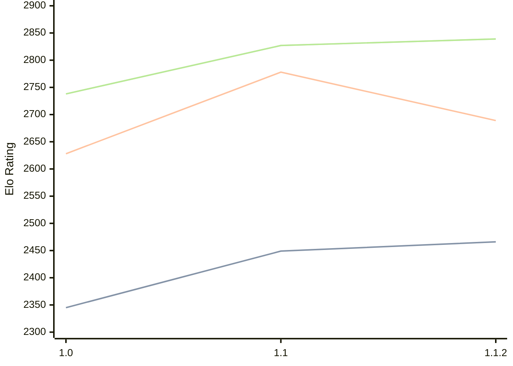

# Engine: Casanchess

Author: Carlos Sanchez Mayordomo

Home: https://github.com/casanche/casanchess

## Elo Ratings

| Version | Published | STC 8.0+0.08s  | LTC 60.0+0.60s | VLTC 2m24s+1.12s | Comment |
| --- | --- | --- | --- | --- | --- |
| 1.1.2 | 2026-09-06 | 2466(+17) | 2689(-89) | 2839(+12) |  |
| 1.1 | 2026-08-15 | 2449(+104) | 2778(+150) | 2827(+89) |  |
| 1.0 | 2026-07-14 | 2345 | 2628 | 2738 |  |
 | | | cElo (∆ prev) | cElo (∆ prev) | cElo (∆ prev) | 

<a href="https://github.com/computer-chess-index/cci/issues/new?template=submit-version.yml&title=[VERSION]+Casanchess+<version>&body=###%20Engine%20name%0ACasanchess%0A%0A###%20Version%0A1.1.2" target="_blank">Submit new version</a>

 Test Conditions:

GUI/CLI: <a href=https://github.com/cutechess/cutechess target="_blank">Cute-Chess</a> 
Elo Calculation: <a href=https://www.remi-coulom.fr/Bayesian-Elo/ target="_blank">Bayesian-Elo</a> 
CPU: Intel(R) Core(TM) i5-7500T 2.70GHz 
Opening book: 8_moves_v3 
\* STC: 8.0+0.08s, LTC: 60.0+0.60s, VLTC: 2m24s+1.12s

 Lists:
Ratings: <a href=https://github.com/computer-chess-index/cci/blob/main/lists/CCIRatings.csv target="_blank">Complete list</a>

Generated: 2026-09-11 04:36:35

## Ratings Verlauf

## Detailed Evaluation Results

| Version | Time Control | Elo  | Range +/- | Matches | Score | Average Opponent Elo | Draws |
| --- | --- | --- | --- | --- | --- | --- | --- |
| 1.1.2 | VLTC (2m24s+1.12s) | 2839 | 61 | 80 | 52% | 2823 | 44% |
| 1.1.2 | LTC (60.0+0.60s) | 2689 | 47 | 136 | 47% | 2709 | 45% |
| 1.1.2 | STC (8.0+0.08s) | 2466 | 50 | 120 | 52% | 2456 | 40% |
| --- | --- | --- | --- | --- | --- | --- | --- |
| 1.1 | VLTC (2m24s+1.12s) | 2827 | 34 | 256 | 51% | 2824 | 47% |
| 1.1 | LTC (60.0+0.60s) | 2778 | 32 | 284 | 51% | 2765 | 49% |
| 1.1 | STC (8.0+0.08s) | 2449 | 29 | 356 | 48% | 2468 | 43% |
| --- | --- | --- | --- | --- | --- | --- | --- |
| 1.0 | VLTC (2m24s+1.12s) | 2738 | 32 | 326 | 60% | 2502 | 40% |
| 1.0 | LTC (60.0+0.60s) | 2628 | 32 | 338 | 58% | 2464 | 42% |
| 1.0 | STC (8.0+0.08s) | 2345 | 32 | 352 | 62% | 2103 | 34% |
| --- | --- | --- | --- | --- | --- | --- | --- |