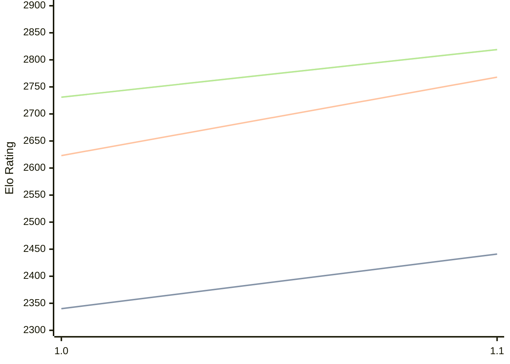

# Engine: Casanchess

Author: Carlos Sanchez Mayordomo

Home: https://github.com/casanche/casanchess

## Elo Ratings

| Version | Published | STC 8.0+0.08s  | LTC 60.0+0.60s | VLTC 2m24s+1.12s | Comment |
| --- | --- | --- | --- | --- | --- |
| 1.1 | 2026-08-15 | 2441(+101) | 2768(+145) | 2819(+88) |  |
| 1.0 | 2026-07-14 | 2340 | 2623 | 2731 |  |
 | | | cElo (∆ prev) | cElo (∆ prev) | cElo (∆ prev) | 

<a href="https://github.com/computer-chess-index/cci/issues/new?template=submit-version.yml&title=[VERSION]+Casanchess+<version>&body=###%20Engine%20name%0ACasanchess%0A%0A###%20Version%0A1.1" target="_blank">Submit new version</a>

 Test Conditions:

GUI/CLI: <a href=https://github.com/cutechess/cutechess target="_blank">Cute-Chess</a> 
Elo Calculation: <a href=https://www.remi-coulom.fr/Bayesian-Elo/ target="_blank">Bayesian-Elo</a> 
CPU: Intel(R) Core(TM) i5-7500T 2.70GHz 
Opening book: 8_moves_v3 
\* STC: 8.0+0.08s, LTC: 60.0+0.60s, VLTC: 2m24s+1.12s

 Lists:
Ratings: <a href=https://github.com/computer-chess-index/cci/blob/main/lists/CCIRatings.csv target="_blank">Complete list</a>

Generated: 2026-08-22 06:23:26

## Ratings Verlauf

⬛ STC (8.0+0.08s) &nbsp;&nbsp; 🟧 LTC (60.0+0.60s) &nbsp;&nbsp; 🟩 VLTC (2m24s+1.12s)

dark mode: 🟩STC (8.0+0.08s) 🟧LTC (60.0+0.60s) ⬜VLTC (2m24s+1.12s)

## Detailed Evaluation Results

| Version | Time Control | Elo  | Range +/- | Matches | Score | Average Opponent Elo | Draws |
| --- | --- | --- | --- | --- | --- | --- | --- |
| 1.1 | VLTC (2m24s+1.12s) | 2819 | 35 | 234 | 50% | 2817 | 47% |
| 1.1 | LTC (60.0+0.60s) | 2768 | 36 | 228 | 52% | 2753 | 47% |
| 1.1 | STC (8.0+0.08s) | 2441 | 31 | 316 | 48% | 2456 | 45% |
| --- | --- | --- | --- | --- | --- | --- | --- |
| 1.0 | VLTC (2m24s+1.12s) | 2731 | 32 | 326 | 60% | 2496 | 40% |
| 1.0 | LTC (60.0+0.60s) | 2623 | 32 | 338 | 58% | 2460 | 42% |
| 1.0 | STC (8.0+0.08s) | 2340 | 32 | 352 | 62% | 2099 | 34% |
| --- | --- | --- | --- | --- | --- | --- | --- |