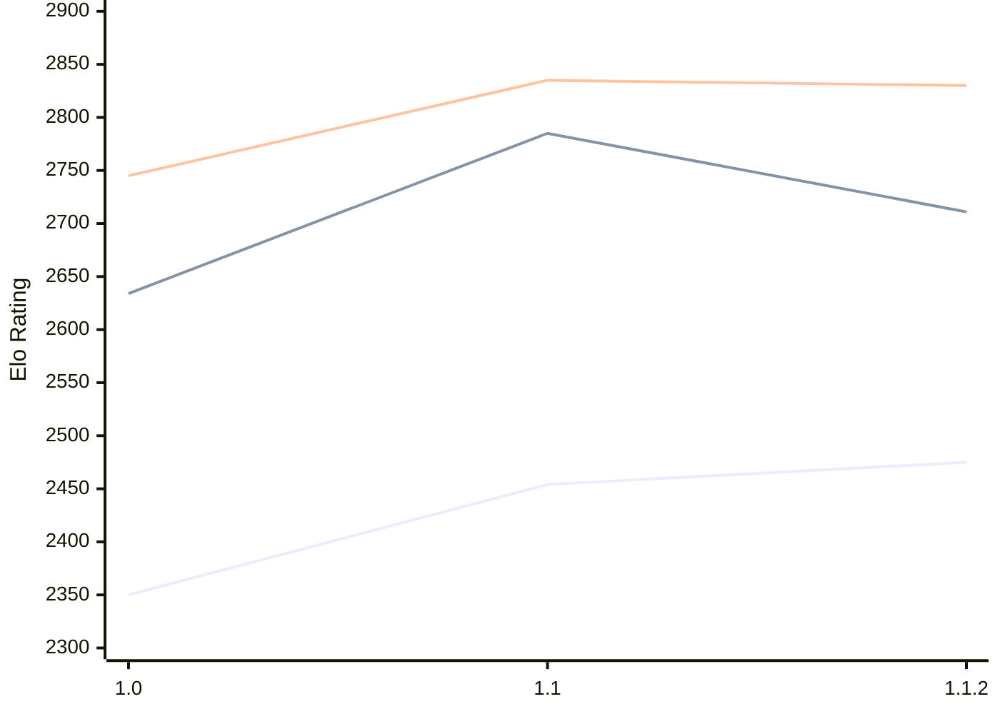

# Engine: Casanchess

Author: Carlos Sanchez Mayordomo

Home: https://github.com/casanche/casanchess

## Elo Ratings E1 (Ultra 7 265T (1.50 GHz) - E-Core)

| Version | Published | STC 8.0+0.08s  | LTC 60.0+0.60s | VLTC 2m24s+1.12s | Comment |
| --- | --- | --- | --- | --- | --- |
| 1.1.2 | 2026-09-06 | 2376 | 2757 | 2823 |  |
 | | | cElo (∆ prev) | cElo (∆ prev) | cElo (∆ prev) | 

## Elo Ratings P1 (Ultra 7 265T (1.50 GHz) - P-Core)

| Version | Published | STC 8.0+0.08s  | LTC 60.0+0.60s | VLTC 2m24s+1.12s | Comment |
| --- | --- | --- | --- | --- | --- |
| 1.1.2 | 2026-09-06 | 2545 | 2799 | 2896 |  |
 | | | cElo (∆ prev) | cElo (∆ prev) | cElo (∆ prev) | 

## Elo Ratings T1 (i5-7500T 2.70GHz)

| Version | Published | STC 8.0+0.08s  | LTC 60.0+0.60s | VLTC 2m24s+1.12s | Comment |
| --- | --- | --- | --- | --- | --- |
| 1.1.2 | 2026-09-06 | 2475(+21) | 2711(-74) | 2830(-5) |  |
| 1.1 | 2026-08-15 | 2454(+104) | 2785(+151) | 2835(+90) |  |
| 1.0 | 2026-07-14 | 2350 | 2634 | 2745 |  |
 | | | cElo (∆ prev) | cElo (∆ prev) | cElo (∆ prev) | 

<a href="https://github.com/computer-chess-index/cci/issues/new?template=submit-version.yml&title=[VERSION]+Casanchess+<version>&body=###%20Engine%20name%0ACasanchess%0A%0A###%20Version%0A1.1.2" target="_blank">Submit new version</a>

 Test Conditions:

GUI/CLI: <a href=https://github.com/cutechess/cutechess target="_blank">Cute-Chess</a> 
Elo Calculation: <a href=https://www.remi-coulom.fr/Bayesian-Elo/ target="_blank">Bayesian-Elo</a> 
CPU for P1: Intel(R) Core(TM) Ultra 7 265T (1.50 GHz) - P-Core 
CPU for E1: Intel(R) Core(TM) Ultra 7 265T (1.50 GHz) - E-Core 
CPU for T1: Intel(R) Core(TM) i5-7500T 2.70GHz 
Opening book: 8_moves_v3 
\* STC: 8.0+0.08s, LTC: 60.0+0.60s, VLTC: 2m24s+1.12s

 Lists:
Ratings: <a href=https://github.com/computer-chess-index/cci/blob/main/lists/CCIRatings.csv target="_blank">Complete list</a>

Generated: 2026-10-21 04:36:46

## Ratings Verlauf T1

```mermaid
%%{init: {"theme":"base","themeVariables":{"seriesColors:['#a3a3a3','#222221','#faa371']}}}%%
xychart-beta
  x-axis ["1.0", "1.1", "1.1.2"]
  y-axis "Elo Rating" 2300 --> 2900
  line "T1: STC (8.0+0.08s)" [2350, 2454, 2475]
  line "T1: LTC (60.0+0.60s)" [2634, 2785, 2711]
  line "T1: VLTC (2m24s+1.12s)" [2745, 2835, 2830]
```

## Detailed Evaluation Results

| Version | Time Control | Variant | Elo  | Range +/- | Matches | Score | Average Opponent Elo | Draws |
| --- | --- |--- | --- | --- | --- | --- | --- | --- |
| 1.1.2 | VLTC (2m24s+1.12s) | T1 | 2830 | 36 | 230 | 50% | 2834 | 40% |
|  |  | P1 | 2896 | 38 | 196 | 46% | 2924 | 48% |
|  |  | E1 | 2823 | 30 | 324 | 48% | 2850 | 45% |
|  | LTC (60.0+0.60s) | P1 | 2799 | 37 | 216 | 50% | 2800 | 47% |
|  |  | E1 | 2757 | 32 | 294 | 52% | 2709 | 46% |
|  |  | T1 | 2711 | 34 | 252 | 50% | 2709 | 46% |
|  | STC (8.0+0.08s) | P1 | 2545 | 38 | 222 | 52% | 2520 | 40% |
|  |  | E1 | 2376 | 32 | 316 | 44% | 2427 | 39% |
|  |  | T1 | 2475 | 36 | 236 | 51% | 2469 | 41% |
| --- | --- |--- | --- | --- | --- | --- | --- | --- |
| 1.1 | VLTC (2m24s+1.12s) | T1 | 2835 | 34 | 256 | 51% | 2831 | 47% |
|  | LTC (60.0+0.60s) | T1 | 2785 | 32 | 284 | 51% | 2772 | 49% |
|  | STC (8.0+0.08s) | T1 | 2454 | 29 | 356 | 48% | 2475 | 43% |
| --- | --- |--- | --- | --- | --- | --- | --- | --- |
| 1.0 | VLTC (2m24s+1.12s) | T1 | 2745 | 32 | 326 | 60% | 2507 | 40% |
|  | LTC (60.0+0.60s) | T1 | 2634 | 32 | 338 | 58% | 2471 | 42% |
|  | STC (8.0+0.08s) | T1 | 2350 | 32 | 352 | 62% | 2109 | 34% |