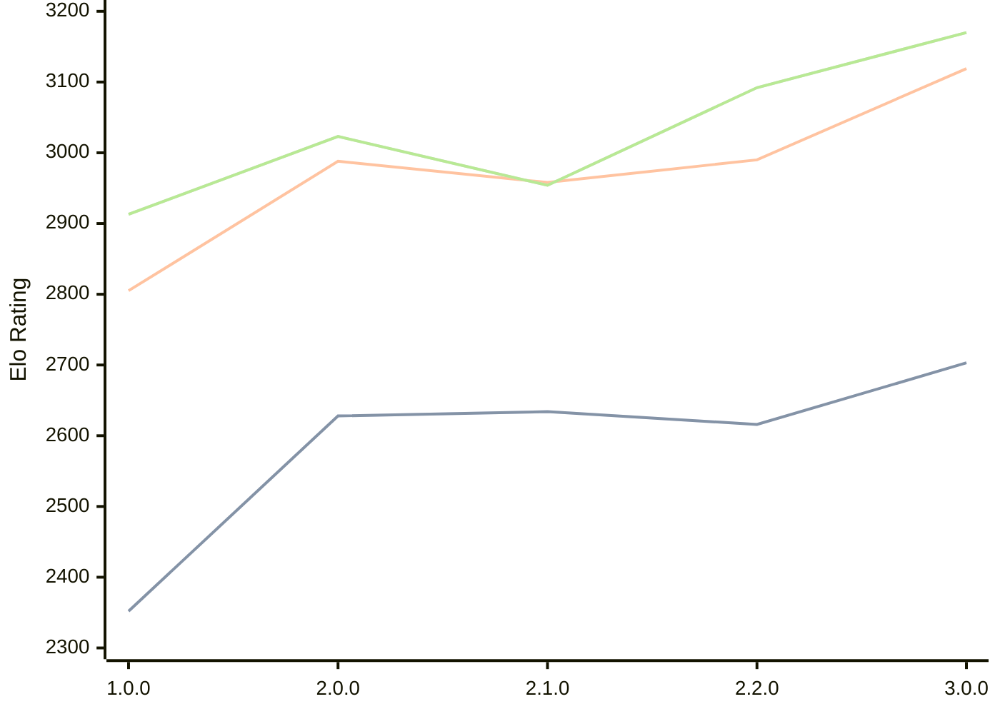

# Engine: Catalyst

Author: Anany Tanwar

Home: https://github.com/AnanyTanwar/Catalyst

## Ratings nach Version

| Version | Published | STC 8.0+0.08s  | LTC 60.0+0.60s | VLTC 2m24s+1.12s | Comment |
| --- | --- | --- | --- | --- | --- |
| 3.0.0 | 2026-04-23 | 2703(+87) | 3119(+129) | 3170(+78) |  |
| 2.2.0 | 2026-04-03 | 2616(-18) | 2990(+32) | 3092(+138) |  |
| 2.1.0 | 2026-04-02 | 2634(+6) | 2958(-30) | 2954(-69) |  |
| 2.0.0 | 2026-03-29 | 2628(+276) | 2988(+183) | 3023(+110) |  |
| 1.0.0 | 2026-03-26 | 2352 | 2805 | 2913 |  |
 | | | cElo (∆ prev) | cElo (∆ prev) | cElo (∆ prev) | 

<a href="https://github.com/computer-chess-index/cci/issues/new?template=submit-version.yml&title=[VERSION]+Catalyst+<version>&body=###%20Engine%20name%0ACatalyst%0A%0A###%20Version%0A3.0.0" target="_blank">Submit new version</a>

 Test Conditions:

GUI/CLI: <a href=https://github.com/cutechess/cutechess target="_blank">Cute-Chess</a> 
Elo Calculation: <a href=https://www.remi-coulom.fr/Bayesian-Elo/ target="_blank">Bayesian-Elo</a> 
CPU: Intel(R) Core(TM) i5-7500T 2.70GHz 
Opening book: 8_moves_v3 
\* STC: 8.0+0.08s, LTC: 60.0+0.60s, VLTC: 2m24s+1.12s

 Lists:
Ratings: <a href=https://github.com/computer-chess-index/cci/blob/main/lists/CCIRatings.csv target="_blank">Complete list</a>

Generated: 2026-04-28 06:23:05

## Ratings Verlauf

⬛ STC (8.0+0.08s) &nbsp;&nbsp; 🟧 LTC (60.0+0.60s) &nbsp;&nbsp; 🟩 VLTC (2m24s+1.12s)

dark mode: 🟩STC (8.0+0.08s) 🟧LTC (60.0+0.60s) ⬜VLTC (2m24s+1.12s)

