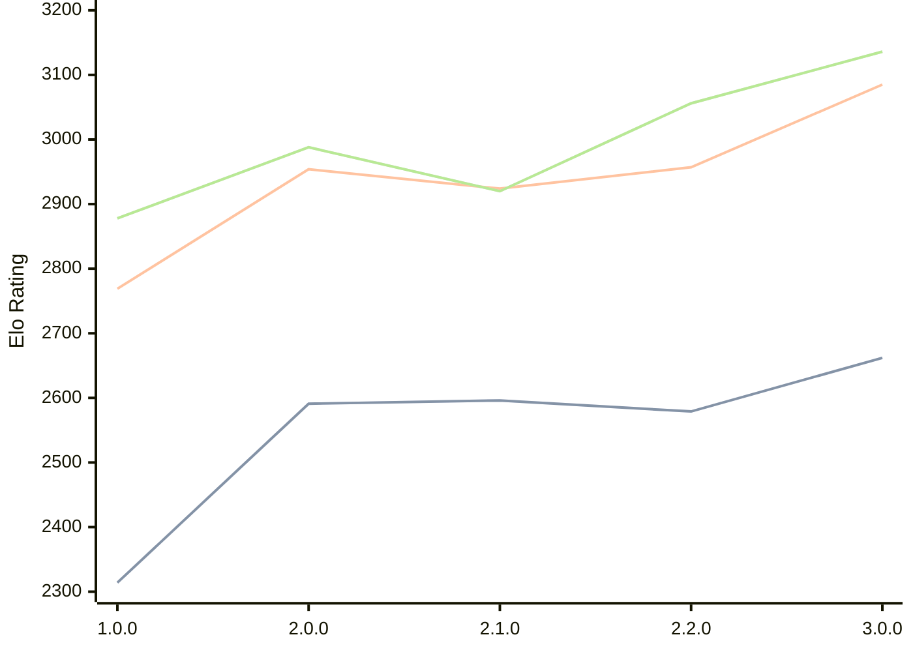

# Engine: Catalyst

Author: Anany Tanwar

Home: https://github.com/AnanyTanwar/Catalyst

## Elo Ratings

| Version | Published | STC 8.0+0.08s  | LTC 60.0+0.60s | VLTC 2m24s+1.12s | Comment |
| --- | --- | --- | --- | --- | --- |
| 3.1.0 | 2026-07-07 |  |  |  |  |
| 3.0.0 | 2026-04-23 | 2662(+83) | 3085(+128) | 3136(+80) |  |
| 2.2.0 | 2026-04-03 | 2579(-17) | 2957(+33) | 3056(+136) |  |
| 2.1.0 | 2026-04-02 | 2596(+5) | 2924(-30) | 2920(-68) |  |
| 2.0.0 | 2026-03-29 | 2591(+277) | 2954(+185) | 2988(+110) |  |
| 1.0.0 | 2026-03-26 | 2314 | 2769 | 2878 |  |
 | | | cElo (∆ prev) | cElo (∆ prev) | cElo (∆ prev) | 

<a href="https://github.com/computer-chess-index/cci/issues/new?template=submit-version.yml&title=[VERSION]+Catalyst+<version>&body=###%20Engine%20name%0ACatalyst%0A%0A###%20Version%0A3.1.0" target="_blank">Submit new version</a>

 Test Conditions:

GUI/CLI: <a href=https://github.com/cutechess/cutechess target="_blank">Cute-Chess</a> 
Elo Calculation: <a href=https://www.remi-coulom.fr/Bayesian-Elo/ target="_blank">Bayesian-Elo</a> 
CPU: Intel(R) Core(TM) i5-7500T 2.70GHz 
Opening book: 8_moves_v3 
\* STC: 8.0+0.08s, LTC: 60.0+0.60s, VLTC: 2m24s+1.12s

 Lists:
Ratings: <a href=https://github.com/computer-chess-index/cci/blob/main/lists/CCIRatings.csv target="_blank">Complete list</a>

Generated: 2026-09-14 04:36:34

## Ratings Verlauf

## Detailed Evaluation Results

| Version | Time Control | Elo  | Range +/- | Matches | Score | Average Opponent Elo | Draws |
| --- | --- | --- | --- | --- | --- | --- | --- |
| 3.0.0 | VLTC (2m24s+1.12s) | 3136 | 38 | 202 | 48% | 3154 | 49% |
| 3.0.0 | LTC (60.0+0.60s) | 3085 | 43 | 150 | 51% | 3081 | 52% |
| 3.0.0 | STC (8.0+0.08s) | 2662 | 50 | 128 | 50% | 2664 | 33% |
| --- | --- | --- | --- | --- | --- | --- | --- |
| 2.2.0 | VLTC (2m24s+1.12s) | 3056 | 34 | 242 | 51% | 3052 | 56% |
| 2.2.0 | LTC (60.0+0.60s) | 2957 | 35 | 238 | 50% | 2950 | 51% |
| 2.2.0 | STC (8.0+0.08s) | 2579 | 34 | 274 | 50% | 2579 | 34% |
| --- | --- | --- | --- | --- | --- | --- | --- |
| 2.1.0 | VLTC (2m24s+1.12s) | 2920 | 31 | 292 | 49% | 2931 | 52% |
| 2.1.0 | LTC (60.0+0.60s) | 2924 | 34 | 248 | 49% | 2928 | 50% |
| 2.1.0 | STC (8.0+0.08s) | 2596 | 35 | 256 | 48% | 2610 | 41% |
| --- | --- | --- | --- | --- | --- | --- | --- |
| 2.0.0 | VLTC (2m24s+1.12s) | 2988 | 31 | 288 | 49% | 2994 | 54% |
| 2.0.0 | LTC (60.0+0.60s) | 2954 | 32 | 280 | 51% | 2944 | 49% |
| 2.0.0 | STC (8.0+0.08s) | 2591 | 30 | 336 | 48% | 2607 | 39% |
| --- | --- | --- | --- | --- | --- | --- | --- |
| 1.0.0 | VLTC (2m24s+1.12s) | 2878 | 32 | 302 | 49% | 2888 | 41% |
| 1.0.0 | LTC (60.0+0.60s) | 2769 | 34 | 268 | 48% | 2786 | 39% |
| 1.0.0 | STC (8.0+0.08s) | 2314 | 35 | 272 | 46% | 2350 | 32% |
| --- | --- | --- | --- | --- | --- | --- | --- |