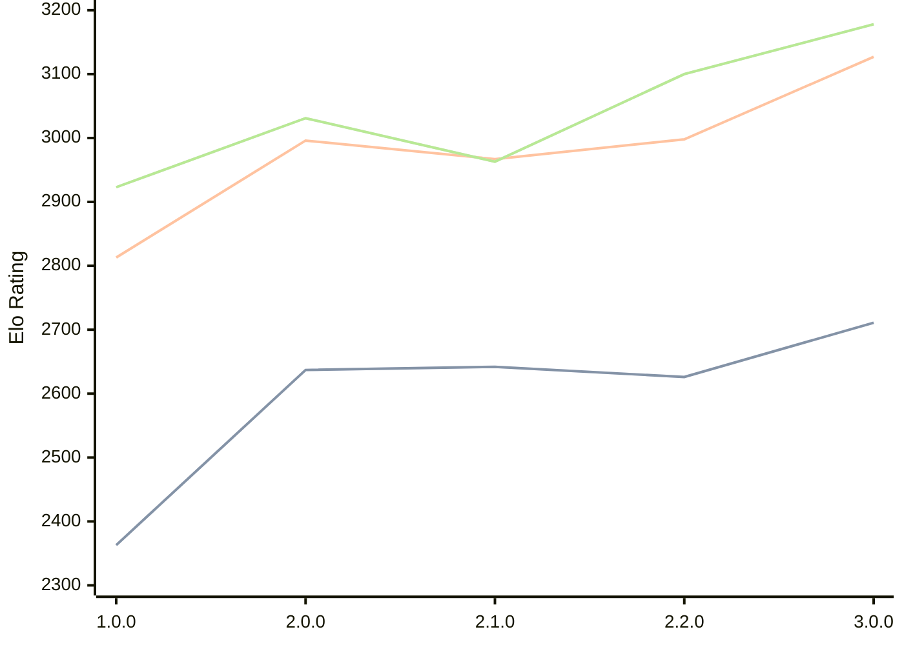

# Engine: Catalyst

Author: Anany Tanwar

Home: https://github.com/AnanyTanwar/Catalyst

## Elo Ratings

| Version | Published | STC 8.0+0.08s  | LTC 60.0+0.60s | VLTC 2m24s+1.12s | Comment |
| --- | --- | --- | --- | --- | --- |
| 3.0.0 | 2026-04-23 | 2711(+85) | 3127(+129) | 3178(+78) |  |
| 2.2.0 | 2026-04-03 | 2626(-16) | 2998(+31) | 3100(+137) |  |
| 2.1.0 | 2026-04-02 | 2642(+5) | 2967(-29) | 2963(-68) |  |
| 2.0.0 | 2026-03-29 | 2637(+274) | 2996(+183) | 3031(+108) |  |
| 1.0.0 | 2026-03-26 | 2363 | 2813 | 2923 |  |
 | | | cElo (∆ prev) | cElo (∆ prev) | cElo (∆ prev) | 

<a href="https://github.com/computer-chess-index/cci/issues/new?template=submit-version.yml&title=[VERSION]+Catalyst+<version>&body=###%20Engine%20name%0ACatalyst%0A%0A###%20Version%0A3.0.0" target="_blank">Submit new version</a>

 Test Conditions:

GUI/CLI: <a href=https://github.com/cutechess/cutechess target="_blank">Cute-Chess</a> 
Elo Calculation: <a href=https://www.remi-coulom.fr/Bayesian-Elo/ target="_blank">Bayesian-Elo</a> 
CPU: Intel(R) Core(TM) i5-7500T 2.70GHz 
Opening book: 8_moves_v3 
\* STC: 8.0+0.08s, LTC: 60.0+0.60s, VLTC: 2m24s+1.12s

 Lists:
Ratings: <a href=https://github.com/computer-chess-index/cci/blob/main/lists/CCIRatings.csv target="_blank">Complete list</a>

Generated: 2026-05-18 06:23:07

## Ratings Verlauf

⬛ STC (8.0+0.08s) &nbsp;&nbsp; 🟧 LTC (60.0+0.60s) &nbsp;&nbsp; 🟩 VLTC (2m24s+1.12s)

dark mode: 🟩STC (8.0+0.08s) 🟧LTC (60.0+0.60s) ⬜VLTC (2m24s+1.12s)

## Detailed Evaluation Results

| Version | Time Control | Elo  | Range +/- | Matches | Score | Average Opponent Elo | Draws |
| --- | --- | --- | --- | --- | --- | --- | --- |
| 3.0.0 | VLTC (2m24s+1.12s) | 3178 | 38 | 202 | 48% | 3195 | 49% |
| 3.0.0 | LTC (60.0+0.60s) | 3127 | 43 | 150 | 51% | 3123 | 52% |
| 3.0.0 | STC (8.0+0.08s) | 2711 | 50 | 128 | 50% | 2712 | 33% |
| --- | --- | --- | --- | --- | --- | --- | --- |
| 2.2.0 | VLTC (2m24s+1.12s) | 3100 | 34 | 242 | 51% | 3094 | 56% |
| 2.2.0 | LTC (60.0+0.60s) | 2998 | 35 | 238 | 50% | 2993 | 51% |
| 2.2.0 | STC (8.0+0.08s) | 2626 | 34 | 274 | 50% | 2624 | 34% |
| --- | --- | --- | --- | --- | --- | --- | --- |
| 2.1.0 | VLTC (2m24s+1.12s) | 2963 | 31 | 292 | 49% | 2974 | 52% |
| 2.1.0 | LTC (60.0+0.60s) | 2967 | 34 | 248 | 49% | 2971 | 50% |
| 2.1.0 | STC (8.0+0.08s) | 2642 | 35 | 256 | 48% | 2655 | 41% |
| --- | --- | --- | --- | --- | --- | --- | --- |
| 2.0.0 | VLTC (2m24s+1.12s) | 3031 | 31 | 288 | 49% | 3038 | 54% |
| 2.0.0 | LTC (60.0+0.60s) | 2996 | 32 | 280 | 51% | 2988 | 49% |
| 2.0.0 | STC (8.0+0.08s) | 2637 | 30 | 336 | 48% | 2653 | 39% |
| --- | --- | --- | --- | --- | --- | --- | --- |
| 1.0.0 | VLTC (2m24s+1.12s) | 2923 | 32 | 302 | 49% | 2932 | 41% |
| 1.0.0 | LTC (60.0+0.60s) | 2813 | 34 | 268 | 48% | 2831 | 39% |
| 1.0.0 | STC (8.0+0.08s) | 2363 | 35 | 272 | 46% | 2399 | 32% |
| --- | --- | --- | --- | --- | --- | --- | --- |