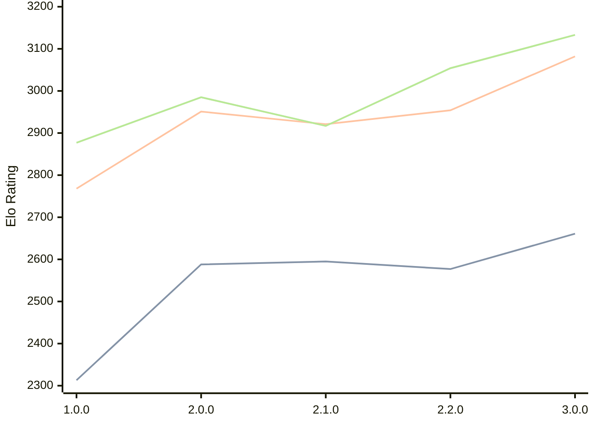

# Engine: Catalyst

Author: Anany Tanwar

Home: https://github.com/AnanyTanwar/Catalyst

## Elo Ratings

| Version | Published | STC 8.0+0.08s  | LTC 60.0+0.60s | VLTC 2m24s+1.12s | Comment |
| --- | --- | --- | --- | --- | --- |
| 3.1.0 | 2026-07-07 |  |  |  |  |
| 3.0.0 | 2026-04-23 | 2661(+84) | 3082(+128) | 3133(+79) |  |
| 2.2.0 | 2026-04-03 | 2577(-18) | 2954(+33) | 3054(+137) |  |
| 2.1.0 | 2026-04-02 | 2595(+7) | 2921(-30) | 2917(-68) |  |
| 2.0.0 | 2026-03-29 | 2588(+275) | 2951(+183) | 2985(+108) |  |
| 1.0.0 | 2026-03-26 | 2313 | 2768 | 2877 |  |
 | | | cElo (∆ prev) | cElo (∆ prev) | cElo (∆ prev) | 

<a href="https://github.com/computer-chess-index/cci/issues/new?template=submit-version.yml&title=[VERSION]+Catalyst+<version>&body=###%20Engine%20name%0ACatalyst%0A%0A###%20Version%0A3.1.0" target="_blank">Submit new version</a>

 Test Conditions:

GUI/CLI: <a href=https://github.com/cutechess/cutechess target="_blank">Cute-Chess</a> 
Elo Calculation: <a href=https://www.remi-coulom.fr/Bayesian-Elo/ target="_blank">Bayesian-Elo</a> 
CPU: Intel(R) Core(TM) i5-7500T 2.70GHz 
Opening book: 8_moves_v3 
\* STC: 8.0+0.08s, LTC: 60.0+0.60s, VLTC: 2m24s+1.12s

 Lists:
Ratings: <a href=https://github.com/computer-chess-index/cci/blob/main/lists/CCIRatings.csv target="_blank">Complete list</a>

Generated: 2026-09-06 06:22:59

## Ratings Verlauf

## Detailed Evaluation Results

| Version | Time Control | Elo  | Range +/- | Matches | Score | Average Opponent Elo | Draws |
| --- | --- | --- | --- | --- | --- | --- | --- |
| 3.0.0 | VLTC (2m24s+1.12s) | 3133 | 38 | 202 | 48% | 3152 | 49% |
| 3.0.0 | LTC (60.0+0.60s) | 3082 | 43 | 150 | 51% | 3078 | 52% |
| 3.0.0 | STC (8.0+0.08s) | 2661 | 50 | 128 | 50% | 2662 | 33% |
| --- | --- | --- | --- | --- | --- | --- | --- |
| 2.2.0 | VLTC (2m24s+1.12s) | 3054 | 34 | 242 | 51% | 3050 | 56% |
| 2.2.0 | LTC (60.0+0.60s) | 2954 | 35 | 238 | 50% | 2947 | 51% |
| 2.2.0 | STC (8.0+0.08s) | 2577 | 34 | 274 | 50% | 2576 | 34% |
| --- | --- | --- | --- | --- | --- | --- | --- |
| 2.1.0 | VLTC (2m24s+1.12s) | 2917 | 31 | 292 | 49% | 2928 | 52% |
| 2.1.0 | LTC (60.0+0.60s) | 2921 | 34 | 248 | 49% | 2925 | 50% |
| 2.1.0 | STC (8.0+0.08s) | 2595 | 35 | 256 | 48% | 2607 | 41% |
| --- | --- | --- | --- | --- | --- | --- | --- |
| 2.0.0 | VLTC (2m24s+1.12s) | 2985 | 31 | 288 | 49% | 2992 | 54% |
| 2.0.0 | LTC (60.0+0.60s) | 2951 | 32 | 280 | 51% | 2942 | 49% |
| 2.0.0 | STC (8.0+0.08s) | 2588 | 30 | 336 | 48% | 2604 | 39% |
| --- | --- | --- | --- | --- | --- | --- | --- |
| 1.0.0 | VLTC (2m24s+1.12s) | 2877 | 32 | 302 | 49% | 2886 | 41% |
| 1.0.0 | LTC (60.0+0.60s) | 2768 | 34 | 268 | 48% | 2785 | 39% |
| 1.0.0 | STC (8.0+0.08s) | 2313 | 35 | 272 | 46% | 2349 | 32% |
| --- | --- | --- | --- | --- | --- | --- | --- |