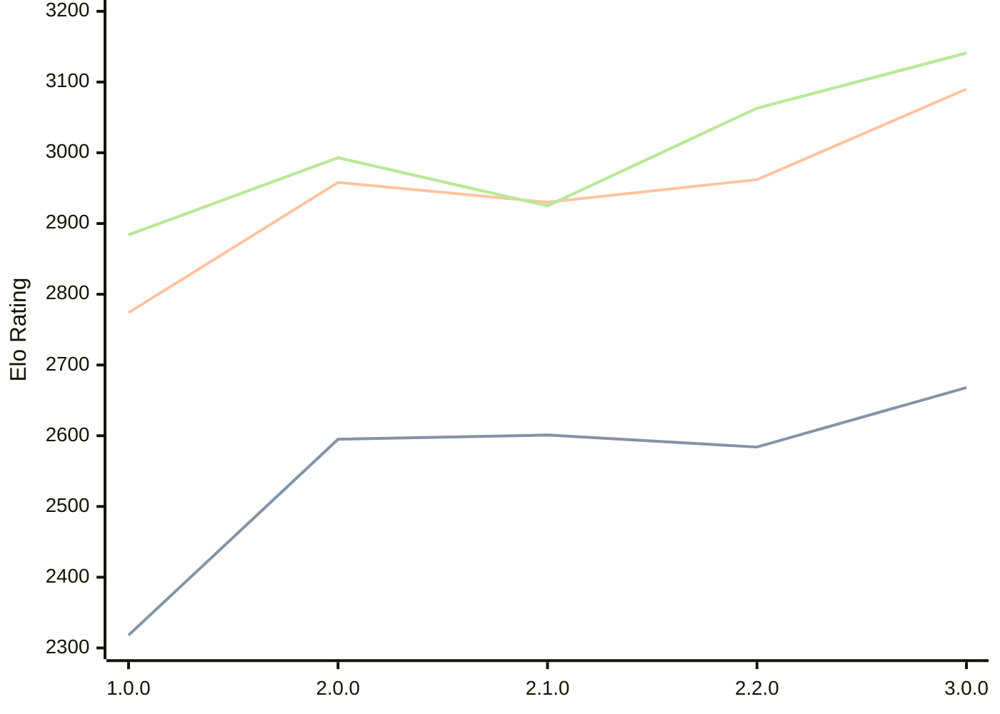

# Engine: Catalyst

Author: Anany Tanwar

Home: https://github.com/AnanyTanwar/Catalyst

## Elo Ratings E1

| Version | Published | STC 8.0+0.08s  | LTC 60.0+0.60s | VLTC 2m24s+1.12s | Comment |
| --- | --- | --- | --- | --- | --- |
|  |  |  |  |  |  |
 | | | cElo (∆ prev) | cElo (∆ prev) | cElo (∆ prev) | 

## Elo Ratings P1

| Version | Published | STC 8.0+0.08s  | LTC 60.0+0.60s | VLTC 2m24s+1.12s | Comment |
| --- | --- | --- | --- | --- | --- |
|  |  |  |  |  |  |
 | | | cElo (∆ prev) | cElo (∆ prev) | cElo (∆ prev) | 

## Elo Ratings T1

| Version | Published | STC 8.0+0.08s  | LTC 60.0+0.60s | VLTC 2m24s+1.12s | Comment |
| --- | --- | --- | --- | --- | --- |
| 3.0.0 | 2026-04-23 | 2668(+84) | 3090(+128) | 3141(+78) |  |
| 2.2.0 | 2026-04-03 | 2584(-17) | 2962(+32) | 3063(+138) |  |
| 2.1.0 | 2026-04-02 | 2601(+6) | 2930(-28) | 2925(-68) |  |
| 2.0.0 | 2026-03-29 | 2595(+277) | 2958(+184) | 2993(+109) |  |
| 1.0.0 | 2026-03-26 | 2318 | 2774 | 2884 |  |
 | | | cElo (∆ prev) | cElo (∆ prev) | cElo (∆ prev) | 

<a href="https://github.com/computer-chess-index/cci/issues/new?template=submit-version.yml&title=[VERSION]+Catalyst+<version>&body=###%20Engine%20name%0ACatalyst%0A%0A###%20Version%0A3.0.0" target="_blank">Submit new version</a>

 Test Conditions:

GUI/CLI: <a href=https://github.com/cutechess/cutechess target="_blank">Cute-Chess</a> 
Elo Calculation: <a href=https://www.remi-coulom.fr/Bayesian-Elo/ target="_blank">Bayesian-Elo</a> 
CPU for P1: Intel(R) Core(TM) Ultra 7 265T (1.50 GHz) - P-Core 
CPU for E1: Intel(R) Core(TM) Ultra 7 265T (1.50 GHz) - E-Core 
CPU for T1: Intel(R) Core(TM) i5-7500T 2.70GHz 
Opening book: 8_moves_v3 
\* STC: 8.0+0.08s, LTC: 60.0+0.60s, VLTC: 2m24s+1.12s

 Lists:
Ratings: <a href=https://github.com/computer-chess-index/cci/blob/main/lists/CCIRatings.csv target="_blank">Complete list</a>

Generated: 2026-10-09 14:09:32

## Ratings Verlauf

```mermaid
%%{init: {"theme":"base","themeVariables":{"seriesColors:['#a3a3a3','#222221','#faa371']}}}%%
xychart-beta
  x-axis ["1.0.0", "2.0.0", "2.1.0", "2.2.0", "3.0.0"]
  y-axis "Elo Rating" 2300 --> 3200
  line "" [2318, 2595, 2601, 2584, 2668]
  line "STC (8.0+0.08s)" [2318, 2595, 2601, 2584, 2668]
  line "LTC (60.0+0.60s)" [2774, 2958, 2930, 2962, 3090]
  line "" [2884, 2993, 2925, 3063, 3141]
  line "VLTC (2m24s+1.12s)" [2884, 2993, 2925, 3063, 3141]
```

## Detailed Evaluation Results

| Version | Time Control | Elo  | Range +/- | Matches | Score | Average Opponent Elo | Draws |
| --- | --- | --- | --- | --- | --- | --- | --- |
| 3.0.0 | VLTC (2m24s+1.12s) | 3141 | 38 | 202 | 48% | 3160 | 49% |
| 3.0.0 | LTC (60.0+0.60s) | 3090 | 43 | 150 | 51% | 3086 | 52% |
| 3.0.0 | STC (8.0+0.08s) | 2668 | 50 | 128 | 50% | 2669 | 33% |
| --- | --- | --- | --- | --- | --- | --- | --- |
| 2.2.0 | VLTC (2m24s+1.12s) | 3063 | 34 | 242 | 51% | 3058 | 56% |
| 2.2.0 | LTC (60.0+0.60s) | 2962 | 35 | 238 | 50% | 2955 | 51% |
| 2.2.0 | STC (8.0+0.08s) | 2584 | 34 | 274 | 50% | 2583 | 34% |
| --- | --- | --- | --- | --- | --- | --- | --- |
| 2.1.0 | VLTC (2m24s+1.12s) | 2925 | 31 | 292 | 49% | 2936 | 52% |
| 2.1.0 | LTC (60.0+0.60s) | 2930 | 34 | 248 | 49% | 2934 | 50% |
| 2.1.0 | STC (8.0+0.08s) | 2601 | 35 | 256 | 48% | 2615 | 41% |
| --- | --- | --- | --- | --- | --- | --- | --- |
| 2.0.0 | VLTC (2m24s+1.12s) | 2993 | 31 | 288 | 49% | 3000 | 54% |
| 2.0.0 | LTC (60.0+0.60s) | 2958 | 32 | 280 | 51% | 2950 | 49% |
| 2.0.0 | STC (8.0+0.08s) | 2595 | 30 | 336 | 48% | 2611 | 39% |
| --- | --- | --- | --- | --- | --- | --- | --- |
| 1.0.0 | VLTC (2m24s+1.12s) | 2884 | 32 | 302 | 49% | 2893 | 41% |
| 1.0.0 | LTC (60.0+0.60s) | 2774 | 34 | 268 | 48% | 2792 | 39% |
| 1.0.0 | STC (8.0+0.08s) | 2318 | 35 | 272 | 46% | 2354 | 32% |
| --- | --- | --- | --- | --- | --- | --- | --- |