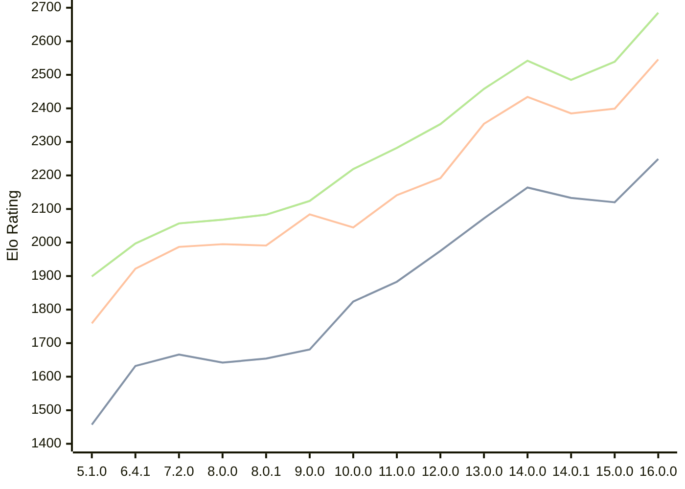

# Engine: Cepimetheus

Author: George Bland

Home: https://github.com/mrgwbland/Cepimetheus

## Elo Ratings

| Version | Published | STC 8.0+0.08s  | LTC 60.0+0.60s | VLTC 2m24s+1.12s | Comment |
| --- | --- | --- | --- | --- | --- |
| 16.0.0 | 2026-08-30 | 2249(+129) | 2546(+147) | 2685(+146) |  |
| 15.0.0 | 2026-08-13 | 2120(-13) | 2399(+14) | 2539(+54) |  |
| 14.0.1 | 2026-08-02 | 2133(-31) | 2385(-49) | 2485(-57) |  |
| 14.0.0 | 2026-07-31 | 2164(+92) | 2434(+80) | 2542(+84) |  |
| 13.0.0 | 2026-07-23 | 2072(+97) | 2354(+162) | 2458(+105) |  |
| 12.0.0 | 2026-07-19 | 1975(+92) | 2192(+51) | 2353(+71) |  |
| 11.0.0 | 2026-07-08 | 1883(+59) | 2141(+96) | 2282(+63) |  |
| 10.0.0 | 2026-07-01 | 1824(+143) | 2045(-39) | 2219(+95) |  |
| 9.0.0 | 2026-06-24 | 1681(+27) | 2084(+93) | 2124(+41) |  |
| 8.0.1 | 2026-06-20 | 1654(+12) | 1991(-4) | 2083(+15) |  |
| 8.0.0 | 2026-06-18 | 1642(-24) | 1995(+8) | 2068(+11) |  |
| 7.2.0 | 2026-06-16 | 1666(+new) | 1987(+new) | 2057(+new) |  |
| 7.1.0 | 2026-06-12 |  |  |  |  |
| 7.0.0 | 2026-06-02 |  |  |  |  |
| 6.4.1 | 2026-05-28 | 1632(+new) | 1922(+new) | 1997(+new) |  |
| 6.4.0 | 2026-05-27 |  |  |  |  |
| 6.3.0 | 2026-05-24 |  |  |  |  |
| 6.2.0 | 2026-05-24 |  |  |  |  |
| 6.1.0 | 2026-05-21 |  |  |  |  |
| 6.0.1 | 2026-05-21 |  |  |  |  |
| 6.0.0 | 2026-05-21 |  |  |  |  |
| 5.1.0 | 2026-05-20 | 1457(+new) | 1759(+new) | 1899(+new) |  |
| 5.0.0 | 2026-05-16 |  |  |  |  |
| 4.3.1 | 2026-05-15 |  |  |  |  |
| 4.3.0 | 2026-05-13 |  |  |  |  |
| 4.2.1 | 2026-05-09 |  |  |  |  |
| 4.2.0 | 2026-05-08 |  |  |  |  |
| 4.1.0 | 2026-05-06 |  |  |  |  |
| 4.0.0 | 2026-05-06 |  |  |  |  |
| 3.2.1 | 2026-04-26 |  |  |  |  |
| 3.2.0 | 2026-04-26 |  |  |  |  |
| 3.1.0 | 2026-04-26 |  |  |  |  |
| 3.0.0 | 2026-04-24 |  |  |  |  |
| 2.2.0 | 2026-04-23 |  |  |  |  |
| 2.1.0 | 2026-04-15 |  |  |  |  |
| 2.0.0 | 2026-04-14 |  |  |  |  |
| 1.0.0 | 2026-04-07 |  |  |  |  |
 | | | cElo (∆ prev) | cElo (∆ prev) | cElo (∆ prev) | 

<a href="https://github.com/computer-chess-index/cci/issues/new?template=submit-version.yml&title=[VERSION]+Cepimetheus+<version>&body=###%20Engine%20name%0ACepimetheus%0A%0A###%20Version%0A16.0.0" target="_blank">Submit new version</a>

 Test Conditions:

GUI/CLI: <a href=https://github.com/cutechess/cutechess target="_blank">Cute-Chess</a> 
Elo Calculation: <a href=https://www.remi-coulom.fr/Bayesian-Elo/ target="_blank">Bayesian-Elo</a> 
CPU: Intel(R) Core(TM) i5-7500T 2.70GHz 
Opening book: 8_moves_v3 
\* STC: 8.0+0.08s, LTC: 60.0+0.60s, VLTC: 2m24s+1.12s

 Lists:
Ratings: <a href=https://github.com/computer-chess-index/cci/blob/main/lists/CCIRatings.csv target="_blank">Complete list</a>

Generated: 2026-09-05 04:33:32

## Ratings Verlauf

## Detailed Evaluation Results

| Version | Time Control | Elo  | Range +/- | Matches | Score | Average Opponent Elo | Draws |
| --- | --- | --- | --- | --- | --- | --- | --- |
| 16.0.0 | VLTC (2m24s+1.12s) | 2685 | 41 | 192 | 51% | 2674 | 29% |
| 16.0.0 | LTC (60.0+0.60s) | 2546 | 40 | 206 | 51% | 2535 | 30% |
| 16.0.0 | STC (8.0+0.08s) | 2249 | 40 | 232 | 53% | 2217 | 16% |
| --- | --- | --- | --- | --- | --- | --- | --- |
| 15.0.0 | VLTC (2m24s+1.12s) | 2539 | 42 | 188 | 48% | 2554 | 28% |
| 15.0.0 | LTC (60.0+0.60s) | 2399 | 42 | 188 | 50% | 2399 | 27% |
| 15.0.0 | STC (8.0+0.08s) | 2120 | 45 | 164 | 50% | 2118 | 26% |
| --- | --- | --- | --- | --- | --- | --- | --- |
| 14.0.1 | VLTC (2m24s+1.12s) | 2485 | 34 | 286 | 51% | 2479 | 30% |
| 14.0.1 | LTC (60.0+0.60s) | 2385 | 35 | 278 | 51% | 2387 | 28% |
| 14.0.1 | STC (8.0+0.08s) | 2133 | 39 | 236 | 49% | 2142 | 19% |
| --- | --- | --- | --- | --- | --- | --- | --- |
| 14.0.0 | VLTC (2m24s+1.12s) | 2542 | 36 | 256 | 48% | 2558 | 29% |
| 14.0.0 | LTC (60.0+0.60s) | 2434 | 33 | 304 | 47% | 2466 | 28% |
| 14.0.0 | STC (8.0+0.08s) | 2164 | 37 | 256 | 50% | 2157 | 22% |
| --- | --- | --- | --- | --- | --- | --- | --- |
| 13.0.0 | VLTC (2m24s+1.12s) | 2458 | 36 | 264 | 49% | 2466 | 25% |
| 13.0.0 | LTC (60.0+0.60s) | 2354 | 40 | 224 | 50% | 2357 | 21% |
| 13.0.0 | STC (8.0+0.08s) | 2072 | 39 | 234 | 52% | 2052 | 21% |
| --- | --- | --- | --- | --- | --- | --- | --- |
| 12.0.0 | VLTC (2m24s+1.12s) | 2353 | 40 | 216 | 51% | 2341 | 26% |
| 12.0.0 | LTC (60.0+0.60s) | 2192 | 37 | 256 | 48% | 2201 | 25% |
| 12.0.0 | STC (8.0+0.08s) | 1975 | 44 | 186 | 52% | 1953 | 18% |
| --- | --- | --- | --- | --- | --- | --- | --- |
| 11.0.0 | VLTC (2m24s+1.12s) | 2282 | 54 | 118 | 47% | 2302 | 25% |
| 11.0.0 | LTC (60.0+0.60s) | 2141 | 55 | 116 | 49% | 2149 | 21% |
| 11.0.0 | STC (8.0+0.08s) | 1883 | 64 | 88 | 50% | 1887 | 18% |
| --- | --- | --- | --- | --- | --- | --- | --- |
| 10.0.0 | VLTC (2m24s+1.12s) | 2219 | 40 | 228 | 48% | 2241 | 19% |
| 10.0.0 | LTC (60.0+0.60s) | 2045 | 44 | 178 | 50% | 2048 | 21% |
| 10.0.0 | STC (8.0+0.08s) | 1824 | 43 | 184 | 49% | 1836 | 27% |
| --- | --- | --- | --- | --- | --- | --- | --- |
| 9.0.0 | VLTC (2m24s+1.12s) | 2124 | 36 | 276 | 49% | 2136 | 22% |
| 9.0.0 | LTC (60.0+0.60s) | 2084 | 38 | 240 | 50% | 2091 | 25% |
| 9.0.0 | STC (8.0+0.08s) | 1681 | 39 | 244 | 50% | 1677 | 17% |
| --- | --- | --- | --- | --- | --- | --- | --- |
| 8.0.1 | VLTC (2m24s+1.12s) | 2083 | 35 | 280 | 47% | 2114 | 23% |
| 8.0.1 | LTC (60.0+0.60s) | 1991 | 37 | 260 | 49% | 2003 | 23% |
| 8.0.1 | STC (8.0+0.08s) | 1654 | 41 | 220 | 48% | 1670 | 16% |
| --- | --- | --- | --- | --- | --- | --- | --- |
| 8.0.0 | VLTC (2m24s+1.12s) | 2068 | 41 | 202 | 50% | 2068 | 24% |
| 8.0.0 | LTC (60.0+0.60s) | 1995 | 41 | 218 | 49% | 2002 | 19% |
| 8.0.0 | STC (8.0+0.08s) | 1642 | 41 | 220 | 48% | 1665 | 17% |
| --- | --- | --- | --- | --- | --- | --- | --- |
| 7.2.0 | VLTC (2m24s+1.12s) | 2057 | 44 | 178 | 51% | 2048 | 21% |
| 7.2.0 | LTC (60.0+0.60s) | 1987 | 44 | 184 | 52% | 1967 | 22% |
| 7.2.0 | STC (8.0+0.08s) | 1666 | 43 | 196 | 51% | 1656 | 18% |
| --- | --- | --- | --- | --- | --- | --- | --- |
| 6.4.1 | VLTC (2m24s+1.12s) | 1997 | 42 | 200 | 50% | 2002 | 19% |
| 6.4.1 | LTC (60.0+0.60s) | 1922 | 40 | 222 | 51% | 1918 | 23% |
| 6.4.1 | STC (8.0+0.08s) | 1632 | 41 | 216 | 48% | 1652 | 17% |
| --- | --- | --- | --- | --- | --- | --- | --- |
| 5.1.0 | VLTC (2m24s+1.12s) | 1899 | 50 | 160 | 50% | 1901 | 8% |
| 5.1.0 | LTC (60.0+0.60s) | 1759 | 52 | 152 | 46% | 1805 | 3% |
| 5.1.0 | STC (8.0+0.08s) | 1457 | 61 | 108 | 51% | 1447 | 6% |
| --- | --- | --- | --- | --- | --- | --- | --- |