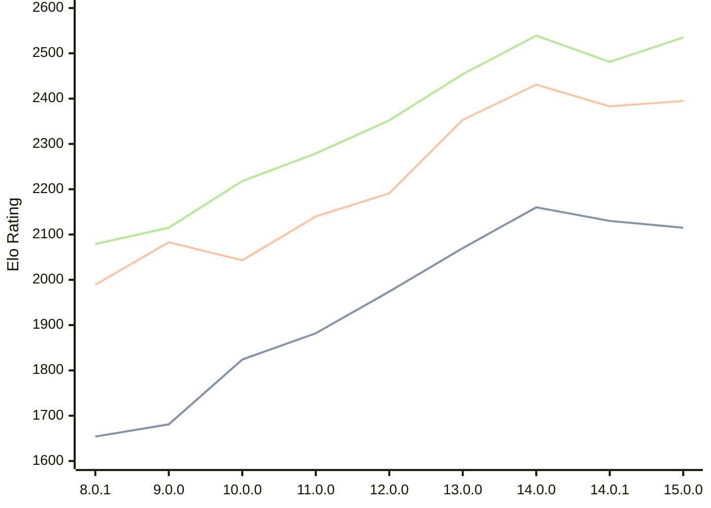

# Engine: Cepimetheus

Author: George Bland

Home: https://github.com/mrgwbland/Cepimetheus

## Elo Ratings

| Version | Published | STC 8.0+0.08s  | LTC 60.0+0.60s | VLTC 2m24s+1.12s | Comment |
| --- | --- | --- | --- | --- | --- |
| 15.0.0 | 2026-08-13 | 2115(-15) | 2395(+12) | 2535(+54) |  |
| 14.0.1 | 2026-08-02 | 2130(-30) | 2383(-48) | 2481(-58) |  |
| 14.0.0 | 2026-07-31 | 2160(+90) | 2431(+78) | 2539(+85) |  |
| 13.0.0 | 2026-07-23 | 2070(+96) | 2353(+162) | 2454(+102) |  |
| 12.0.0 | 2026-07-19 | 1974(+92) | 2191(+51) | 2352(+73) |  |
| 11.0.0 | 2026-07-08 | 1882(+58) | 2140(+97) | 2279(+61) |  |
| 10.0.0 | 2026-07-01 | 1824(+143) | 2043(-40) | 2218(+103) |  |
| 9.0.0 | 2026-06-24 | 1681(+27) | 2083(+94) | 2115(+36) |  |
| 8.0.1 | 2026-06-20 | 1654(+new) | 1989(+new) | 2079(+new) |  |
| 8.0.0 | 2026-06-18 |  |  |  |  |
| 7.2.0 | 2026-06-16 |  |  |  |  |
| 7.1.0 | 2026-06-12 |  |  |  |  |
| 7.0.0 | 2026-06-02 |  |  |  |  |
| 6.4.1 | 2026-05-28 |  |  |  |  |
| 6.4.0 | 2026-05-27 |  |  |  |  |
| 6.3.0 | 2026-05-24 |  |  |  |  |
| 6.2.0 | 2026-05-24 |  |  |  |  |
| 6.1.0 | 2026-05-21 |  |  |  |  |
| 6.0.1 | 2026-05-21 |  |  |  |  |
| 6.0.0 | 2026-05-21 |  |  |  |  |
| 5.1.0 | 2026-05-20 |  |  |  |  |
| 5.0.0 | 2026-05-16 |  |  |  |  |
| 4.3.1 | 2026-05-15 |  |  |  |  |
| 4.3.0 | 2026-05-13 |  |  |  |  |
| 4.2.1 | 2026-05-09 |  |  |  |  |
| 4.2.0 | 2026-05-08 |  |  |  |  |
| 4.1.0 | 2026-05-06 |  |  |  |  |
| 4.0.0 | 2026-05-06 |  |  |  |  |
| 3.2.1 | 2026-04-26 |  |  |  |  |
| 3.2.0 | 2026-04-26 |  |  |  |  |
| 3.1.0 | 2026-04-26 |  |  |  |  |
| 3.0.0 | 2026-04-24 |  |  |  |  |
| 2.2.0 | 2026-04-23 |  |  |  |  |
| 2.1.0 | 2026-04-15 |  |  |  |  |
| 2.0.0 | 2026-04-14 |  |  |  |  |
| 1.0.0 | 2026-04-07 |  |  |  |  |
 | | | cElo (∆ prev) | cElo (∆ prev) | cElo (∆ prev) | 

<a href="https://github.com/computer-chess-index/cci/issues/new?template=submit-version.yml&title=[VERSION]+Cepimetheus+<version>&body=###%20Engine%20name%0ACepimetheus%0A%0A###%20Version%0A15.0.0" target="_blank">Submit new version</a>

 Test Conditions:

GUI/CLI: <a href=https://github.com/cutechess/cutechess target="_blank">Cute-Chess</a> 
Elo Calculation: <a href=https://www.remi-coulom.fr/Bayesian-Elo/ target="_blank">Bayesian-Elo</a> 
CPU: Intel(R) Core(TM) i5-7500T 2.70GHz 
Opening book: 8_moves_v3 
\* STC: 8.0+0.08s, LTC: 60.0+0.60s, VLTC: 2m24s+1.12s

 Lists:
Ratings: <a href=https://github.com/computer-chess-index/cci/blob/main/lists/CCIRatings.csv target="_blank">Complete list</a>

Generated: 2026-08-25 06:23:35

## Ratings Verlauf

⬛ STC (8.0+0.08s) &nbsp;&nbsp; 🟧 LTC (60.0+0.60s) &nbsp;&nbsp; 🟩 VLTC (2m24s+1.12s)

dark mode: 🟩STC (8.0+0.08s) 🟧LTC (60.0+0.60s) ⬜VLTC (2m24s+1.12s)

## Detailed Evaluation Results

| Version | Time Control | Elo  | Range +/- | Matches | Score | Average Opponent Elo | Draws |
| --- | --- | --- | --- | --- | --- | --- | --- |
| 15.0.0 | VLTC (2m24s+1.12s) | 2535 | 42 | 188 | 48% | 2550 | 28% |
| 15.0.0 | LTC (60.0+0.60s) | 2395 | 42 | 188 | 50% | 2396 | 27% |
| 15.0.0 | STC (8.0+0.08s) | 2115 | 45 | 164 | 50% | 2114 | 26% |
| --- | --- | --- | --- | --- | --- | --- | --- |
| 14.0.1 | VLTC (2m24s+1.12s) | 2481 | 34 | 286 | 51% | 2475 | 30% |
| 14.0.1 | LTC (60.0+0.60s) | 2383 | 35 | 278 | 51% | 2384 | 28% |
| 14.0.1 | STC (8.0+0.08s) | 2130 | 39 | 236 | 49% | 2140 | 19% |
| --- | --- | --- | --- | --- | --- | --- | --- |
| 14.0.0 | VLTC (2m24s+1.12s) | 2539 | 36 | 256 | 48% | 2554 | 29% |
| 14.0.0 | LTC (60.0+0.60s) | 2431 | 33 | 304 | 47% | 2464 | 28% |
| 14.0.0 | STC (8.0+0.08s) | 2160 | 37 | 256 | 50% | 2153 | 22% |
| --- | --- | --- | --- | --- | --- | --- | --- |
| 13.0.0 | VLTC (2m24s+1.12s) | 2454 | 36 | 264 | 49% | 2462 | 25% |
| 13.0.0 | LTC (60.0+0.60s) | 2353 | 40 | 224 | 50% | 2354 | 21% |
| 13.0.0 | STC (8.0+0.08s) | 2070 | 39 | 234 | 52% | 2048 | 21% |
| --- | --- | --- | --- | --- | --- | --- | --- |
| 12.0.0 | VLTC (2m24s+1.12s) | 2352 | 40 | 216 | 51% | 2338 | 26% |
| 12.0.0 | LTC (60.0+0.60s) | 2191 | 37 | 256 | 48% | 2198 | 25% |
| 12.0.0 | STC (8.0+0.08s) | 1974 | 44 | 186 | 52% | 1952 | 18% |
| --- | --- | --- | --- | --- | --- | --- | --- |
| 11.0.0 | VLTC (2m24s+1.12s) | 2279 | 54 | 118 | 47% | 2299 | 25% |
| 11.0.0 | LTC (60.0+0.60s) | 2140 | 55 | 116 | 49% | 2147 | 21% |
| 11.0.0 | STC (8.0+0.08s) | 1882 | 64 | 88 | 50% | 1885 | 18% |
| --- | --- | --- | --- | --- | --- | --- | --- |
| 10.0.0 | VLTC (2m24s+1.12s) | 2218 | 40 | 228 | 48% | 2240 | 19% |
| 10.0.0 | LTC (60.0+0.60s) | 2043 | 44 | 178 | 50% | 2045 | 21% |
| 10.0.0 | STC (8.0+0.08s) | 1824 | 43 | 184 | 49% | 1836 | 27% |
| --- | --- | --- | --- | --- | --- | --- | --- |
| 9.0.0 | VLTC (2m24s+1.12s) | 2115 | 36 | 268 | 48% | 2133 | 22% |
| 9.0.0 | LTC (60.0+0.60s) | 2083 | 39 | 220 | 49% | 2091 | 26% |
| 9.0.0 | STC (8.0+0.08s) | 1681 | 40 | 232 | 50% | 1678 | 18% |
| --- | --- | --- | --- | --- | --- | --- | --- |
| 8.0.1 | VLTC (2m24s+1.12s) | 2079 | 36 | 276 | 47% | 2113 | 23% |
| 8.0.1 | LTC (60.0+0.60s) | 1989 | 37 | 260 | 49% | 2002 | 23% |
| 8.0.1 | STC (8.0+0.08s) | 1654 | 42 | 212 | 49% | 1669 | 16% |
| --- | --- | --- | --- | --- | --- | --- | --- |