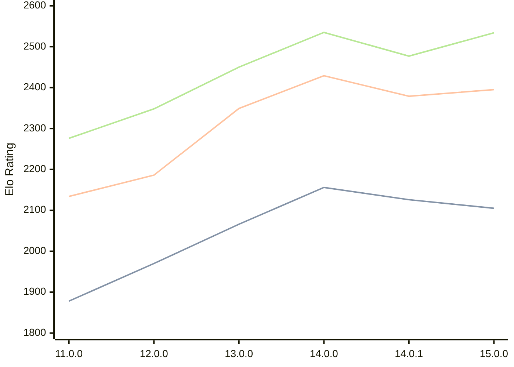

# Engine: Cepimetheus

Author: George Bland

Home: https://github.com/mrgwbland/Cepimetheus

## Elo Ratings

| Version | Published | STC 8.0+0.08s  | LTC 60.0+0.60s | VLTC 2m24s+1.12s | Comment |
| --- | --- | --- | --- | --- | --- |
| 15.0.0 | 2026-08-13 | 2105(-21) | 2395(+16) | 2534(+57) |  |
| 14.0.1 | 2026-08-02 | 2126(-30) | 2379(-50) | 2477(-58) |  |
| 14.0.0 | 2026-07-31 | 2156(+90) | 2429(+80) | 2535(+85) |  |
| 13.0.0 | 2026-07-23 | 2066(+96) | 2349(+163) | 2450(+102) |  |
| 12.0.0 | 2026-07-19 | 1970(+92) | 2186(+52) | 2348(+72) |  |
| 11.0.0 | 2026-07-08 | 1878(+new) | 2134(+new) | 2276(+new) |  |
| 10.0.0 | 2026-07-01 |  |  |  |  |
| 9.0.0 | 2026-06-24 |  |  |  |  |
| 8.0.1 | 2026-06-20 |  |  |  |  |
| 8.0.0 | 2026-06-18 |  |  |  |  |
| 7.2.0 | 2026-06-16 |  |  |  |  |
| 7.1.0 | 2026-06-12 |  |  |  |  |
| 7.0.0 | 2026-06-02 |  |  |  |  |
| 6.4.1 | 2026-05-28 |  |  |  |  |
| 6.4.0 | 2026-05-27 |  |  |  |  |
| 6.3.0 | 2026-05-24 |  |  |  |  |
| 6.2.0 | 2026-05-24 |  |  |  |  |
| 6.1.0 | 2026-05-21 |  |  |  |  |
| 6.0.1 | 2026-05-21 |  |  |  |  |
| 6.0.0 | 2026-05-21 |  |  |  |  |
| 5.1.0 | 2026-05-20 |  |  |  |  |
| 5.0.0 | 2026-05-16 |  |  |  |  |
| 4.3.1 | 2026-05-15 |  |  |  |  |
| 4.3.0 | 2026-05-13 |  |  |  |  |
| 4.2.1 | 2026-05-09 |  |  |  |  |
| 4.2.0 | 2026-05-08 |  |  |  |  |
| 4.1.0 | 2026-05-06 |  |  |  |  |
| 4.0.0 | 2026-05-06 |  |  |  |  |
| 3.2.1 | 2026-04-26 |  |  |  |  |
| 3.2.0 | 2026-04-26 |  |  |  |  |
| 3.1.0 | 2026-04-26 |  |  |  |  |
| 3.0.0 | 2026-04-24 |  |  |  |  |
| 2.2.0 | 2026-04-23 |  |  |  |  |
| 2.1.0 | 2026-04-15 |  |  |  |  |
| 2.0.0 | 2026-04-14 |  |  |  |  |
| 1.0.0 | 2026-04-07 |  |  |  |  |
 | | | cElo (∆ prev) | cElo (∆ prev) | cElo (∆ prev) | 

<a href="https://github.com/computer-chess-index/cci/issues/new?template=submit-version.yml&title=[VERSION]+Cepimetheus+<version>&body=###%20Engine%20name%0ACepimetheus%0A%0A###%20Version%0A15.0.0" target="_blank">Submit new version</a>

 Test Conditions:

GUI/CLI: <a href=https://github.com/cutechess/cutechess target="_blank">Cute-Chess</a> 
Elo Calculation: <a href=https://www.remi-coulom.fr/Bayesian-Elo/ target="_blank">Bayesian-Elo</a> 
CPU: Intel(R) Core(TM) i5-7500T 2.70GHz 
Opening book: 8_moves_v3 
\* STC: 8.0+0.08s, LTC: 60.0+0.60s, VLTC: 2m24s+1.12s

 Lists:
Ratings: <a href=https://github.com/computer-chess-index/cci/blob/main/lists/CCIRatings.csv target="_blank">Complete list</a>

Generated: 2026-08-18 06:23:31

## Ratings Verlauf

⬛ STC (8.0+0.08s) &nbsp;&nbsp; 🟧 LTC (60.0+0.60s) &nbsp;&nbsp; 🟩 VLTC (2m24s+1.12s)

dark mode: 🟩STC (8.0+0.08s) 🟧LTC (60.0+0.60s) ⬜VLTC (2m24s+1.12s)

## Detailed Evaluation Results

| Version | Time Control | Elo  | Range +/- | Matches | Score | Average Opponent Elo | Draws |
| --- | --- | --- | --- | --- | --- | --- | --- |
| 15.0.0 | VLTC (2m24s+1.12s) | 2534 | 43 | 182 | 49% | 2546 | 27% |
| 15.0.0 | LTC (60.0+0.60s) | 2395 | 43 | 180 | 51% | 2391 | 27% |
| 15.0.0 | STC (8.0+0.08s) | 2105 | 47 | 156 | 49% | 2111 | 24% |
| --- | --- | --- | --- | --- | --- | --- | --- |
| 14.0.1 | VLTC (2m24s+1.12s) | 2477 | 34 | 286 | 51% | 2472 | 30% |
| 14.0.1 | LTC (60.0+0.60s) | 2379 | 35 | 278 | 51% | 2380 | 28% |
| 14.0.1 | STC (8.0+0.08s) | 2126 | 39 | 236 | 49% | 2136 | 19% |
| --- | --- | --- | --- | --- | --- | --- | --- |
| 14.0.0 | VLTC (2m24s+1.12s) | 2535 | 36 | 256 | 48% | 2550 | 29% |
| 14.0.0 | LTC (60.0+0.60s) | 2429 | 33 | 304 | 47% | 2461 | 28% |
| 14.0.0 | STC (8.0+0.08s) | 2156 | 37 | 256 | 50% | 2149 | 22% |
| --- | --- | --- | --- | --- | --- | --- | --- |
| 13.0.0 | VLTC (2m24s+1.12s) | 2450 | 36 | 264 | 49% | 2458 | 25% |
| 13.0.0 | LTC (60.0+0.60s) | 2349 | 40 | 224 | 50% | 2352 | 21% |
| 13.0.0 | STC (8.0+0.08s) | 2066 | 39 | 234 | 52% | 2044 | 21% |
| --- | --- | --- | --- | --- | --- | --- | --- |
| 12.0.0 | VLTC (2m24s+1.12s) | 2348 | 40 | 216 | 51% | 2334 | 26% |
| 12.0.0 | LTC (60.0+0.60s) | 2186 | 37 | 256 | 48% | 2194 | 25% |
| 12.0.0 | STC (8.0+0.08s) | 1970 | 44 | 186 | 52% | 1948 | 18% |
| --- | --- | --- | --- | --- | --- | --- | --- |
| 11.0.0 | VLTC (2m24s+1.12s) | 2276 | 54 | 118 | 47% | 2296 | 25% |
| 11.0.0 | LTC (60.0+0.60s) | 2134 | 55 | 116 | 49% | 2142 | 21% |
| 11.0.0 | STC (8.0+0.08s) | 1878 | 64 | 88 | 50% | 1881 | 18% |
| --- | --- | --- | --- | --- | --- | --- | --- |