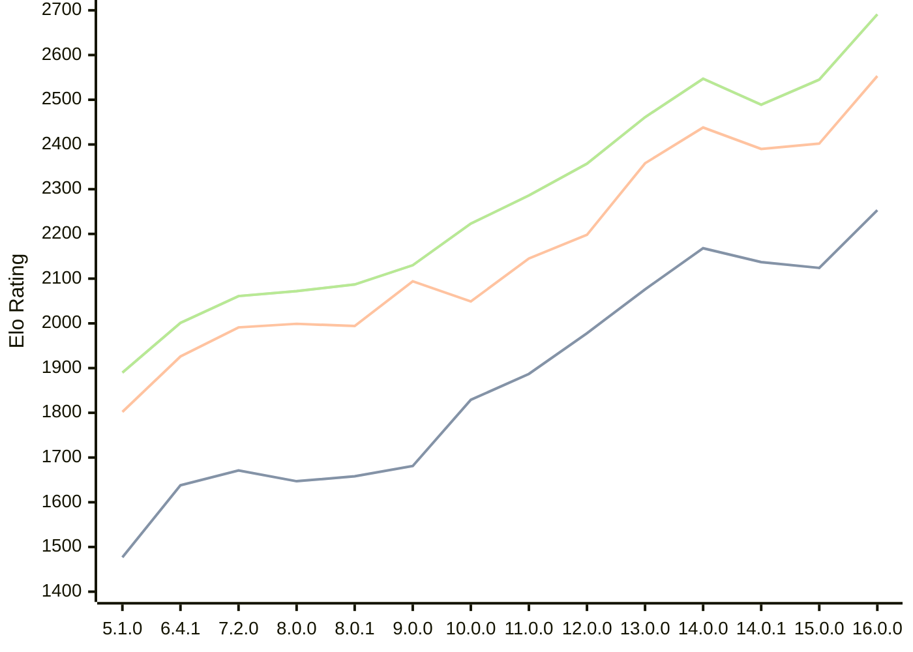

# Engine: Cepimetheus

Author: George Bland

Home: https://github.com/mrgwbland/Cepimetheus

## Elo Ratings

| Version | Published | STC 8.0+0.08s  | LTC 60.0+0.60s | VLTC 2m24s+1.12s | Comment |
| --- | --- | --- | --- | --- | --- |
| 17.0.0 | 2026-09-28 |  |  |  |  |
| 16.0.0 | 2026-08-30 | 2253(+129) | 2553(+151) | 2691(+146) |  |
| 15.0.0 | 2026-08-13 | 2124(-13) | 2402(+12) | 2545(+56) |  |
| 14.0.1 | 2026-08-02 | 2137(-31) | 2390(-48) | 2489(-58) |  |
| 14.0.0 | 2026-07-31 | 2168(+92) | 2438(+80) | 2547(+86) |  |
| 13.0.0 | 2026-07-23 | 2076(+98) | 2358(+160) | 2461(+104) |  |
| 12.0.0 | 2026-07-19 | 1978(+91) | 2198(+53) | 2357(+71) |  |
| 11.0.0 | 2026-07-08 | 1887(+58) | 2145(+96) | 2286(+63) |  |
| 10.0.0 | 2026-07-01 | 1829(+148) | 2049(-45) | 2223(+93) |  |
| 9.0.0 | 2026-06-24 | 1681(+23) | 2094(+100) | 2130(+43) |  |
| 8.0.1 | 2026-06-20 | 1658(+11) | 1994(-5) | 2087(+15) |  |
| 8.0.0 | 2026-06-18 | 1647(-24) | 1999(+8) | 2072(+11) |  |
| 7.2.0 | 2026-06-16 | 1671(+new) | 1991(+new) | 2061(+new) |  |
| 7.1.0 | 2026-06-12 |  |  |  |  |
| 7.0.0 | 2026-06-02 |  |  |  |  |
| 6.4.1 | 2026-05-28 | 1638(+new) | 1926(+new) | 2001(+new) |  |
| 6.4.0 | 2026-05-27 |  |  |  |  |
| 6.3.0 | 2026-05-24 |  |  |  |  |
| 6.2.0 | 2026-05-24 |  |  |  |  |
| 6.1.0 | 2026-05-21 |  |  |  |  |
| 6.0.1 | 2026-05-21 |  |  |  |  |
| 6.0.0 | 2026-05-21 |  |  |  |  |
| 5.1.0 | 2026-05-20 | 1477(+new) | 1802(+new) | 1890(+new) |  |
| 5.0.0 | 2026-05-16 |  |  |  |  |
| 4.3.1 | 2026-05-15 |  |  |  |  |
| 4.3.0 | 2026-05-13 |  |  |  |  |
| 4.2.1 | 2026-05-09 |  |  |  |  |
| 4.2.0 | 2026-05-08 |  |  |  |  |
| 4.1.0 | 2026-05-06 |  |  |  |  |
| 4.0.0 | 2026-05-06 |  |  |  |  |
| 3.2.1 | 2026-04-26 |  |  |  |  |
| 3.2.0 | 2026-04-26 |  |  |  |  |
| 3.1.0 | 2026-04-26 |  |  |  |  |
| 3.0.0 | 2026-04-24 |  |  |  |  |
| 2.2.0 | 2026-04-23 |  |  |  |  |
| 2.1.0 | 2026-04-15 |  |  |  |  |
| 2.0.0 | 2026-04-14 |  |  |  |  |
| 1.0.0 | 2026-04-07 |  |  |  |  |
 | | | cElo (∆ prev) | cElo (∆ prev) | cElo (∆ prev) | 

<a href="https://github.com/computer-chess-index/cci/issues/new?template=submit-version.yml&title=[VERSION]+Cepimetheus+<version>&body=###%20Engine%20name%0ACepimetheus%0A%0A###%20Version%0A17.0.0" target="_blank">Submit new version</a>

 Test Conditions:

GUI/CLI: <a href=https://github.com/cutechess/cutechess target="_blank">Cute-Chess</a> 
Elo Calculation: <a href=https://www.remi-coulom.fr/Bayesian-Elo/ target="_blank">Bayesian-Elo</a> 
CPU: Intel(R) Core(TM) i5-7500T 2.70GHz 
Opening book: 8_moves_v3 
\* STC: 8.0+0.08s, LTC: 60.0+0.60s, VLTC: 2m24s+1.12s

 Lists:
Ratings: <a href=https://github.com/computer-chess-index/cci/blob/main/lists/CCIRatings.csv target="_blank">Complete list</a>

Generated: 2026-10-01 04:36:51

## Ratings Verlauf

```mermaid
%%{init: {"theme":"base","themeVariables":{"seriesColors:['#a3a3a3','#222221','#faa371']}}}%%
xychart-beta
  x-axis ["5.1.0", "6.4.1", "7.2.0", "8.0.0", "8.0.1", "9.0.0", "10.0.0", "11.0.0", "12.0.0", "13.0.0", "14.0.0", "14.0.1", "15.0.0", "16.0.0"]
  y-axis "Elo Rating" 1400 --> 2700
  line "" [1477, 1638, 1671, 1647, 1658, 1681, 1829, 1887, 1978, 2076, 2168, 2137, 2124, 2253]
  line "STC (8.0+0.08s)" [1477, 1638, 1671, 1647, 1658, 1681, 1829, 1887, 1978, 2076, 2168, 2137, 2124, 2253]
  line "LTC (60.0+0.60s)" [1802, 1926, 1991, 1999, 1994, 2094, 2049, 2145, 2198, 2358, 2438, 2390, 2402, 2553]
  line "" [1890, 2001, 2061, 2072, 2087, 2130, 2223, 2286, 2357, 2461, 2547, 2489, 2545, 2691]
  line "VLTC (2m24s+1.12s)" [1890, 2001, 2061, 2072, 2087, 2130, 2223, 2286, 2357, 2461, 2547, 2489, 2545, 2691]
```

## Detailed Evaluation Results

| Version | Time Control | Elo  | Range +/- | Matches | Score | Average Opponent Elo | Draws |
| --- | --- | --- | --- | --- | --- | --- | --- |
| 16.0.0 | VLTC (2m24s+1.12s) | 2691 | 41 | 192 | 51% | 2678 | 29% |
| 16.0.0 | LTC (60.0+0.60s) | 2553 | 40 | 206 | 51% | 2541 | 30% |
| 16.0.0 | STC (8.0+0.08s) | 2253 | 40 | 232 | 53% | 2222 | 16% |
| --- | --- | --- | --- | --- | --- | --- | --- |
| 15.0.0 | VLTC (2m24s+1.12s) | 2545 | 42 | 188 | 48% | 2560 | 28% |
| 15.0.0 | LTC (60.0+0.60s) | 2402 | 42 | 188 | 50% | 2403 | 27% |
| 15.0.0 | STC (8.0+0.08s) | 2124 | 45 | 164 | 50% | 2122 | 26% |
| --- | --- | --- | --- | --- | --- | --- | --- |
| 14.0.1 | VLTC (2m24s+1.12s) | 2489 | 34 | 286 | 51% | 2483 | 30% |
| 14.0.1 | LTC (60.0+0.60s) | 2390 | 35 | 278 | 51% | 2391 | 28% |
| 14.0.1 | STC (8.0+0.08s) | 2137 | 39 | 236 | 49% | 2147 | 19% |
| --- | --- | --- | --- | --- | --- | --- | --- |
| 14.0.0 | VLTC (2m24s+1.12s) | 2547 | 36 | 256 | 48% | 2562 | 29% |
| 14.0.0 | LTC (60.0+0.60s) | 2438 | 33 | 304 | 47% | 2471 | 28% |
| 14.0.0 | STC (8.0+0.08s) | 2168 | 37 | 256 | 50% | 2161 | 22% |
| --- | --- | --- | --- | --- | --- | --- | --- |
| 13.0.0 | VLTC (2m24s+1.12s) | 2461 | 36 | 264 | 49% | 2471 | 25% |
| 13.0.0 | LTC (60.0+0.60s) | 2358 | 40 | 224 | 50% | 2361 | 21% |
| 13.0.0 | STC (8.0+0.08s) | 2076 | 39 | 234 | 52% | 2056 | 21% |
| --- | --- | --- | --- | --- | --- | --- | --- |
| 12.0.0 | VLTC (2m24s+1.12s) | 2357 | 40 | 216 | 51% | 2344 | 26% |
| 12.0.0 | LTC (60.0+0.60s) | 2198 | 37 | 256 | 48% | 2205 | 25% |
| 12.0.0 | STC (8.0+0.08s) | 1978 | 44 | 186 | 52% | 1958 | 18% |
| --- | --- | --- | --- | --- | --- | --- | --- |
| 11.0.0 | VLTC (2m24s+1.12s) | 2286 | 54 | 118 | 47% | 2306 | 25% |
| 11.0.0 | LTC (60.0+0.60s) | 2145 | 55 | 116 | 49% | 2152 | 21% |
| 11.0.0 | STC (8.0+0.08s) | 1887 | 64 | 88 | 50% | 1891 | 18% |
| --- | --- | --- | --- | --- | --- | --- | --- |
| 10.0.0 | VLTC (2m24s+1.12s) | 2223 | 40 | 228 | 48% | 2245 | 19% |
| 10.0.0 | LTC (60.0+0.60s) | 2049 | 44 | 178 | 50% | 2052 | 21% |
| 10.0.0 | STC (8.0+0.08s) | 1829 | 43 | 184 | 49% | 1840 | 27% |
| --- | --- | --- | --- | --- | --- | --- | --- |
| 9.0.0 | VLTC (2m24s+1.12s) | 2130 | 35 | 284 | 49% | 2138 | 23% |
| 9.0.0 | LTC (60.0+0.60s) | 2094 | 36 | 268 | 50% | 2093 | 25% |
| 9.0.0 | STC (8.0+0.08s) | 1681 | 36 | 284 | 50% | 1679 | 18% |
| --- | --- | --- | --- | --- | --- | --- | --- |
| 8.0.1 | VLTC (2m24s+1.12s) | 2087 | 35 | 280 | 47% | 2118 | 23% |
| 8.0.1 | LTC (60.0+0.60s) | 1994 | 37 | 260 | 49% | 2007 | 23% |
| 8.0.1 | STC (8.0+0.08s) | 1658 | 41 | 220 | 48% | 1674 | 16% |
| --- | --- | --- | --- | --- | --- | --- | --- |
| 8.0.0 | VLTC (2m24s+1.12s) | 2072 | 41 | 202 | 50% | 2072 | 24% |
| 8.0.0 | LTC (60.0+0.60s) | 1999 | 41 | 218 | 49% | 2006 | 19% |
| 8.0.0 | STC (8.0+0.08s) | 1647 | 41 | 220 | 48% | 1669 | 17% |
| --- | --- | --- | --- | --- | --- | --- | --- |
| 7.2.0 | VLTC (2m24s+1.12s) | 2061 | 44 | 178 | 51% | 2052 | 21% |
| 7.2.0 | LTC (60.0+0.60s) | 1991 | 44 | 184 | 52% | 1971 | 22% |
| 7.2.0 | STC (8.0+0.08s) | 1671 | 43 | 196 | 51% | 1662 | 18% |
| --- | --- | --- | --- | --- | --- | --- | --- |
| 6.4.1 | VLTC (2m24s+1.12s) | 2001 | 42 | 200 | 50% | 2006 | 19% |
| 6.4.1 | LTC (60.0+0.60s) | 1926 | 40 | 222 | 51% | 1922 | 23% |
| 6.4.1 | STC (8.0+0.08s) | 1638 | 41 | 216 | 48% | 1658 | 17% |
| --- | --- | --- | --- | --- | --- | --- | --- |
| 5.1.0 | VLTC (2m24s+1.12s) | 1890 | 42 | 230 | 49% | 1898 | 7% |
| 5.1.0 | LTC (60.0+0.60s) | 1802 | 42 | 234 | 50% | 1801 | 4% |
| 5.1.0 | STC (8.0+0.08s) | 1477 | 43 | 222 | 51% | 1469 | 7% |
| --- | --- | --- | --- | --- | --- | --- | --- |