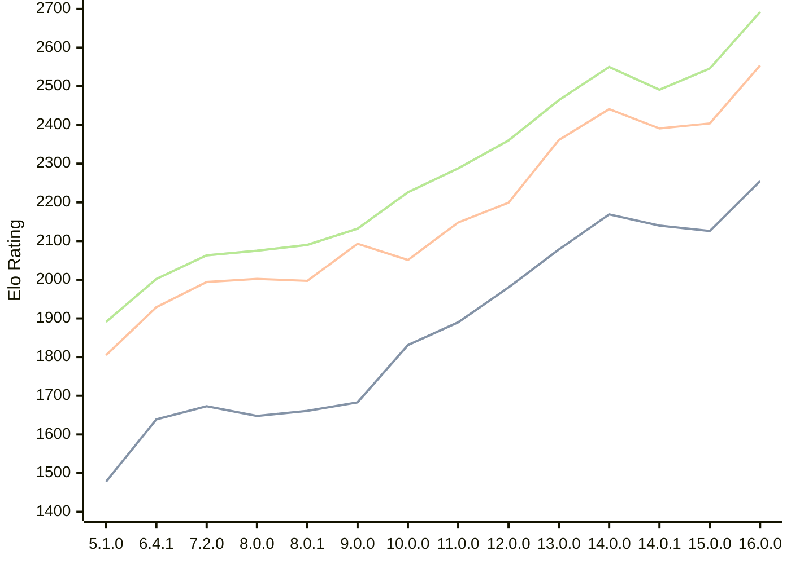

# Engine: Cepimetheus

Author: George Bland

Home: https://github.com/mrgwbland/Cepimetheus

## Elo Ratings

| Version | Published | STC 8.0+0.08s  | LTC 60.0+0.60s | VLTC 2m24s+1.12s | Comment |
| --- | --- | --- | --- | --- | --- |
| 17.0.0 | 2026-09-28 |  |  |  |  |
| 16.0.0 | 2026-08-30 | 2255(+129) | 2554(+150) | 2692(+146) |  |
| 15.0.0 | 2026-08-13 | 2126(-14) | 2404(+13) | 2546(+55) |  |
| 14.0.1 | 2026-08-02 | 2140(-29) | 2391(-50) | 2491(-59) |  |
| 14.0.0 | 2026-07-31 | 2169(+91) | 2441(+80) | 2550(+86) |  |
| 13.0.0 | 2026-07-23 | 2078(+98) | 2361(+162) | 2464(+104) |  |
| 12.0.0 | 2026-07-19 | 1980(+90) | 2199(+51) | 2360(+72) |  |
| 11.0.0 | 2026-07-08 | 1890(+59) | 2148(+97) | 2288(+62) |  |
| 10.0.0 | 2026-07-01 | 1831(+148) | 2051(-42) | 2226(+94) |  |
| 9.0.0 | 2026-06-24 | 1683(+22) | 2093(+96) | 2132(+42) |  |
| 8.0.1 | 2026-06-20 | 1661(+13) | 1997(-5) | 2090(+15) |  |
| 8.0.0 | 2026-06-18 | 1648(-25) | 2002(+8) | 2075(+12) |  |
| 7.2.0 | 2026-06-16 | 1673(+new) | 1994(+new) | 2063(+new) |  |
| 7.1.0 | 2026-06-12 |  |  |  |  |
| 7.0.0 | 2026-06-02 |  |  |  |  |
| 6.4.1 | 2026-05-28 | 1639(+new) | 1929(+new) | 2002(+new) |  |
| 6.4.0 | 2026-05-27 |  |  |  |  |
| 6.3.0 | 2026-05-24 |  |  |  |  |
| 6.2.0 | 2026-05-24 |  |  |  |  |
| 6.1.0 | 2026-05-21 |  |  |  |  |
| 6.0.1 | 2026-05-21 |  |  |  |  |
| 6.0.0 | 2026-05-21 |  |  |  |  |
| 5.1.0 | 2026-05-20 | 1478(+new) | 1805(+new) | 1891(+new) |  |
| 5.0.0 | 2026-05-16 |  |  |  |  |
| 4.3.1 | 2026-05-15 |  |  |  |  |
| 4.3.0 | 2026-05-13 |  |  |  |  |
| 4.2.1 | 2026-05-09 |  |  |  |  |
| 4.2.0 | 2026-05-08 |  |  |  |  |
| 4.1.0 | 2026-05-06 |  |  |  |  |
| 4.0.0 | 2026-05-06 |  |  |  |  |
| 3.2.1 | 2026-04-26 |  |  |  |  |
| 3.2.0 | 2026-04-26 |  |  |  |  |
| 3.1.0 | 2026-04-26 |  |  |  |  |
| 3.0.0 | 2026-04-24 |  |  |  |  |
| 2.2.0 | 2026-04-23 |  |  |  |  |
| 2.1.0 | 2026-04-15 |  |  |  |  |
| 2.0.0 | 2026-04-14 |  |  |  |  |
| 1.0.0 | 2026-04-07 |  |  |  |  |
 | | | cElo (∆ prev) | cElo (∆ prev) | cElo (∆ prev) | 

<a href="https://github.com/computer-chess-index/cci/issues/new?template=submit-version.yml&title=[VERSION]+Cepimetheus+<version>&body=###%20Engine%20name%0ACepimetheus%0A%0A###%20Version%0A17.0.0" target="_blank">Submit new version</a>

 Test Conditions:

GUI/CLI: <a href=https://github.com/cutechess/cutechess target="_blank">Cute-Chess</a> 
Elo Calculation: <a href=https://www.remi-coulom.fr/Bayesian-Elo/ target="_blank">Bayesian-Elo</a> 
CPU: Intel(R) Core(TM) i5-7500T 2.70GHz 
Opening book: 8_moves_v3 
\* STC: 8.0+0.08s, LTC: 60.0+0.60s, VLTC: 2m24s+1.12s

 Lists:
Ratings: <a href=https://github.com/computer-chess-index/cci/blob/main/lists/CCIRatings.csv target="_blank">Complete list</a>

Generated: 2026-10-09 04:36:46

## Ratings Verlauf

```mermaid
%%{init: {"theme":"base","themeVariables":{"seriesColors:['#a3a3a3','#222221','#faa371']}}}%%
xychart-beta
  x-axis ["5.1.0", "6.4.1", "7.2.0", "8.0.0", "8.0.1", "9.0.0", "10.0.0", "11.0.0", "12.0.0", "13.0.0", "14.0.0", "14.0.1", "15.0.0", "16.0.0"]
  y-axis "Elo Rating" 1400 --> 2700
  line "" [1478, 1639, 1673, 1648, 1661, 1683, 1831, 1890, 1980, 2078, 2169, 2140, 2126, 2255]
  line "STC (8.0+0.08s)" [1478, 1639, 1673, 1648, 1661, 1683, 1831, 1890, 1980, 2078, 2169, 2140, 2126, 2255]
  line "LTC (60.0+0.60s)" [1805, 1929, 1994, 2002, 1997, 2093, 2051, 2148, 2199, 2361, 2441, 2391, 2404, 2554]
  line "" [1891, 2002, 2063, 2075, 2090, 2132, 2226, 2288, 2360, 2464, 2550, 2491, 2546, 2692]
  line "VLTC (2m24s+1.12s)" [1891, 2002, 2063, 2075, 2090, 2132, 2226, 2288, 2360, 2464, 2550, 2491, 2546, 2692]
```

## Detailed Evaluation Results

| Version | Time Control | Elo  | Range +/- | Matches | Score | Average Opponent Elo | Draws |
| --- | --- | --- | --- | --- | --- | --- | --- |
| 16.0.0 | VLTC (2m24s+1.12s) | 2692 | 41 | 192 | 51% | 2681 | 29% |
| 16.0.0 | LTC (60.0+0.60s) | 2554 | 40 | 206 | 51% | 2543 | 30% |
| 16.0.0 | STC (8.0+0.08s) | 2255 | 40 | 232 | 53% | 2223 | 16% |
| --- | --- | --- | --- | --- | --- | --- | --- |
| 15.0.0 | VLTC (2m24s+1.12s) | 2546 | 42 | 188 | 48% | 2562 | 28% |
| 15.0.0 | LTC (60.0+0.60s) | 2404 | 42 | 188 | 50% | 2406 | 27% |
| 15.0.0 | STC (8.0+0.08s) | 2126 | 45 | 164 | 50% | 2124 | 26% |
| --- | --- | --- | --- | --- | --- | --- | --- |
| 14.0.1 | VLTC (2m24s+1.12s) | 2491 | 34 | 286 | 51% | 2485 | 30% |
| 14.0.1 | LTC (60.0+0.60s) | 2391 | 35 | 278 | 51% | 2392 | 28% |
| 14.0.1 | STC (8.0+0.08s) | 2140 | 39 | 236 | 49% | 2149 | 19% |
| --- | --- | --- | --- | --- | --- | --- | --- |
| 14.0.0 | VLTC (2m24s+1.12s) | 2550 | 36 | 256 | 48% | 2565 | 29% |
| 14.0.0 | LTC (60.0+0.60s) | 2441 | 33 | 304 | 47% | 2473 | 28% |
| 14.0.0 | STC (8.0+0.08s) | 2169 | 37 | 256 | 50% | 2163 | 22% |
| --- | --- | --- | --- | --- | --- | --- | --- |
| 13.0.0 | VLTC (2m24s+1.12s) | 2464 | 36 | 264 | 49% | 2472 | 25% |
| 13.0.0 | LTC (60.0+0.60s) | 2361 | 40 | 224 | 50% | 2364 | 21% |
| 13.0.0 | STC (8.0+0.08s) | 2078 | 39 | 234 | 52% | 2057 | 21% |
| --- | --- | --- | --- | --- | --- | --- | --- |
| 12.0.0 | VLTC (2m24s+1.12s) | 2360 | 40 | 216 | 51% | 2346 | 26% |
| 12.0.0 | LTC (60.0+0.60s) | 2199 | 37 | 256 | 48% | 2207 | 25% |
| 12.0.0 | STC (8.0+0.08s) | 1980 | 44 | 186 | 52% | 1959 | 18% |
| --- | --- | --- | --- | --- | --- | --- | --- |
| 11.0.0 | VLTC (2m24s+1.12s) | 2288 | 54 | 118 | 47% | 2309 | 25% |
| 11.0.0 | LTC (60.0+0.60s) | 2148 | 55 | 116 | 49% | 2155 | 21% |
| 11.0.0 | STC (8.0+0.08s) | 1890 | 64 | 88 | 50% | 1893 | 18% |
| --- | --- | --- | --- | --- | --- | --- | --- |
| 10.0.0 | VLTC (2m24s+1.12s) | 2226 | 40 | 228 | 48% | 2246 | 19% |
| 10.0.0 | LTC (60.0+0.60s) | 2051 | 44 | 178 | 50% | 2053 | 21% |
| 10.0.0 | STC (8.0+0.08s) | 1831 | 43 | 184 | 49% | 1841 | 27% |
| --- | --- | --- | --- | --- | --- | --- | --- |
| 9.0.0 | VLTC (2m24s+1.12s) | 2132 | 35 | 284 | 49% | 2140 | 23% |
| 9.0.0 | LTC (60.0+0.60s) | 2093 | 36 | 272 | 50% | 2095 | 25% |
| 9.0.0 | STC (8.0+0.08s) | 1683 | 36 | 284 | 50% | 1682 | 18% |
| --- | --- | --- | --- | --- | --- | --- | --- |
| 8.0.1 | VLTC (2m24s+1.12s) | 2090 | 35 | 280 | 47% | 2121 | 23% |
| 8.0.1 | LTC (60.0+0.60s) | 1997 | 37 | 260 | 49% | 2009 | 23% |
| 8.0.1 | STC (8.0+0.08s) | 1661 | 41 | 220 | 48% | 1677 | 16% |
| --- | --- | --- | --- | --- | --- | --- | --- |
| 8.0.0 | VLTC (2m24s+1.12s) | 2075 | 41 | 202 | 50% | 2075 | 24% |
| 8.0.0 | LTC (60.0+0.60s) | 2002 | 41 | 218 | 49% | 2007 | 19% |
| 8.0.0 | STC (8.0+0.08s) | 1648 | 41 | 220 | 48% | 1671 | 17% |
| --- | --- | --- | --- | --- | --- | --- | --- |
| 7.2.0 | VLTC (2m24s+1.12s) | 2063 | 44 | 178 | 51% | 2053 | 21% |
| 7.2.0 | LTC (60.0+0.60s) | 1994 | 44 | 184 | 52% | 1974 | 22% |
| 7.2.0 | STC (8.0+0.08s) | 1673 | 43 | 196 | 51% | 1663 | 18% |
| --- | --- | --- | --- | --- | --- | --- | --- |
| 6.4.1 | VLTC (2m24s+1.12s) | 2002 | 42 | 200 | 50% | 2007 | 19% |
| 6.4.1 | LTC (60.0+0.60s) | 1929 | 40 | 222 | 51% | 1924 | 23% |
| 6.4.1 | STC (8.0+0.08s) | 1639 | 41 | 216 | 48% | 1661 | 17% |
| --- | --- | --- | --- | --- | --- | --- | --- |
| 5.1.0 | VLTC (2m24s+1.12s) | 1891 | 42 | 230 | 49% | 1899 | 7% |
| 5.1.0 | LTC (60.0+0.60s) | 1805 | 42 | 234 | 50% | 1802 | 4% |
| 5.1.0 | STC (8.0+0.08s) | 1478 | 43 | 222 | 51% | 1472 | 7% |
| --- | --- | --- | --- | --- | --- | --- | --- |