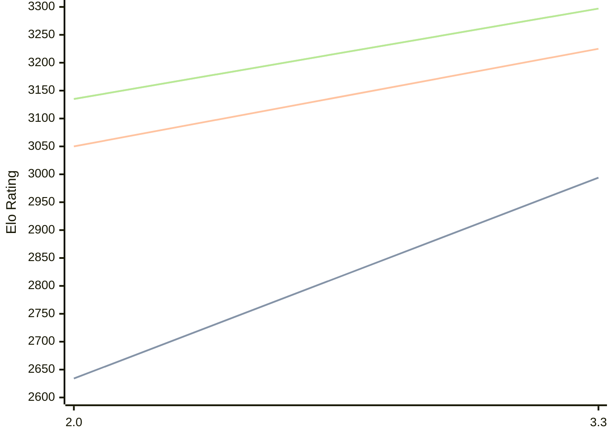

# Engine: Ceylondemon

Author: Madushan Bhashana Dissanayake

Home: https://github.com/Madushan996/CeylonDemon2.0

## Elo Ratings

| Version | Published | STC 8.0+0.08s  | LTC 60.0+0.60s | VLTC 2m24s+1.12s | Comment |
| --- | --- | --- | --- | --- | --- |
| 3.3 | 2026-09-26 | 2994(+360) | 3225(+175) | 3297(+162) |  |
| 2.0 | 2026-08-28 | 2634 | 3050 | 3135 |  |
 | | | cElo (∆ prev) | cElo (∆ prev) | cElo (∆ prev) | 

<a href="https://github.com/computer-chess-index/cci/issues/new?template=submit-version.yml&title=[VERSION]+Ceylondemon+<version>&body=###%20Engine%20name%0ACeylondemon%0A%0A###%20Version%0A3.3" target="_blank">Submit new version</a>

 Test Conditions:

GUI/CLI: <a href=https://github.com/cutechess/cutechess target="_blank">Cute-Chess</a> 
Elo Calculation: <a href=https://www.remi-coulom.fr/Bayesian-Elo/ target="_blank">Bayesian-Elo</a> 
CPU: Intel(R) Core(TM) i5-7500T 2.70GHz 
Opening book: 8_moves_v3 
\* STC: 8.0+0.08s, LTC: 60.0+0.60s, VLTC: 2m24s+1.12s

 Lists:
Ratings: <a href=https://github.com/computer-chess-index/cci/blob/main/lists/CCIRatings.csv target="_blank">Complete list</a>

Generated: 2026-10-02 04:36:55

## Ratings Verlauf

## Detailed Evaluation Results

| Version | Time Control | Elo  | Range +/- | Matches | Score | Average Opponent Elo | Draws |
| --- | --- | --- | --- | --- | --- | --- | --- |
| 3.3 | VLTC (2m24s+1.12s) | 3297 | 41 | 162 | 52% | 3274 | 59% |
| 3.3 | LTC (60.0+0.60s) | 3225 | 42 | 156 | 52% | 3212 | 53% |
| 3.3 | STC (8.0+0.08s) | 2994 | 51 | 120 | 57% | 2932 | 43% |
| --- | --- | --- | --- | --- | --- | --- | --- |
| 2.0 | VLTC (2m24s+1.12s) | 3135 | 29 | 360 | 54% | 3093 | 49% |
| 2.0 | LTC (60.0+0.60s) | 3050 | 31 | 312 | 52% | 3023 | 48% |
| 2.0 | STC (8.0+0.08s) | 2634 | 31 | 348 | 48% | 2649 | 28% |
| --- | --- | --- | --- | --- | --- | --- | --- |