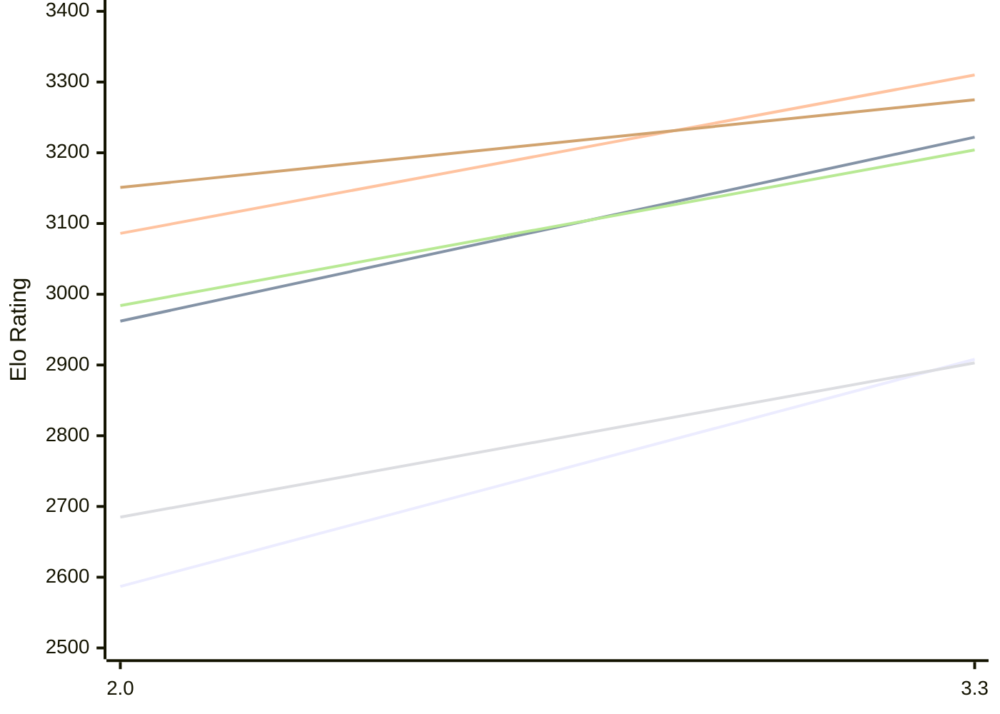
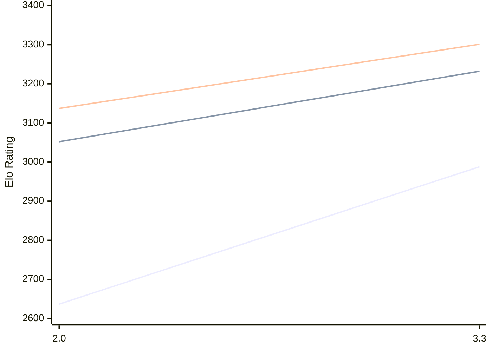

# Engine: Ceylondemon

Author: Madushan B. Dissanayake

Home: https://github.com/Madushan996/CeylonDemon2.0

## Elo Ratings E1 (Ultra 7 265T (1.50 GHz) - E-Core)

| Version | Published | STC 8.0+0.08s  | LTC 60.0+0.60s | VLTC 2m24s+1.12s | Comment |
| --- | --- | --- | --- | --- | --- |
| 3.3 | 2026-09-26 | 2908(+321) | 3222(+260) | 3310(+224) |  |
| 2.0 | 2026-08-28 | 2587 | 2962 | 3086 |  |
 | | | cElo (∆ prev) | cElo (∆ prev) | cElo (∆ prev) | 

## Elo Ratings P1 (Ultra 7 265T (1.50 GHz) - P-Core)

| Version | Published | STC 8.0+0.08s  | LTC 60.0+0.60s | VLTC 2m24s+1.12s | Comment |
| --- | --- | --- | --- | --- | --- |
| 3.3 | 2026-09-26 | 2903(+218) | 3204(+220) | 3275(+124) |  |
| 2.0 | 2026-08-28 | 2685 | 2984 | 3151 |  |
 | | | cElo (∆ prev) | cElo (∆ prev) | cElo (∆ prev) | 

## Elo Ratings T1 (i5-7500T 2.70GHz)

| Version | Published | STC 8.0+0.08s  | LTC 60.0+0.60s | VLTC 2m24s+1.12s | Comment |
| --- | --- | --- | --- | --- | --- |
| 3.3 | 2026-09-26 | 2988(+351) | 3232(+180) | 3301(+164) |  |
| 2.0 | 2026-08-28 | 2637 | 3052 | 3137 |  |
 | | | cElo (∆ prev) | cElo (∆ prev) | cElo (∆ prev) | 

<a href="https://github.com/computer-chess-index/cci/issues/new?template=submit-version.yml&title=[VERSION]+Ceylondemon+<version>&body=###%20Engine%20name%0ACeylondemon%0A%0A###%20Version%0A3.3" target="_blank">Submit new version</a>

 Test Conditions:

GUI/CLI: <a href=https://github.com/cutechess/cutechess target="_blank">Cute-Chess</a> 
Elo Calculation: <a href=https://www.remi-coulom.fr/Bayesian-Elo/ target="_blank">Bayesian-Elo</a> 
CPU for P1: Intel(R) Core(TM) Ultra 7 265T (1.50 GHz) - P-Core 
CPU for E1: Intel(R) Core(TM) Ultra 7 265T (1.50 GHz) - E-Core 
CPU for T1: Intel(R) Core(TM) i5-7500T 2.70GHz 
Opening book: 8_moves_v3 
\* STC: 8.0+0.08s, LTC: 60.0+0.60s, VLTC: 2m24s+1.12s

 Lists:
Ratings: <a href=https://github.com/computer-chess-index/cci/blob/main/lists/CCIRatings.csv target="_blank">Complete list</a>

Generated: 2026-11-23 05:36:54

## Ratings Verlauf E1 / P1

```mermaid
%%{init: {"theme":"base","themeVariables":{"seriesColors:['#a3a3a3','#222221','#faa371']}}}%%
xychart-beta
  x-axis ["2.0", "3.3"]
  y-axis "Elo Rating" 2500 --> 3400
  line "E1: STC (8.0+0.08s)" [2587, 2908]
  line "E1: LTC (60.0+0.60s)" [2962, 3222]
  line "E1: VLTC (2m24s+1.12s)" [3086, 3310]
  line "P1: STC (8.0+0.08s)" [2685, 2903]
  line "P1: LTC (60.0+0.60s)" [2984, 3204]
  line "P1: VLTC (2m24s+1.12s)" [3151, 3275]
```

## Ratings Verlauf T1

```mermaid
%%{init: {"theme":"base","themeVariables":{"seriesColors:['#a3a3a3','#222221','#faa371']}}}%%
xychart-beta
  x-axis ["2.0", "3.3"]
  y-axis "Elo Rating" 2600 --> 3400
  line "T1: STC (8.0+0.08s)" [2637, 2988]
  line "T1: LTC (60.0+0.60s)" [3052, 3232]
  line "T1: VLTC (2m24s+1.12s)" [3137, 3301]
```

## Detailed Evaluation Results

| Version | Time Control | Variant | Elo  | Range +/- | Matches | Score | Average Opponent Elo | Draws |
| --- | --- |--- | --- | --- | --- | --- | --- | --- |
| 3.3 | VLTC (2m24s+1.12s) | P1 | 3275 | 35 | 208 | 52% | 3263 | 64% |
|  |  | E1 | 3310 | 30 | 302 | 50% | 3309 | 58% |
|  |  | T1 | 3301 | 35 | 216 | 52% | 3282 | 58% |
|  | LTC (60.0+0.60s) | E1 | 3222 | 28 | 368 | 50% | 3224 | 54% |
|  |  | T1 | 3232 | 37 | 196 | 52% | 3216 | 58% |
|  |  | P1 | 3204 | 28 | 350 | 53% | 3177 | 57% |
|  | STC (8.0+0.08s) | E1 | 2908 | 28 | 392 | 49% | 2915 | 40% |
|  |  | T1 | 2988 | 44 | 158 | 54% | 2948 | 42% |
|  |  | P1 | 2903 | 36 | 244 | 53% | 2878 | 39% |
| --- | --- |--- | --- | --- | --- | --- | --- | --- |
| 2.0 | VLTC (2m24s+1.12s) | T1 | 3137 | 29 | 360 | 54% | 3096 | 49% |
|  |  | P1 | 3151 | 35 | 234 | 49% | 3159 | 52% |
|  |  | E1 | 3086 | 30 | 336 | 47% | 3109 | 47% |
|  | LTC (60.0+0.60s) | T1 | 3052 | 31 | 312 | 52% | 3025 | 48% |
|  |  | P1 | 2984 | 32 | 290 | 51% | 2974 | 44% |
|  |  | E1 | 2962 | 28 | 372 | 45% | 3002 | 45% |
|  | STC (8.0+0.08s) | T1 | 2637 | 31 | 348 | 48% | 2650 | 28% |
|  |  | P1 | 2685 | 31 | 328 | 51% | 2645 | 38% |
|  |  | E1 | 2587 | 30 | 354 | 47% | 2614 | 34% |