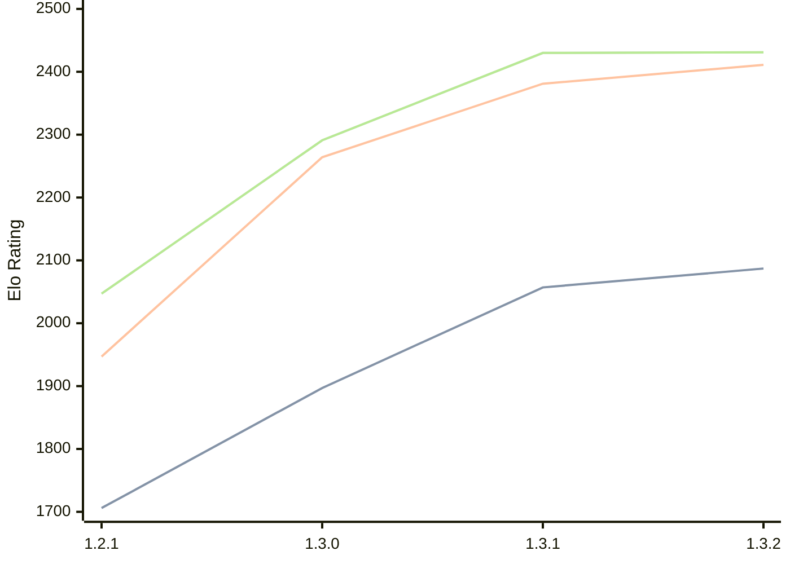

# Engine: Chal

Author: Naman Thanki

Home: https://github.com/namanthanki/chal

## Ratings nach Version

| Version | Published | STC 8.0+0.08s  | LTC 60.0+0.60s | VLTC 2m24s+1.12s | Comment |
| --- | --- | --- | --- | --- | --- |
| 1.3.2 | 2026-03-14 | 2087(+30) | 2411(+30) | 2431(+1) |  |
| 1.3.1 | 2026-03-10 | 2057(+160) | 2381(+117) | 2430(+139) |  |
| 1.3.0 | 2026-03-08 | 1897(+191) | 2264(+317) | 2291(+244) |  |
| 1.2.1 | 2026-03-07 | 1706(+new) | 1947(+new) | 2047(+new) |  |
| 1.2.0 | 2026-03-05 |  |  |  |  |
| 1.1.0 | 2026-03-05 |  |  |  |  |
| 1.0.0 | 2026-03-05 |  |  |  |  |
 | | | cElo (∆ prev) | cElo (∆ prev) | cElo (∆ prev) | 

 Test Conditions:

GUI/CLI: <a href=https://github.com/cutechess/cutechess target="_blank">Cute-Chess</a> 
Elo Calculation: <a href=https://www.remi-coulom.fr/Bayesian-Elo/ target="_blank">Bayesian-Elo</a> 
CPU: Intel(R) Core(TM) i5-7500T 2.70GHz 
Opening book: 8_moves_v3 
\* STC: 8.0+0.08s, LTC: 60.0+0.60s, VLTC: 2m24s+1.12s

 Lists:
Ratings: <a href=https://github.com/computer-chess-index/cci/blob/main/lists/CCIRatings.csv target="_blank">Complete list</a>

Generated: 2026-03-16 06:22:45

## Ratings Verlauf

⬛ STC (8.0+0.08s) &nbsp;&nbsp; 🟧 LTC (60.0+0.60s) &nbsp;&nbsp; 🟩 VLTC (2m24s+1.12s)

