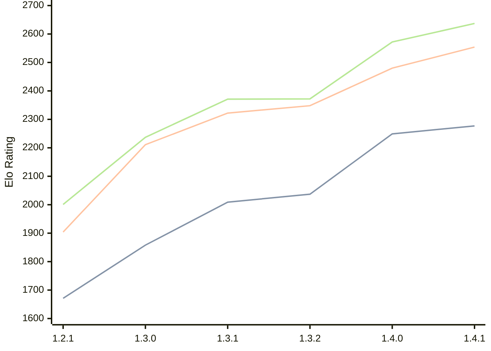

# Engine: Chal

Author: Naman Thanki

Home: https://github.com/namanthanki/chal

## Elo Ratings

| Version | Published | STC 8.0+0.08s  | LTC 60.0+0.60s | VLTC 2m24s+1.12s | Comment |
| --- | --- | --- | --- | --- | --- |
| 1.4.1 | 2026-04-26 | 2277(+28) | 2554(+74) | 2637(+65) |  |
| 1.4.0 | 2026-04-01 | 2249(+212) | 2480(+132) | 2572(+200) |  |
| 1.3.2 | 2026-03-14 | 2037(+28) | 2348(+26) | 2372(+1) |  |
| 1.3.1 | 2026-03-10 | 2009(+151) | 2322(+111) | 2371(+134) |  |
| 1.3.0 | 2026-03-08 | 1858(+187) | 2211(+307) | 2237(+236) |  |
| 1.2.1 | 2026-03-07 | 1671 | 1904 | 2001 |  |
 | | | cElo (∆ prev) | cElo (∆ prev) | cElo (∆ prev) | 

<a href="https://github.com/computer-chess-index/cci/issues/new?template=submit-version.yml&title=[VERSION]+Chal+<version>&body=###%20Engine%20name%0AChal%0A%0A###%20Version%0A1.4.1" target="_blank">Submit new version</a>

 Test Conditions:

GUI/CLI: <a href=https://github.com/cutechess/cutechess target="_blank">Cute-Chess</a> 
Elo Calculation: <a href=https://www.remi-coulom.fr/Bayesian-Elo/ target="_blank">Bayesian-Elo</a> 
CPU: Intel(R) Core(TM) i5-7500T 2.70GHz 
Opening book: 8_moves_v3 
\* STC: 8.0+0.08s, LTC: 60.0+0.60s, VLTC: 2m24s+1.12s

 Lists:
Ratings: <a href=https://github.com/computer-chess-index/cci/blob/main/lists/CCIRatings.csv target="_blank">Complete list</a>

Generated: 2026-08-12 07:47:50

## Ratings Verlauf

⬛ STC (8.0+0.08s) &nbsp;&nbsp; 🟧 LTC (60.0+0.60s) &nbsp;&nbsp; 🟩 VLTC (2m24s+1.12s)

dark mode: 🟩STC (8.0+0.08s) 🟧LTC (60.0+0.60s) ⬜VLTC (2m24s+1.12s)

## Detailed Evaluation Results

| Version | Time Control | Elo  | Range +/- | Matches | Score | Average Opponent Elo | Draws |
| --- | --- | --- | --- | --- | --- | --- | --- |
| 1.4.1 | VLTC (2m24s+1.12s) | 2637 | 26 | 466 | 52% | 2619 | 34% |
| 1.4.1 | LTC (60.0+0.60s) | 2554 | 26 | 468 | 50% | 2553 | 33% |
| 1.4.1 | STC (8.0+0.08s) | 2277 | 28 | 444 | 48% | 2302 | 28% |
| --- | --- | --- | --- | --- | --- | --- | --- |
| 1.4.0 | VLTC (2m24s+1.12s) | 2572 | 30 | 360 | 50% | 2570 | 33% |
| 1.4.0 | LTC (60.0+0.60s) | 2480 | 32 | 320 | 49% | 2485 | 31% |
| 1.4.0 | STC (8.0+0.08s) | 2249 | 31 | 360 | 52% | 2232 | 26% |
| --- | --- | --- | --- | --- | --- | --- | --- |
| 1.3.2 | VLTC (2m24s+1.12s) | 2372 | 34 | 296 | 49% | 2383 | 28% |
| 1.3.2 | LTC (60.0+0.60s) | 2348 | 32 | 312 | 51% | 2342 | 33% |
| 1.3.2 | STC (8.0+0.08s) | 2037 | 32 | 320 | 48% | 2056 | 29% |
| --- | --- | --- | --- | --- | --- | --- | --- |
| 1.3.1 | VLTC (2m24s+1.12s) | 2371 | 37 | 244 | 51% | 2357 | 27% |
| 1.3.1 | LTC (60.0+0.60s) | 2322 | 37 | 240 | 51% | 2314 | 29% |
| 1.3.1 | STC (8.0+0.08s) | 2009 | 40 | 212 | 52% | 1994 | 26% |
| --- | --- | --- | --- | --- | --- | --- | --- |
| 1.3.0 | VLTC (2m24s+1.12s) | 2237 | 44 | 188 | 54% | 2202 | 21% |
| 1.3.0 | LTC (60.0+0.60s) | 2211 | 41 | 204 | 55% | 2168 | 27% |
| 1.3.0 | STC (8.0+0.08s) | 1858 | 42 | 196 | 50% | 1856 | 26% |
| --- | --- | --- | --- | --- | --- | --- | --- |
| 1.2.1 | VLTC (2m24s+1.12s) | 2001 | 39 | 254 | 50% | 2010 | 15% |
| 1.2.1 | LTC (60.0+0.60s) | 1904 | 45 | 192 | 46% | 1974 | 16% |
| 1.2.1 | STC (8.0+0.08s) | 1671 | 44 | 200 | 47% | 1744 | 19% |
| --- | --- | --- | --- | --- | --- | --- | --- |