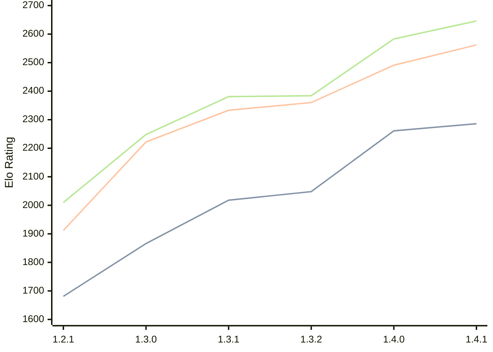

# Engine: Chal

Author: Naman Thanki

Home: https://github.com/namanthanki/chal

## Elo Ratings

| Version | Published | STC 8.0+0.08s  | LTC 60.0+0.60s | VLTC 2m24s+1.12s | Comment |
| --- | --- | --- | --- | --- | --- |
| 1.4.1 | 2026-04-26 | 2286(+25) | 2562(+71) | 2646(+63) |  |
| 1.4.0 | 2026-04-01 | 2261(+213) | 2491(+131) | 2583(+199) |  |
| 1.3.2 | 2026-03-14 | 2048(+30) | 2360(+27) | 2384(+3) |  |
| 1.3.1 | 2026-03-10 | 2018(+152) | 2333(+111) | 2381(+133) |  |
| 1.3.0 | 2026-03-08 | 1866(+185) | 2222(+310) | 2248(+238) |  |
| 1.2.1 | 2026-03-07 | 1681 | 1912 | 2010 |  |
 | | | cElo (∆ prev) | cElo (∆ prev) | cElo (∆ prev) | 

<a href="https://github.com/computer-chess-index/cci/issues/new?template=submit-version.yml&title=[VERSION]+Chal+<version>&body=###%20Engine%20name%0AChal%0A%0A###%20Version%0A1.4.1" target="_blank">Submit new version</a>

 Test Conditions:

GUI/CLI: <a href=https://github.com/cutechess/cutechess target="_blank">Cute-Chess</a> 
Elo Calculation: <a href=https://www.remi-coulom.fr/Bayesian-Elo/ target="_blank">Bayesian-Elo</a> 
CPU: Intel(R) Core(TM) i5-7500T 2.70GHz 
Opening book: 8_moves_v3 
\* STC: 8.0+0.08s, LTC: 60.0+0.60s, VLTC: 2m24s+1.12s

 Lists:
Ratings: <a href=https://github.com/computer-chess-index/cci/blob/main/lists/CCIRatings.csv target="_blank">Complete list</a>

Generated: 2026-08-30 15:47:53

## Ratings Verlauf

## Detailed Evaluation Results

| Version | Time Control | Elo  | Range +/- | Matches | Score | Average Opponent Elo | Draws |
| --- | --- | --- | --- | --- | --- | --- | --- |
| 1.4.1 | VLTC (2m24s+1.12s) | 2646 | 26 | 490 | 52% | 2630 | 34% |
| 1.4.1 | LTC (60.0+0.60s) | 2562 | 26 | 494 | 50% | 2564 | 32% |
| 1.4.1 | STC (8.0+0.08s) | 2286 | 27 | 464 | 48% | 2311 | 28% |
| --- | --- | --- | --- | --- | --- | --- | --- |
| 1.4.0 | VLTC (2m24s+1.12s) | 2583 | 30 | 360 | 50% | 2581 | 33% |
| 1.4.0 | LTC (60.0+0.60s) | 2491 | 32 | 320 | 49% | 2496 | 31% |
| 1.4.0 | STC (8.0+0.08s) | 2261 | 31 | 360 | 52% | 2244 | 26% |
| --- | --- | --- | --- | --- | --- | --- | --- |
| 1.3.2 | VLTC (2m24s+1.12s) | 2384 | 34 | 296 | 49% | 2394 | 28% |
| 1.3.2 | LTC (60.0+0.60s) | 2360 | 32 | 312 | 51% | 2353 | 33% |
| 1.3.2 | STC (8.0+0.08s) | 2048 | 32 | 320 | 48% | 2066 | 29% |
| --- | --- | --- | --- | --- | --- | --- | --- |
| 1.3.1 | VLTC (2m24s+1.12s) | 2381 | 37 | 244 | 51% | 2368 | 27% |
| 1.3.1 | LTC (60.0+0.60s) | 2333 | 37 | 240 | 51% | 2326 | 29% |
| 1.3.1 | STC (8.0+0.08s) | 2018 | 40 | 212 | 52% | 2003 | 26% |
| --- | --- | --- | --- | --- | --- | --- | --- |
| 1.3.0 | VLTC (2m24s+1.12s) | 2248 | 44 | 188 | 54% | 2213 | 21% |
| 1.3.0 | LTC (60.0+0.60s) | 2222 | 41 | 204 | 55% | 2179 | 27% |
| 1.3.0 | STC (8.0+0.08s) | 1866 | 42 | 196 | 50% | 1866 | 26% |
| --- | --- | --- | --- | --- | --- | --- | --- |
| 1.2.1 | VLTC (2m24s+1.12s) | 2010 | 39 | 254 | 50% | 2020 | 15% |
| 1.2.1 | LTC (60.0+0.60s) | 1912 | 45 | 192 | 46% | 1982 | 16% |
| 1.2.1 | STC (8.0+0.08s) | 1681 | 44 | 200 | 47% | 1754 | 19% |
| --- | --- | --- | --- | --- | --- | --- | --- |