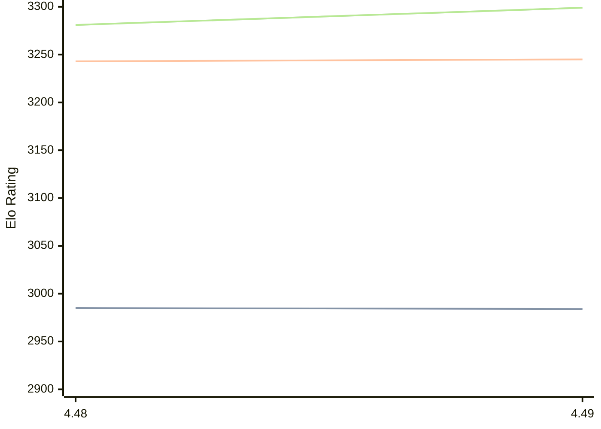

# Engine: Cheng4

Author: Martin Sedlak

Home: https://github.com/kmar/cheng4_releases

## Elo Ratings

| Version | Published | STC 8.0+0.08s  | LTC 60.0+0.60s | VLTC 2m24s+1.12s | Comment |
| --- | --- | --- | --- | --- | --- |
| 4.49 | 2026-09-03 | 2984(-1) | 3245(+2) | 3299(+18) |  |
| 4.48 | 2026-07-12 | 2985 | 3243 | 3281 |  |
 | | | cElo (∆ prev) | cElo (∆ prev) | cElo (∆ prev) | 

<a href="https://github.com/computer-chess-index/cci/issues/new?template=submit-version.yml&title=[VERSION]+Cheng4+<version>&body=###%20Engine%20name%0ACheng4%0A%0A###%20Version%0A4.49" target="_blank">Submit new version</a>

 Test Conditions:

GUI/CLI: <a href=https://github.com/cutechess/cutechess target="_blank">Cute-Chess</a> 
Elo Calculation: <a href=https://www.remi-coulom.fr/Bayesian-Elo/ target="_blank">Bayesian-Elo</a> 
CPU: Intel(R) Core(TM) i5-7500T 2.70GHz 
Opening book: 8_moves_v3 
\* STC: 8.0+0.08s, LTC: 60.0+0.60s, VLTC: 2m24s+1.12s

 Lists:
Ratings: <a href=https://github.com/computer-chess-index/cci/blob/main/lists/CCIRatings.csv target="_blank">Complete list</a>

Generated: 2026-09-16 04:36:49

## Ratings Verlauf

## Detailed Evaluation Results

| Version | Time Control | Elo  | Range +/- | Matches | Score | Average Opponent Elo | Draws |
| --- | --- | --- | --- | --- | --- | --- | --- |
| 4.49 | VLTC (2m24s+1.12s) | 3299 | 34 | 220 | 50% | 3299 | 65% |
| 4.49 | LTC (60.0+0.60s) | 3245 | 34 | 236 | 51% | 3241 | 60% |
| 4.49 | STC (8.0+0.08s) | 2984 | 36 | 226 | 50% | 2982 | 46% |
| --- | --- | --- | --- | --- | --- | --- | --- |
| 4.48 | VLTC (2m24s+1.12s) | 3281 | 25 | 432 | 53% | 3247 | 61% |
| 4.48 | LTC (60.0+0.60s) | 3243 | 29 | 320 | 52% | 3205 | 58% |
| 4.48 | STC (8.0+0.08s) | 2985 | 29 | 370 | 54% | 2936 | 41% |
| --- | --- | --- | --- | --- | --- | --- | --- |