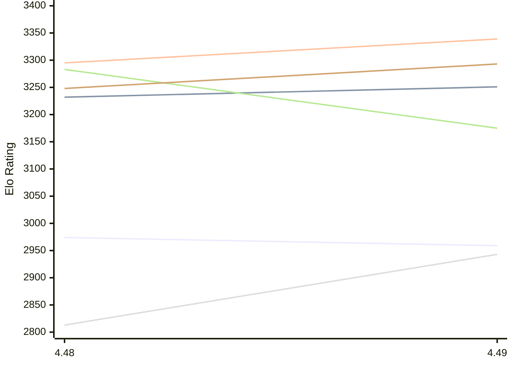
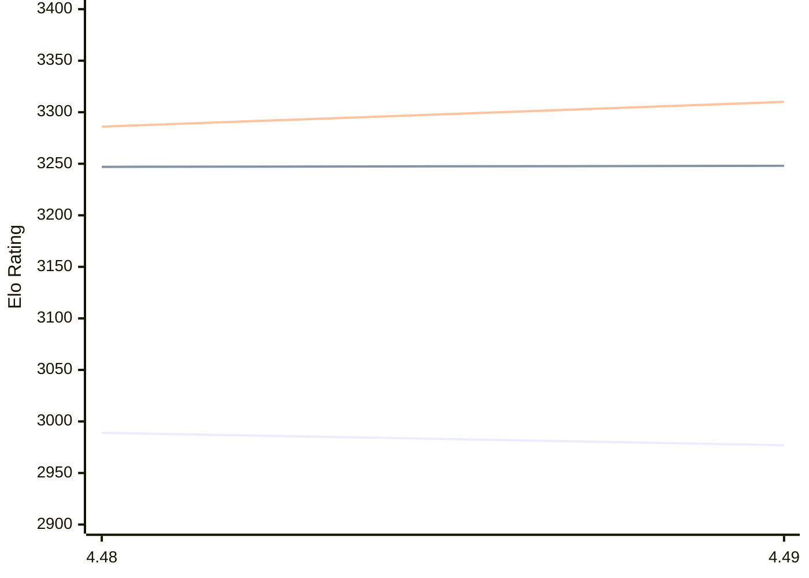

# Engine: Cheng4

Author: Martin Sedlak

Home: https://github.com/kmar/cheng4_releases

## Elo Ratings E1 (Ultra 7 265T (1.50 GHz) - E-Core)

| Version | Published | STC 8.0+0.08s  | LTC 60.0+0.60s | VLTC 2m24s+1.12s | Comment |
| --- | --- | --- | --- | --- | --- |
| 4.49 | 2026-09-03 | 2959(-15) | 3251(+19) | 3339(+44) |  |
| 4.48 | 2026-07-12 | 2974 | 3232 | 3295 |  |
 | | | cElo (∆ prev) | cElo (∆ prev) | cElo (∆ prev) | 

## Elo Ratings P1 (Ultra 7 265T (1.50 GHz) - P-Core)

| Version | Published | STC 8.0+0.08s  | LTC 60.0+0.60s | VLTC 2m24s+1.12s | Comment |
| --- | --- | --- | --- | --- | --- |
| 4.49 | 2026-09-03 | 2943(+130) | 3175(-108) | 3293(+45) |  |
| 4.48 | 2026-07-12 | 2813 | 3283 | 3248 |  |
 | | | cElo (∆ prev) | cElo (∆ prev) | cElo (∆ prev) | 

## Elo Ratings T1 (i5-7500T 2.70GHz)

| Version | Published | STC 8.0+0.08s  | LTC 60.0+0.60s | VLTC 2m24s+1.12s | Comment |
| --- | --- | --- | --- | --- | --- |
| 4.49 | 2026-09-03 | 2977(-12) | 3248(+1) | 3310(+24) |  |
| 4.48 | 2026-07-12 | 2989 | 3247 | 3286 |  |
 | | | cElo (∆ prev) | cElo (∆ prev) | cElo (∆ prev) | 

<a href="https://github.com/computer-chess-index/cci/issues/new?template=submit-version.yml&title=[VERSION]+Cheng4+<version>&body=###%20Engine%20name%0ACheng4%0A%0A###%20Version%0A4.49" target="_blank">Submit new version</a>

 Test Conditions:

GUI/CLI: <a href=https://github.com/cutechess/cutechess target="_blank">Cute-Chess</a> 
Elo Calculation: <a href=https://www.remi-coulom.fr/Bayesian-Elo/ target="_blank">Bayesian-Elo</a> 
CPU for P1: Intel(R) Core(TM) Ultra 7 265T (1.50 GHz) - P-Core 
CPU for E1: Intel(R) Core(TM) Ultra 7 265T (1.50 GHz) - E-Core 
CPU for T1: Intel(R) Core(TM) i5-7500T 2.70GHz 
Opening book: 8_moves_v3 
\* STC: 8.0+0.08s, LTC: 60.0+0.60s, VLTC: 2m24s+1.12s

 Lists:
Ratings: <a href=https://github.com/computer-chess-index/cci/blob/main/lists/CCIRatings.csv target="_blank">Complete list</a>

Generated: 2026-11-16 05:37:04

## Ratings Verlauf E1 / P1

```mermaid
%%{init: {"theme":"base","themeVariables":{"seriesColors:['#a3a3a3','#222221','#faa371']}}}%%
xychart-beta
  x-axis ["4.48", "4.49"]
  y-axis "Elo Rating" 2800 --> 3400
  line "E1: STC (8.0+0.08s)" [2974, 2959]
  line "E1: LTC (60.0+0.60s)" [3232, 3251]
  line "E1: VLTC (2m24s+1.12s)" [3295, 3339]
  line "P1: STC (8.0+0.08s)" [2813, 2943]
  line "P1: LTC (60.0+0.60s)" [3283, 3175]
  line "P1: VLTC (2m24s+1.12s)" [3248, 3293]
```

## Ratings Verlauf T1

```mermaid
%%{init: {"theme":"base","themeVariables":{"seriesColors:['#a3a3a3','#222221','#faa371']}}}%%
xychart-beta
  x-axis ["4.48", "4.49"]
  y-axis "Elo Rating" 2900 --> 3400
  line "T1: STC (8.0+0.08s)" [2989, 2977]
  line "T1: LTC (60.0+0.60s)" [3247, 3248]
  line "T1: VLTC (2m24s+1.12s)" [3286, 3310]
```

## Detailed Evaluation Results

| Version | Time Control | Variant | Elo  | Range +/- | Matches | Score | Average Opponent Elo | Draws |
| --- | --- |--- | --- | --- | --- | --- | --- | --- |
| 4.49 | VLTC (2m24s+1.12s) | T1 | 3310 | 34 | 228 | 51% | 3305 | 64% |
|  |  | P1 | 3293 | 29 | 306 | 51% | 3283 | 67% |
|  |  | E1 | 3339 | 27 | 374 | 49% | 3348 | 60% |
|  | LTC (60.0+0.60s) | T1 | 3248 | 32 | 264 | 50% | 3247 | 61% |
|  |  | P1 | 3175 | 30 | 312 | 48% | 3189 | 54% |
|  |  | E1 | 3251 | 25 | 426 | 48% | 3266 | 57% |
|  | STC (8.0+0.08s) | T1 | 2977 | 34 | 250 | 49% | 2986 | 44% |
|  |  | P1 | 2943 | 35 | 250 | 49% | 2950 | 45% |
|  |  | E1 | 2959 | 26 | 456 | 47% | 2986 | 44% |
| --- | --- |--- | --- | --- | --- | --- | --- | --- |
| 4.48 | VLTC (2m24s+1.12s) | P1 | 3248 | 94 | 30 | 60% | 3160 | 60% |
|  |  | E1 | 3295 | 65 | 80 | 66% | 3017 | 45% |
|  |  | T1 | 3286 | 25 | 432 | 53% | 3252 | 61% |
|  | LTC (60.0+0.60s) | P1 | 3283 | 103 | 32 | 69% | 3071 | 38% |
|  |  | E1 | 3232 | 60 | 80 | 56% | 3171 | 50% |
|  |  | T1 | 3247 | 29 | 320 | 52% | 3210 | 58% |
|  | STC (8.0+0.08s) | E1 | 2974 | 68 | 80 | 61% | 2700 | 30% |
|  |  | T1 | 2989 | 29 | 370 | 54% | 2942 | 41% |
|  |  | P1 | 2813 | 77 | 60 | 57% | 2552 | 33% |