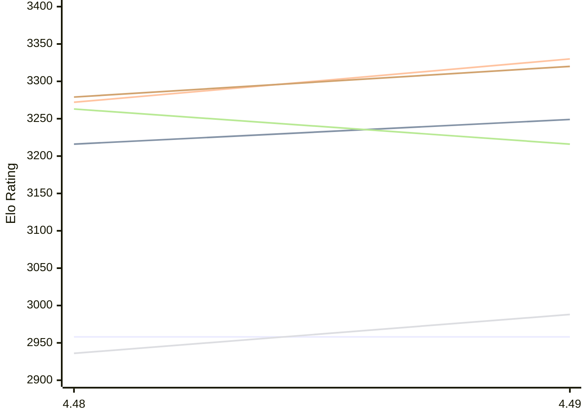
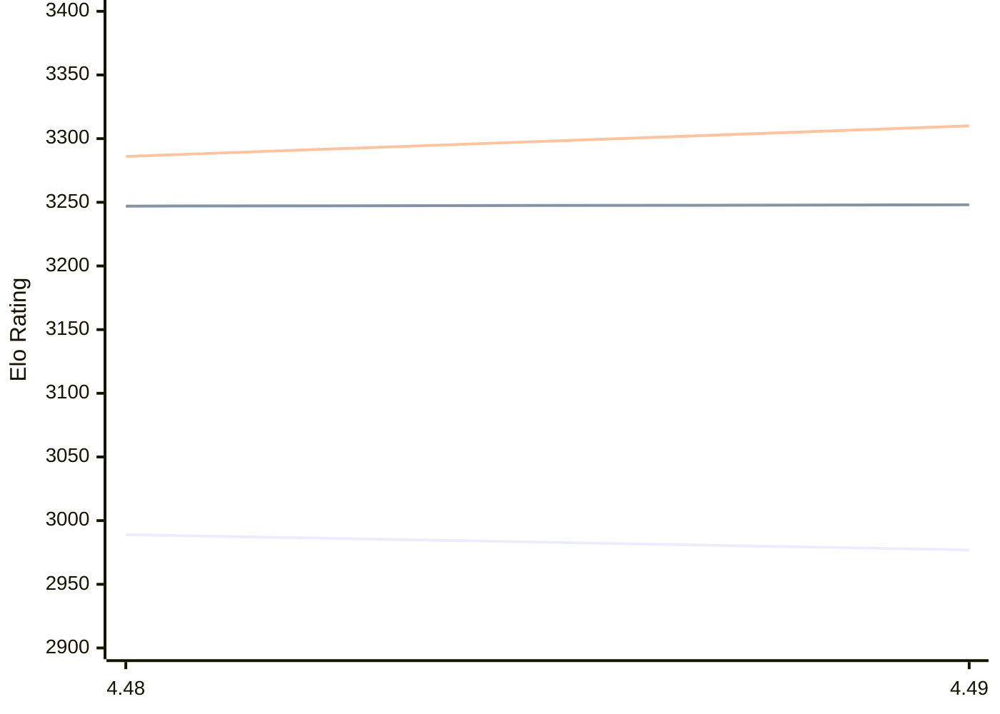

# Engine: Cheng4

Author: Martin Sedlak

Home: https://github.com/kmar/cheng4_releases

## Elo Ratings E1 (Ultra 7 265T (1.50 GHz) - E-Core)

| Version | Published | STC 8.0+0.08s  | LTC 60.0+0.60s | VLTC 2m24s+1.12s | Comment |
| --- | --- | --- | --- | --- | --- |
| 4.49 | 2026-09-03 | 2958(0) | 3249(+33) | 3330(+58) |  |
| 4.48 | 2026-07-12 | 2958 | 3216 | 3272 |  |
 | | | cElo (∆ prev) | cElo (∆ prev) | cElo (∆ prev) | 

## Elo Ratings P1 (Ultra 7 265T (1.50 GHz) - P-Core)

| Version | Published | STC 8.0+0.08s  | LTC 60.0+0.60s | VLTC 2m24s+1.12s | Comment |
| --- | --- | --- | --- | --- | --- |
| 4.49 | 2026-09-03 | 2988(+52) | 3216(-47) | 3320(+41) |  |
| 4.48 | 2026-07-12 | 2936 | 3263 | 3279 |  |
 | | | cElo (∆ prev) | cElo (∆ prev) | cElo (∆ prev) | 

## Elo Ratings T1 (i5-7500T 2.70GHz)

| Version | Published | STC 8.0+0.08s  | LTC 60.0+0.60s | VLTC 2m24s+1.12s | Comment |
| --- | --- | --- | --- | --- | --- |
| 4.49 | 2026-09-03 | 2977(-12) | 3248(+1) | 3310(+24) |  |
| 4.48 | 2026-07-12 | 2989 | 3247 | 3286 |  |
 | | | cElo (∆ prev) | cElo (∆ prev) | cElo (∆ prev) | 

<a href="https://github.com/computer-chess-index/cci/issues/new?template=submit-version.yml&title=[VERSION]+Cheng4+<version>&body=###%20Engine%20name%0ACheng4%0A%0A###%20Version%0A4.49" target="_blank">Submit new version</a>

 Test Conditions:

GUI/CLI: <a href=https://github.com/cutechess/cutechess target="_blank">Cute-Chess</a> 
Elo Calculation: <a href=https://www.remi-coulom.fr/Bayesian-Elo/ target="_blank">Bayesian-Elo</a> 
CPU for P1: Intel(R) Core(TM) Ultra 7 265T (1.50 GHz) - P-Core 
CPU for E1: Intel(R) Core(TM) Ultra 7 265T (1.50 GHz) - E-Core 
CPU for T1: Intel(R) Core(TM) i5-7500T 2.70GHz 
Opening book: 8_moves_v3 
\* STC: 8.0+0.08s, LTC: 60.0+0.60s, VLTC: 2m24s+1.12s

 Lists:
Ratings: <a href=https://github.com/computer-chess-index/cci/blob/main/lists/CCIRatings.csv target="_blank">Complete list</a>

Generated: 2026-11-27 05:37:09

## Ratings Verlauf E1 / P1

```mermaid
%%{init: {"theme":"base","themeVariables":{"seriesColors:['#a3a3a3','#222221','#faa371']}}}%%
xychart-beta
  x-axis ["4.48", "4.49"]
  y-axis "Elo Rating" 2900 --> 3400
  line "E1: STC (8.0+0.08s)" [2958, 2958]
  line "E1: LTC (60.0+0.60s)" [3216, 3249]
  line "E1: VLTC (2m24s+1.12s)" [3272, 3330]
  line "P1: STC (8.0+0.08s)" [2936, 2988]
  line "P1: LTC (60.0+0.60s)" [3263, 3216]
  line "P1: VLTC (2m24s+1.12s)" [3279, 3320]
```

## Ratings Verlauf T1

```mermaid
%%{init: {"theme":"base","themeVariables":{"seriesColors:['#a3a3a3','#222221','#faa371']}}}%%
xychart-beta
  x-axis ["4.48", "4.49"]
  y-axis "Elo Rating" 2900 --> 3400
  line "T1: STC (8.0+0.08s)" [2989, 2977]
  line "T1: LTC (60.0+0.60s)" [3247, 3248]
  line "T1: VLTC (2m24s+1.12s)" [3286, 3310]
```

## Detailed Evaluation Results

| Version | Time Control | Variant | Elo  | Range +/- | Matches | Score | Average Opponent Elo | Draws |
| --- | --- |--- | --- | --- | --- | --- | --- | --- |
| 4.49 | VLTC (2m24s+1.12s) | T1 | 3310 | 34 | 228 | 51% | 3305 | 64% |
|  |  | P1 | 3320 | 28 | 330 | 51% | 3305 | 65% |
|  |  | E1 | 3330 | 25 | 414 | 49% | 3341 | 59% |
|  | LTC (60.0+0.60s) | T1 | 3248 | 32 | 264 | 50% | 3247 | 61% |
|  |  | P1 | 3216 | 28 | 348 | 49% | 3225 | 54% |
|  |  | E1 | 3249 | 24 | 482 | 49% | 3259 | 56% |
|  | STC (8.0+0.08s) | P1 | 2988 | 31 | 300 | 50% | 2992 | 46% |
|  |  | E1 | 2958 | 24 | 528 | 48% | 2978 | 42% |
|  |  | T1 | 2977 | 34 | 250 | 49% | 2986 | 44% |
| --- | --- |--- | --- | --- | --- | --- | --- | --- |
| 4.48 | VLTC (2m24s+1.12s) | E1 | 3272 | 49 | 128 | 59% | 3110 | 50% |
|  |  | T1 | 3286 | 25 | 432 | 53% | 3252 | 61% |
|  |  | P1 | 3279 | 58 | 78 | 51% | 3267 | 63% |
|  | LTC (60.0+0.60s) | E1 | 3216 | 46 | 132 | 52% | 3194 | 52% |
|  |  | T1 | 3247 | 29 | 320 | 52% | 3210 | 58% |
|  |  | P1 | 3263 | 67 | 68 | 53% | 3214 | 44% |
|  | STC (8.0+0.08s) | T1 | 2989 | 29 | 370 | 54% | 2942 | 41% |
|  |  | P1 | 2936 | 57 | 104 | 59% | 2727 | 34% |
|  |  | E1 | 2958 | 54 | 120 | 56% | 2786 | 33% |