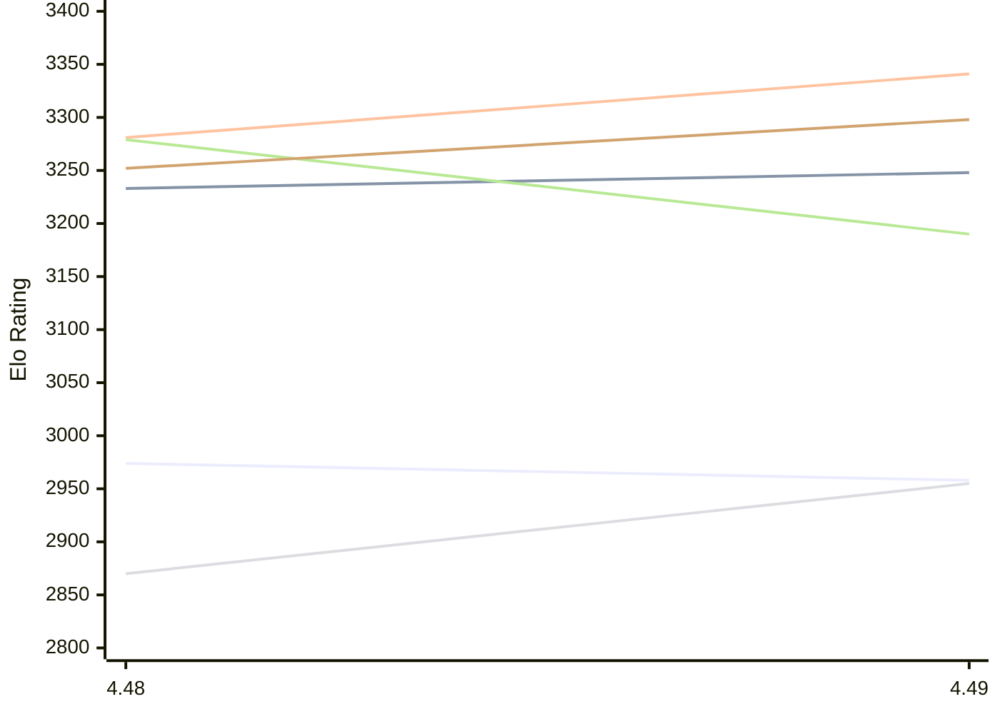
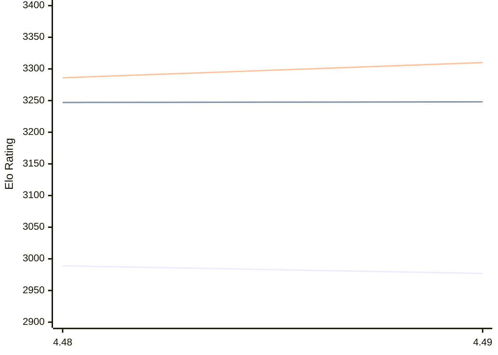

# Engine: Cheng4

Author: Martin Sedlak

Home: https://github.com/kmar/cheng4_releases

## Elo Ratings E1 (Ultra 7 265T (1.50 GHz) - E-Core)

| Version | Published | STC 8.0+0.08s  | LTC 60.0+0.60s | VLTC 2m24s+1.12s | Comment |
| --- | --- | --- | --- | --- | --- |
| 4.49 | 2026-09-03 | 2958(-16) | 3248(+15) | 3341(+60) |  |
| 4.48 | 2026-07-12 | 2974 | 3233 | 3281 |  |
 | | | cElo (∆ prev) | cElo (∆ prev) | cElo (∆ prev) | 

## Elo Ratings P1 (Ultra 7 265T (1.50 GHz) - P-Core)

| Version | Published | STC 8.0+0.08s  | LTC 60.0+0.60s | VLTC 2m24s+1.12s | Comment |
| --- | --- | --- | --- | --- | --- |
| 4.49 | 2026-09-03 | 2955(+85) | 3190(-89) | 3298(+46) |  |
| 4.48 | 2026-07-12 | 2870 | 3279 | 3252 |  |
 | | | cElo (∆ prev) | cElo (∆ prev) | cElo (∆ prev) | 

## Elo Ratings T1 (i5-7500T 2.70GHz)

| Version | Published | STC 8.0+0.08s  | LTC 60.0+0.60s | VLTC 2m24s+1.12s | Comment |
| --- | --- | --- | --- | --- | --- |
| 4.49 | 2026-09-03 | 2977(-12) | 3248(+1) | 3310(+24) |  |
| 4.48 | 2026-07-12 | 2989 | 3247 | 3286 |  |
 | | | cElo (∆ prev) | cElo (∆ prev) | cElo (∆ prev) | 

<a href="https://github.com/computer-chess-index/cci/issues/new?template=submit-version.yml&title=[VERSION]+Cheng4+<version>&body=###%20Engine%20name%0ACheng4%0A%0A###%20Version%0A4.49" target="_blank">Submit new version</a>

 Test Conditions:

GUI/CLI: <a href=https://github.com/cutechess/cutechess target="_blank">Cute-Chess</a> 
Elo Calculation: <a href=https://www.remi-coulom.fr/Bayesian-Elo/ target="_blank">Bayesian-Elo</a> 
CPU for P1: Intel(R) Core(TM) Ultra 7 265T (1.50 GHz) - P-Core 
CPU for E1: Intel(R) Core(TM) Ultra 7 265T (1.50 GHz) - E-Core 
CPU for T1: Intel(R) Core(TM) i5-7500T 2.70GHz 
Opening book: 8_moves_v3 
\* STC: 8.0+0.08s, LTC: 60.0+0.60s, VLTC: 2m24s+1.12s

 Lists:
Ratings: <a href=https://github.com/computer-chess-index/cci/blob/main/lists/CCIRatings.csv target="_blank">Complete list</a>

Generated: 2026-11-20 05:37:03

## Ratings Verlauf E1 / P1

```mermaid
%%{init: {"theme":"base","themeVariables":{"seriesColors:['#a3a3a3','#222221','#faa371']}}}%%
xychart-beta
  x-axis ["4.48", "4.49"]
  y-axis "Elo Rating" 2800 --> 3400
  line "E1: STC (8.0+0.08s)" [2974, 2958]
  line "E1: LTC (60.0+0.60s)" [3233, 3248]
  line "E1: VLTC (2m24s+1.12s)" [3281, 3341]
  line "P1: STC (8.0+0.08s)" [2870, 2955]
  line "P1: LTC (60.0+0.60s)" [3279, 3190]
  line "P1: VLTC (2m24s+1.12s)" [3252, 3298]
```

## Ratings Verlauf T1

```mermaid
%%{init: {"theme":"base","themeVariables":{"seriesColors:['#a3a3a3','#222221','#faa371']}}}%%
xychart-beta
  x-axis ["4.48", "4.49"]
  y-axis "Elo Rating" 2900 --> 3400
  line "T1: STC (8.0+0.08s)" [2989, 2977]
  line "T1: LTC (60.0+0.60s)" [3247, 3248]
  line "T1: VLTC (2m24s+1.12s)" [3286, 3310]
```

## Detailed Evaluation Results

| Version | Time Control | Variant | Elo  | Range +/- | Matches | Score | Average Opponent Elo | Draws |
| --- | --- |--- | --- | --- | --- | --- | --- | --- |
| 4.49 | VLTC (2m24s+1.12s) | T1 | 3310 | 34 | 228 | 51% | 3305 | 64% |
|  |  | P1 | 3298 | 28 | 318 | 51% | 3291 | 66% |
|  |  | E1 | 3341 | 26 | 398 | 49% | 3347 | 60% |
|  | LTC (60.0+0.60s) | T1 | 3248 | 32 | 264 | 50% | 3247 | 61% |
|  |  | P1 | 3190 | 29 | 324 | 49% | 3200 | 54% |
|  |  | E1 | 3248 | 25 | 446 | 48% | 3264 | 57% |
|  | STC (8.0+0.08s) | P1 | 2955 | 34 | 266 | 49% | 2966 | 45% |
|  |  | E1 | 2958 | 25 | 476 | 47% | 2985 | 43% |
|  |  | T1 | 2977 | 34 | 250 | 49% | 2986 | 44% |
| --- | --- |--- | --- | --- | --- | --- | --- | --- |
| 4.48 | VLTC (2m24s+1.12s) | E1 | 3281 | 58 | 96 | 62% | 3062 | 45% |
|  |  | T1 | 3286 | 25 | 432 | 53% | 3252 | 61% |
|  |  | P1 | 3252 | 75 | 46 | 54% | 3209 | 65% |
|  | LTC (60.0+0.60s) | E1 | 3233 | 55 | 96 | 55% | 3182 | 52% |
|  |  | T1 | 3247 | 29 | 320 | 52% | 3210 | 58% |
|  |  | P1 | 3279 | 81 | 48 | 60% | 3152 | 42% |
|  | STC (8.0+0.08s) | T1 | 2989 | 29 | 370 | 54% | 2942 | 41% |
|  |  | P1 | 2870 | 70 | 72 | 58% | 2619 | 33% |
|  |  | E1 | 2974 | 63 | 92 | 60% | 2735 | 30% |