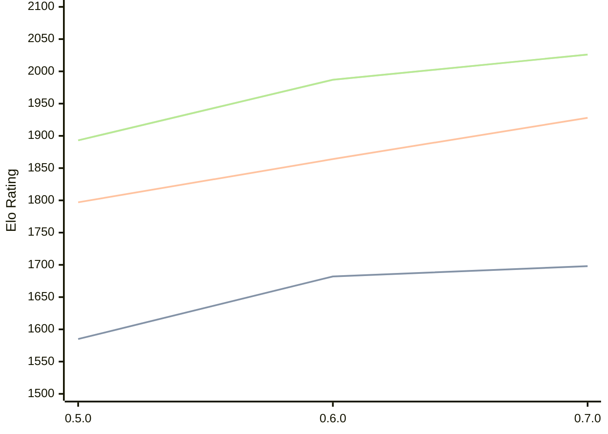

# Engine: Chess-rs

Author: Tom Cant

Home: https://github.com/tomcant/chess-rs

## Elo Ratings

| Version | Published | STC 8.0+0.08s  | LTC 60.0+0.60s | VLTC 2m24s+1.12s | Comment |
| --- | --- | --- | --- | --- | --- |
| 0.7.0 | 2025-12-31 | 1698(+16) | 1928(+64) | 2026(+39) |  |
| 0.6.0 | 2025-11-11 | 1682(+97) | 1864(+67) | 1987(+94) |  |
| 0.5.0 | 2025-11-03 | 1585 | 1797 | 1893 |  |
 | | | cElo (∆ prev) | cElo (∆ prev) | cElo (∆ prev) | 

<a href="https://github.com/computer-chess-index/cci/issues/new?template=submit-version.yml&title=[VERSION]+Chess-rs+<version>&body=###%20Engine%20name%0AChess-rs%0A%0A###%20Version%0A0.7.0" target="_blank">Submit new version</a>

 Test Conditions:

GUI/CLI: <a href=https://github.com/cutechess/cutechess target="_blank">Cute-Chess</a> 
Elo Calculation: <a href=https://www.remi-coulom.fr/Bayesian-Elo/ target="_blank">Bayesian-Elo</a> 
CPU: Intel(R) Core(TM) i5-7500T 2.70GHz 
Opening book: 8_moves_v3 
\* STC: 8.0+0.08s, LTC: 60.0+0.60s, VLTC: 2m24s+1.12s

 Lists:
Ratings: <a href=https://github.com/computer-chess-index/cci/blob/main/lists/CCIRatings.csv target="_blank">Complete list</a>

Generated: 2026-09-24 04:36:55

## Ratings Verlauf

## Detailed Evaluation Results

| Version | Time Control | Elo  | Range +/- | Matches | Score | Average Opponent Elo | Draws |
| --- | --- | --- | --- | --- | --- | --- | --- |
| 0.7.0 | VLTC (2m24s+1.12s) | 2026 | 24 | 644 | 48% | 2040 | 21% |
| 0.7.0 | LTC (60.0+0.60s) | 1928 | 23 | 650 | 49% | 1933 | 22% |
| 0.7.0 | STC (8.0+0.08s) | 1698 | 22 | 754 | 50% | 1696 | 18% |
| --- | --- | --- | --- | --- | --- | --- | --- |
| 0.6.0 | VLTC (2m24s+1.12s) | 1987 | 44 | 184 | 49% | 1995 | 21% |
| 0.6.0 | LTC (60.0+0.60s) | 1864 | 50 | 146 | 50% | 1867 | 21% |
| 0.6.0 | STC (8.0+0.08s) | 1682 | 54 | 124 | 50% | 1681 | 18% |
| --- | --- | --- | --- | --- | --- | --- | --- |
| 0.5.0 | VLTC (2m24s+1.12s) | 1893 | 49 | 148 | 49% | 1902 | 20% |
| 0.5.0 | LTC (60.0+0.60s) | 1797 | 46 | 176 | 47% | 1832 | 18% |
| 0.5.0 | STC (8.0+0.08s) | 1585 | 49 | 156 | 47% | 1613 | 16% |
| --- | --- | --- | --- | --- | --- | --- | --- |