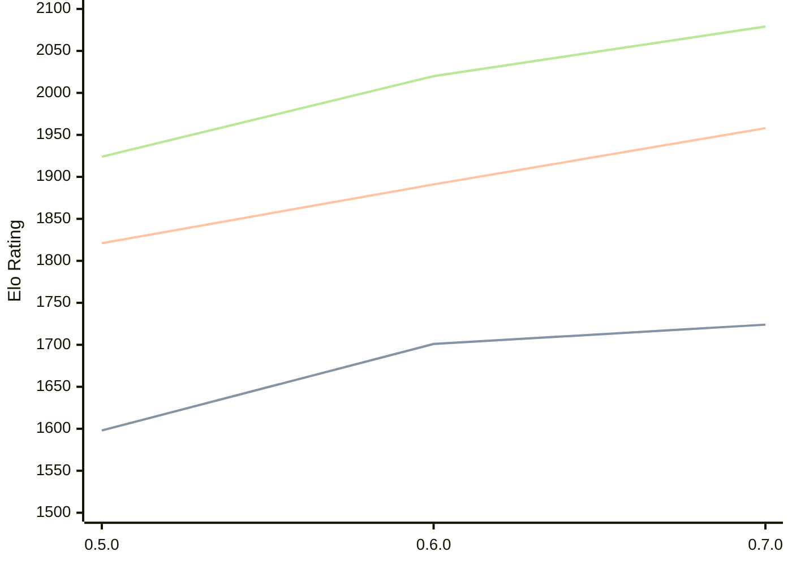

# Engine: Chess-rs

Author: Tom Cant

Home: https://github.com/tomcant/chess-rs

## Elo Ratings

| Version | Published | STC 8.0+0.08s  | LTC 60.0+0.60s | VLTC 2m24s+1.12s | Comment |
| --- | --- | --- | --- | --- | --- |
| 0.7.0 | 2025-12-31 | 1724(+23) | 1958(+67) | 2079(+59) |  |
| 0.6.0 | 2025-11-11 | 1701(+new) | 1891(+new) | 2020(+new) |  |
| 0.5.1 | 2025-11-04 |  |  |  | no public available .exe |
| 0.5.0 | 2025-11-03 | 1598(+new) | 1821(+new) | 1924(+new) |  |
| 0.4.2 | 2025-10-13 |  |  |  |  |
| 0.4.1 | 2025-10-09 |  |  |  |  |
| 0.4.0 | 2025-10-09 |  |  |  |  |
| 0.3.0 | 2025-10-05 |  |  |  |  |
| 0.2.0 | 2023-03-12 |  |  |  |  |
| 0.1.1 | 2022-12-03 |  |  |  |  |
| 0.1.0 | 2022-12-03 |  |  |  |  |
 | | | cElo (∆ prev) | cElo (∆ prev) | cElo (∆ prev) | 

<a href="https://github.com/computer-chess-index/cci/issues/new?template=submit-version.yml&title=[VERSION]+Chess-rs+<version>&body=###%20Engine%20name%0AChess-rs%0A%0A###%20Version%0A0.7.0" target="_blank">Submit new version</a>

 Test Conditions:

GUI/CLI: <a href=https://github.com/cutechess/cutechess target="_blank">Cute-Chess</a> 
Elo Calculation: <a href=https://www.remi-coulom.fr/Bayesian-Elo/ target="_blank">Bayesian-Elo</a> 
CPU: Intel(R) Core(TM) i5-7500T 2.70GHz 
Opening book: 8_moves_v3 
\* STC: 8.0+0.08s, LTC: 60.0+0.60s, VLTC: 2m24s+1.12s

 Lists:
Ratings: <a href=https://github.com/computer-chess-index/cci/blob/main/lists/CCIRatings.csv target="_blank">Complete list</a>

Generated: 2026-05-05 06:23:20

## Ratings Verlauf

⬛ STC (8.0+0.08s) &nbsp;&nbsp; 🟧 LTC (60.0+0.60s) &nbsp;&nbsp; 🟩 VLTC (2m24s+1.12s)

dark mode: 🟩STC (8.0+0.08s) 🟧LTC (60.0+0.60s) ⬜VLTC (2m24s+1.12s)

## Detailed Evaluation Results

| Version | Time Control | Elo  | Range +/- | Matches | Score | Average Opponent Elo | Draws |
| --- | --- | --- | --- | --- | --- | --- | --- |
| 0.7.0 | VLTC (2m24s+1.12s) | 2079 | 27 | 484 | 50% | 2080 | 22% |
| 0.7.0 | LTC (60.0+0.60s) | 1958 | 27 | 506 | 49% | 1968 | 23% |
| 0.7.0 | STC (8.0+0.08s) | 1724 | 27 | 530 | 50% | 1719 | 19% |
| --- | --- | --- | --- | --- | --- | --- | --- |
| 0.6.0 | VLTC (2m24s+1.12s) | 2020 | 44 | 184 | 49% | 2029 | 21% |
| 0.6.0 | LTC (60.0+0.60s) | 1891 | 50 | 146 | 50% | 1895 | 21% |
| 0.6.0 | STC (8.0+0.08s) | 1701 | 54 | 124 | 50% | 1700 | 18% |
| --- | --- | --- | --- | --- | --- | --- | --- |
| 0.5.0 | VLTC (2m24s+1.12s) | 1924 | 49 | 148 | 49% | 1933 | 20% |
| 0.5.0 | LTC (60.0+0.60s) | 1821 | 46 | 176 | 47% | 1856 | 18% |
| 0.5.0 | STC (8.0+0.08s) | 1598 | 49 | 156 | 47% | 1627 | 16% |
| --- | --- | --- | --- | --- | --- | --- | --- |