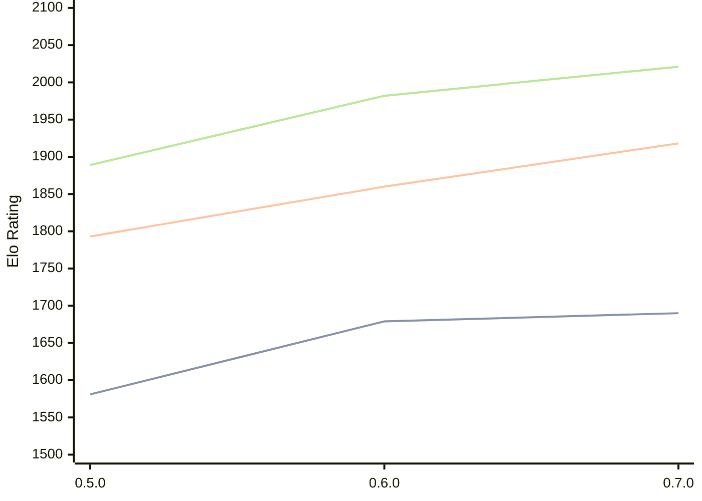

# Engine: Chess-rs

Author: Tom Cant

Home: https://github.com/tomcant/chess-rs

## Elo Ratings

| Version | Published | STC 8.0+0.08s  | LTC 60.0+0.60s | VLTC 2m24s+1.12s | Comment |
| --- | --- | --- | --- | --- | --- |
| 0.7.0 | 2025-12-31 | 1690(+11) | 1918(+58) | 2021(+39) |  |
| 0.6.0 | 2025-11-11 | 1679(+98) | 1860(+67) | 1982(+93) |  |
| 0.5.0 | 2025-11-03 | 1581 | 1793 | 1889 |  |
 | | | cElo (∆ prev) | cElo (∆ prev) | cElo (∆ prev) | 

<a href="https://github.com/computer-chess-index/cci/issues/new?template=submit-version.yml&title=[VERSION]+Chess-rs+<version>&body=###%20Engine%20name%0AChess-rs%0A%0A###%20Version%0A0.7.0" target="_blank">Submit new version</a>

 Test Conditions:

GUI/CLI: <a href=https://github.com/cutechess/cutechess target="_blank">Cute-Chess</a> 
Elo Calculation: <a href=https://www.remi-coulom.fr/Bayesian-Elo/ target="_blank">Bayesian-Elo</a> 
CPU: Intel(R) Core(TM) i5-7500T 2.70GHz 
Opening book: 8_moves_v3 
\* STC: 8.0+0.08s, LTC: 60.0+0.60s, VLTC: 2m24s+1.12s

 Lists:
Ratings: <a href=https://github.com/computer-chess-index/cci/blob/main/lists/CCIRatings.csv target="_blank">Complete list</a>

Generated: 2026-08-27 07:33:19

## Ratings Verlauf

## Detailed Evaluation Results

| Version | Time Control | Elo  | Range +/- | Matches | Score | Average Opponent Elo | Draws |
| --- | --- | --- | --- | --- | --- | --- | --- |
| 0.7.0 | VLTC (2m24s+1.12s) | 2021 | 24 | 616 | 48% | 2036 | 21% |
| 0.7.0 | LTC (60.0+0.60s) | 1918 | 24 | 622 | 49% | 1928 | 23% |
| 0.7.0 | STC (8.0+0.08s) | 1690 | 23 | 710 | 49% | 1689 | 19% |
| --- | --- | --- | --- | --- | --- | --- | --- |
| 0.6.0 | VLTC (2m24s+1.12s) | 1982 | 44 | 184 | 49% | 1991 | 21% |
| 0.6.0 | LTC (60.0+0.60s) | 1860 | 50 | 146 | 50% | 1863 | 21% |
| 0.6.0 | STC (8.0+0.08s) | 1679 | 54 | 124 | 50% | 1678 | 18% |
| --- | --- | --- | --- | --- | --- | --- | --- |
| 0.5.0 | VLTC (2m24s+1.12s) | 1889 | 49 | 148 | 49% | 1898 | 20% |
| 0.5.0 | LTC (60.0+0.60s) | 1793 | 46 | 176 | 47% | 1828 | 18% |
| 0.5.0 | STC (8.0+0.08s) | 1581 | 49 | 156 | 47% | 1609 | 16% |
| --- | --- | --- | --- | --- | --- | --- | --- |