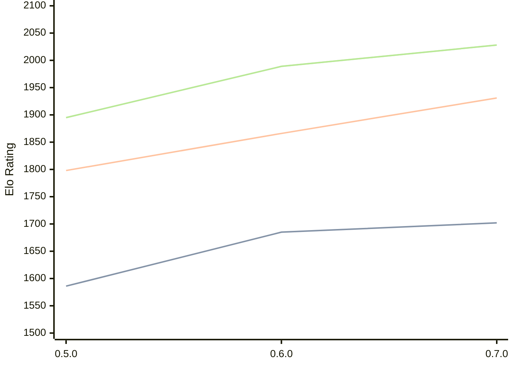

# Engine: Chess-rs

Author: Tom Cant

Home: https://github.com/tomcant/chess-rs

## Elo Ratings E1

| Version | Published | STC 8.0+0.08s  | LTC 60.0+0.60s | VLTC 2m24s+1.12s | Comment |
| --- | --- | --- | --- | --- | --- |
| 0.7.0 | 2025-12-31 | 1593 | 1817 | 1832 |  |
 | | | cElo (∆ prev) | cElo (∆ prev) | cElo (∆ prev) | 

## Elo Ratings P1

| Version | Published | STC 8.0+0.08s  | LTC 60.0+0.60s | VLTC 2m24s+1.12s | Comment |
| --- | --- | --- | --- | --- | --- |
| 0.7.0 | 2025-12-31 | 1754 | 2006 | 2052 |  |
 | | | cElo (∆ prev) | cElo (∆ prev) | cElo (∆ prev) | 

## Elo Ratings T1

| Version | Published | STC 8.0+0.08s  | LTC 60.0+0.60s | VLTC 2m24s+1.12s | Comment |
| --- | --- | --- | --- | --- | --- |
| 0.7.0 | 2025-12-31 | 1702(+17) | 1931(+65) | 2028(+39) |  |
| 0.6.0 | 2025-11-11 | 1685(+99) | 1866(+68) | 1989(+94) |  |
| 0.5.0 | 2025-11-03 | 1586 | 1798 | 1895 |  |
 | | | cElo (∆ prev) | cElo (∆ prev) | cElo (∆ prev) | 

<a href="https://github.com/computer-chess-index/cci/issues/new?template=submit-version.yml&title=[VERSION]+Chess-rs+<version>&body=###%20Engine%20name%0AChess-rs%0A%0A###%20Version%0A0.7.0" target="_blank">Submit new version</a>

 Test Conditions:

GUI/CLI: <a href=https://github.com/cutechess/cutechess target="_blank">Cute-Chess</a> 
Elo Calculation: <a href=https://www.remi-coulom.fr/Bayesian-Elo/ target="_blank">Bayesian-Elo</a> 
CPU for P1: Intel(R) Core(TM) Ultra 7 265T (1.50 GHz) - P-Core 
CPU for E1: Intel(R) Core(TM) Ultra 7 265T (1.50 GHz) - E-Core 
CPU for T1: Intel(R) Core(TM) i5-7500T 2.70GHz 
Opening book: 8_moves_v3 
\* STC: 8.0+0.08s, LTC: 60.0+0.60s, VLTC: 2m24s+1.12s

 Lists:
Ratings: <a href=https://github.com/computer-chess-index/cci/blob/main/lists/CCIRatings.csv target="_blank">Complete list</a>

Generated: 2026-10-09 14:09:51

## Ratings Verlauf

```mermaid
%%{init: {"theme":"base","themeVariables":{"seriesColors:['#a3a3a3','#222221','#faa371']}}}%%
xychart-beta
  x-axis ["0.5.0", "0.6.0", "0.7.0"]
  y-axis "Elo Rating" 1500 --> 2100
  line "" [1586, 1685, 1702]
  line "STC (8.0+0.08s)" [1586, 1685, 1702]
  line "LTC (60.0+0.60s)" [1798, 1866, 1931]
  line "" [1895, 1989, 2028]
  line "VLTC (2m24s+1.12s)" [1895, 1989, 2028]
```

## Detailed Evaluation Results

| Version | Time Control | Elo  | Range +/- | Matches | Score | Average Opponent Elo | Draws |
| --- | --- | --- | --- | --- | --- | --- | --- |
| 0.7.0 | VLTC (2m24s+1.12s) | 2028 | 24 | 644 | 48% | 2041 | 21% |
| 0.7.0 | VLTC (2m24s+1.12s) | 2052 | 46 | 172 | 45% | 2156 | 23% |
| 0.7.0 | VLTC (2m24s+1.12s) | 1832 | 48 | 159 | 50% | 1848 | 26% |
| 0.7.0 | LTC (60.0+0.60s) | 1931 | 23 | 650 | 49% | 1935 | 22% |
| 0.7.0 | LTC (60.0+0.60s) | 2006 | 49 | 158 | 47% | 2068 | 20% |
| 0.7.0 | LTC (60.0+0.60s) | 1817 | 42 | 214 | 50% | 1840 | 19% |
| 0.7.0 | STC (8.0+0.08s) | 1702 | 22 | 762 | 50% | 1697 | 18% |
| --- | --- | --- | --- | --- | --- | --- | --- |
| 0.7.0 | STC (8.0+0.08s) | 1754 | 48 | 158 | 51% | 1743 | 19% |
| --- | --- | --- | --- | --- | --- | --- | --- |
| 0.7.0 | STC (8.0+0.08s) | 1593 | 42 | 212 | 47% | 1654 | 19% |
| --- | --- | --- | --- | --- | --- | --- | --- |
| 0.6.0 | VLTC (2m24s+1.12s) | 1989 | 44 | 184 | 49% | 1998 | 21% |
| 0.6.0 | LTC (60.0+0.60s) | 1866 | 50 | 146 | 50% | 1868 | 21% |
| 0.6.0 | STC (8.0+0.08s) | 1685 | 54 | 124 | 50% | 1683 | 18% |
| --- | --- | --- | --- | --- | --- | --- | --- |
| 0.5.0 | VLTC (2m24s+1.12s) | 1895 | 49 | 148 | 49% | 1905 | 20% |
| 0.5.0 | LTC (60.0+0.60s) | 1798 | 46 | 176 | 47% | 1833 | 18% |
| 0.5.0 | STC (8.0+0.08s) | 1586 | 49 | 156 | 47% | 1616 | 16% |
| --- | --- | --- | --- | --- | --- | --- | --- |