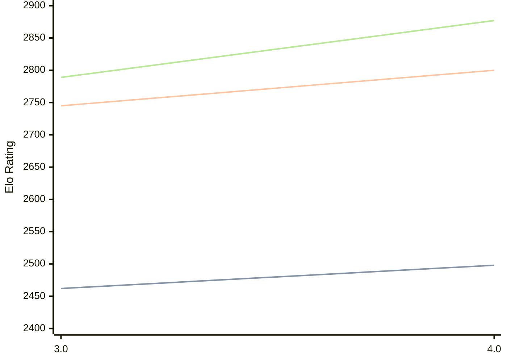

# Engine: Chess3

Author: Paul Sonkoly

Home: https://github.com/paulsonkoly/chess-3

## Elo Ratings

| Version | Published | STC 8.0+0.08s  | LTC 60.0+0.60s | VLTC 2m24s+1.12s | Comment |
| --- | --- | --- | --- | --- | --- |
| 4.0 | 2026-04-02 | 2498(+36) | 2800(+55) | 2877(+88) |  |
| 3.0 | 2026-01-17 | 2462(+new) | 2745(+new) | 2789(+new) |  |
| 2.0 | 2025-08-14 |  |  |  |  |
| 1.0 | 2025-05-15 |  |  |  |  |
 | | | cElo (∆ prev) | cElo (∆ prev) | cElo (∆ prev) | 

<a href="https://github.com/computer-chess-index/cci/issues/new?template=submit-version.yml&title=[VERSION]+Chess3+<version>&body=###%20Engine%20name%0AChess3%0A%0A###%20Version%0A4.0" target="_blank">Submit new version</a>

 Test Conditions:

GUI/CLI: <a href=https://github.com/cutechess/cutechess target="_blank">Cute-Chess</a> 
Elo Calculation: <a href=https://www.remi-coulom.fr/Bayesian-Elo/ target="_blank">Bayesian-Elo</a> 
CPU: Intel(R) Core(TM) i5-7500T 2.70GHz 
Opening book: 8_moves_v3 
\* STC: 8.0+0.08s, LTC: 60.0+0.60s, VLTC: 2m24s+1.12s

 Lists:
Ratings: <a href=https://github.com/computer-chess-index/cci/blob/main/lists/CCIRatings.csv target="_blank">Complete list</a>

Generated: 2026-05-20 06:23:34

## Ratings Verlauf

⬛ STC (8.0+0.08s) &nbsp;&nbsp; 🟧 LTC (60.0+0.60s) &nbsp;&nbsp; 🟩 VLTC (2m24s+1.12s)

dark mode: 🟩STC (8.0+0.08s) 🟧LTC (60.0+0.60s) ⬜VLTC (2m24s+1.12s)

## Detailed Evaluation Results

| Version | Time Control | Elo  | Range +/- | Matches | Score | Average Opponent Elo | Draws |
| --- | --- | --- | --- | --- | --- | --- | --- |
| 4.0 | VLTC (2m24s+1.12s) | 2877 | 28 | 398 | 52% | 2855 | 39% |
| 4.0 | LTC (60.0+0.60s) | 2800 | 28 | 402 | 51% | 2790 | 36% |
| 4.0 | STC (8.0+0.08s) | 2498 | 28 | 420 | 50% | 2493 | 29% |
| --- | --- | --- | --- | --- | --- | --- | --- |
| 3.0 | VLTC (2m24s+1.12s) | 2789 | 32 | 316 | 49% | 2801 | 34% |
| 3.0 | LTC (60.0+0.60s) | 2745 | 32 | 320 | 50% | 2741 | 35% |
| 3.0 | STC (8.0+0.08s) | 2462 | 27 | 440 | 49% | 2468 | 34% |
| --- | --- | --- | --- | --- | --- | --- | --- |