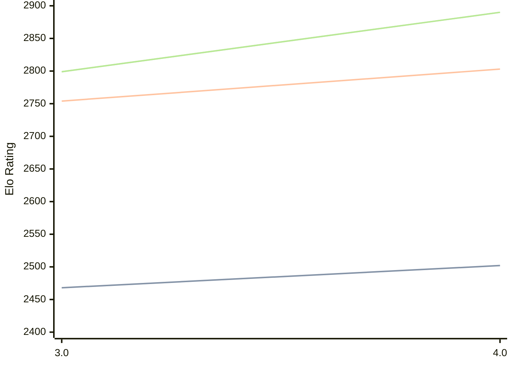

# Engine: Chess3

Author: Paul Sonkoly

Home: https://github.com/paulsonkoly/chess-3

## Elo Ratings

| Version | Published | STC 8.0+0.08s  | LTC 60.0+0.60s | VLTC 2m24s+1.12s | Comment |
| --- | --- | --- | --- | --- | --- |
| 4.0 | 2026-04-02 | 2502(+34) | 2803(+49) | 2890(+91) |  |
| 3.0 | 2026-01-17 | 2468 | 2754 | 2799 |  |
 | | | cElo (∆ prev) | cElo (∆ prev) | cElo (∆ prev) | 

<a href="https://github.com/computer-chess-index/cci/issues/new?template=submit-version.yml&title=[VERSION]+Chess3+<version>&body=###%20Engine%20name%0AChess3%0A%0A###%20Version%0A4.0" target="_blank">Submit new version</a>

 Test Conditions:

GUI/CLI: <a href=https://github.com/cutechess/cutechess target="_blank">Cute-Chess</a> 
Elo Calculation: <a href=https://www.remi-coulom.fr/Bayesian-Elo/ target="_blank">Bayesian-Elo</a> 
CPU: Intel(R) Core(TM) i5-7500T 2.70GHz 
Opening book: 8_moves_v3 
\* STC: 8.0+0.08s, LTC: 60.0+0.60s, VLTC: 2m24s+1.12s

 Lists:
Ratings: <a href=https://github.com/computer-chess-index/cci/blob/main/lists/CCIRatings.csv target="_blank">Complete list</a>

Generated: 2026-08-30 15:48:02

## Ratings Verlauf

## Detailed Evaluation Results

| Version | Time Control | Elo  | Range +/- | Matches | Score | Average Opponent Elo | Draws |
| --- | --- | --- | --- | --- | --- | --- | --- |
| 4.0 | VLTC (2m24s+1.12s) | 2890 | 24 | 536 | 52% | 2873 | 40% |
| 4.0 | LTC (60.0+0.60s) | 2803 | 24 | 566 | 50% | 2804 | 38% |
| 4.0 | STC (8.0+0.08s) | 2502 | 24 | 580 | 49% | 2512 | 29% |
| --- | --- | --- | --- | --- | --- | --- | --- |
| 3.0 | VLTC (2m24s+1.12s) | 2799 | 32 | 316 | 49% | 2812 | 34% |
| 3.0 | LTC (60.0+0.60s) | 2754 | 32 | 320 | 50% | 2750 | 35% |
| 3.0 | STC (8.0+0.08s) | 2468 | 27 | 440 | 49% | 2472 | 34% |
| --- | --- | --- | --- | --- | --- | --- | --- |