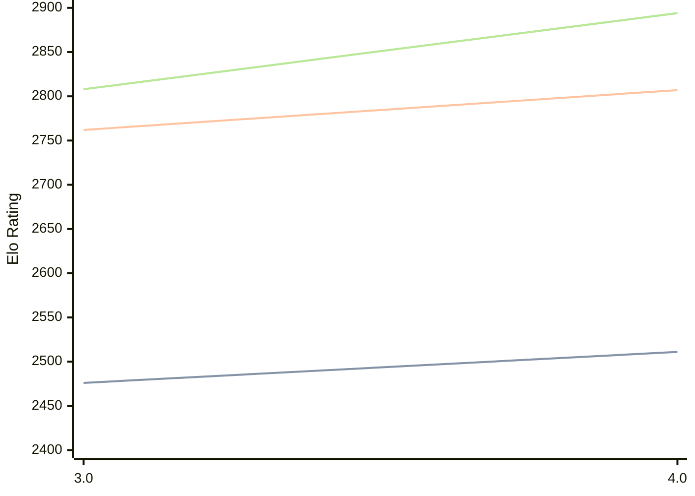

# Engine: Chess3

Author: Paul Sonkoly

Home: https://github.com/paulsonkoly/chess-3

## Elo Ratings E1

| Version | Published | STC 8.0+0.08s  | LTC 60.0+0.60s | VLTC 2m24s+1.12s | Comment |
| --- | --- | --- | --- | --- | --- |
| 4.0 | 2026-04-02 | 2450 | 2749 | 2830 |  |
 | | | cElo (∆ prev) | cElo (∆ prev) | cElo (∆ prev) | 

## Elo Ratings P1

| Version | Published | STC 8.0+0.08s  | LTC 60.0+0.60s | VLTC 2m24s+1.12s | Comment |
| --- | --- | --- | --- | --- | --- |
| 4.0 | 2026-04-02 | 2666 | 2936 | 3009 |  |
 | | | cElo (∆ prev) | cElo (∆ prev) | cElo (∆ prev) | 

## Elo Ratings T1

| Version | Published | STC 8.0+0.08s  | LTC 60.0+0.60s | VLTC 2m24s+1.12s | Comment |
| --- | --- | --- | --- | --- | --- |
| 4.0 | 2026-04-02 | 2511(+35) | 2807(+45) | 2894(+86) |  |
| 3.0 | 2026-01-17 | 2476 | 2762 | 2808 |  |
 | | | cElo (∆ prev) | cElo (∆ prev) | cElo (∆ prev) | 

<a href="https://github.com/computer-chess-index/cci/issues/new?template=submit-version.yml&title=[VERSION]+Chess3+<version>&body=###%20Engine%20name%0AChess3%0A%0A###%20Version%0A4.0" target="_blank">Submit new version</a>

 Test Conditions:

GUI/CLI: <a href=https://github.com/cutechess/cutechess target="_blank">Cute-Chess</a> 
Elo Calculation: <a href=https://www.remi-coulom.fr/Bayesian-Elo/ target="_blank">Bayesian-Elo</a> 
CPU for P1: Intel(R) Core(TM) Ultra 7 265T (1.50 GHz) - P-Core 
CPU for E1: Intel(R) Core(TM) Ultra 7 265T (1.50 GHz) - E-Core 
CPU for T1: Intel(R) Core(TM) i5-7500T 2.70GHz 
Opening book: 8_moves_v3 
\* STC: 8.0+0.08s, LTC: 60.0+0.60s, VLTC: 2m24s+1.12s

 Lists:
Ratings: <a href=https://github.com/computer-chess-index/cci/blob/main/lists/CCIRatings.csv target="_blank">Complete list</a>

Generated: 2026-10-10 04:37:06

## Ratings Verlauf

```mermaid
%%{init: {"theme":"base","themeVariables":{"seriesColors:['#a3a3a3','#222221','#faa371']}}}%%
xychart-beta
  x-axis ["3.0", "4.0"]
  y-axis "Elo Rating" 2400 --> 2900
  line "" [2476, 2511]
  line "STC (8.0+0.08s)" [2476, 2511]
  line "LTC (60.0+0.60s)" [2762, 2807]
  line "" [2808, 2894]
  line "VLTC (2m24s+1.12s)" [2808, 2894]
```

## Detailed Evaluation Results

| Version | Time Control | Elo  | Range +/- | Matches | Score | Average Opponent Elo | Draws |
| --- | --- | --- | --- | --- | --- | --- | --- |
| 4.0 | VLTC (2m24s+1.12s) | 2830 | 30 | 340 | 47% | 2850 | 41% |
| 4.0 | VLTC (2m24s+1.12s) | 2894 | 23 | 568 | 51% | 2882 | 40% |
| 4.0 | VLTC (2m24s+1.12s) | 3009 | 45 | 160 | 48% | 3025 | 33% |
| 4.0 | LTC (60.0+0.60s) | 2749 | 40 | 226 | 51% | 2692 | 30% |
| 4.0 | LTC (60.0+0.60s) | 2807 | 23 | 586 | 49% | 2812 | 38% |
| 4.0 | LTC (60.0+0.60s) | 2936 | 47 | 176 | 61% | 2614 | 27% |
| 4.0 | STC (8.0+0.08s) | 2450 | 38 | 234 | 50% | 2448 | 33% |
| --- | --- | --- | --- | --- | --- | --- | --- |
| 4.0 | STC (8.0+0.08s) | 2511 | 24 | 604 | 49% | 2520 | 29% |
| --- | --- | --- | --- | --- | --- | --- | --- |
| 4.0 | STC (8.0+0.08s) | 2666 | 45 | 172 | 52% | 2643 | 31% |
| --- | --- | --- | --- | --- | --- | --- | --- |
| 3.0 | VLTC (2m24s+1.12s) | 2808 | 32 | 316 | 49% | 2820 | 34% |
| 3.0 | LTC (60.0+0.60s) | 2762 | 32 | 320 | 50% | 2758 | 35% |
| 3.0 | STC (8.0+0.08s) | 2476 | 27 | 440 | 49% | 2480 | 34% |
| --- | --- | --- | --- | --- | --- | --- | --- |