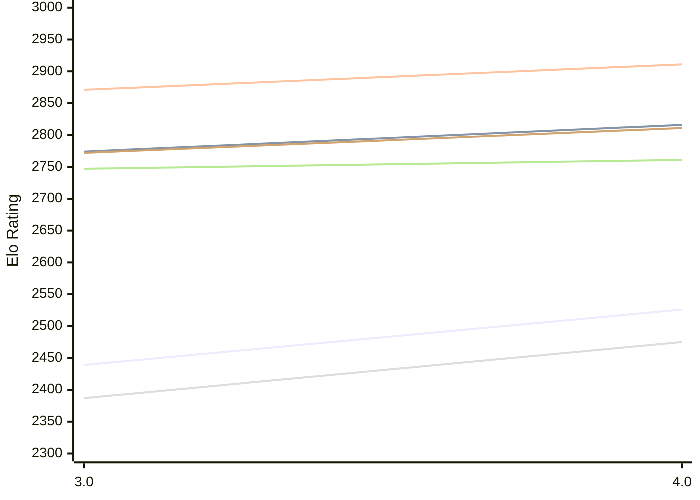
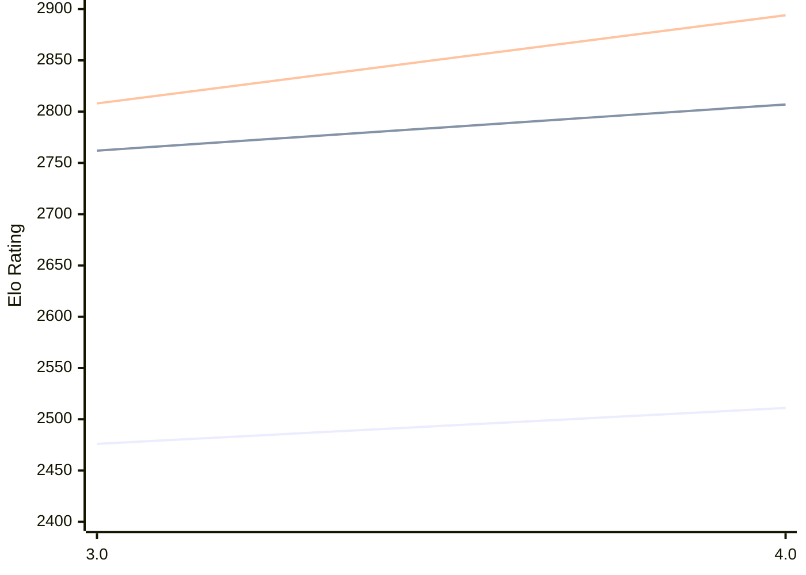

# Engine: Chess3

Author: Paul Sonkoly

Home: https://github.com/paulsonkoly/chess-3

## Elo Ratings E1 (Ultra 7 265T (1.50 GHz) - E-Core)

| Version | Published | STC 8.0+0.08s  | LTC 60.0+0.60s | VLTC 2m24s+1.12s | Comment |
| --- | --- | --- | --- | --- | --- |
| 4.0 | 2026-04-02 | 2526(+87) | 2816(+42) | 2911(+40) |  |
| 3.0 | 2026-01-17 | 2439 | 2774 | 2871 |  |
 | | | cElo (∆ prev) | cElo (∆ prev) | cElo (∆ prev) | 

## Elo Ratings P1 (Ultra 7 265T (1.50 GHz) - P-Core)

| Version | Published | STC 8.0+0.08s  | LTC 60.0+0.60s | VLTC 2m24s+1.12s | Comment |
| --- | --- | --- | --- | --- | --- |
| 4.0 | 2026-04-02 | 2475(+88) | 2761(+14) | 2811(+39) |  |
| 3.0 | 2026-01-17 | 2387 | 2747 | 2772 |  |
 | | | cElo (∆ prev) | cElo (∆ prev) | cElo (∆ prev) | 

## Elo Ratings T1 (i5-7500T 2.70GHz)

| Version | Published | STC 8.0+0.08s  | LTC 60.0+0.60s | VLTC 2m24s+1.12s | Comment |
| --- | --- | --- | --- | --- | --- |
| 4.0 | 2026-04-02 | 2511(+35) | 2807(+45) | 2894(+86) |  |
| 3.0 | 2026-01-17 | 2476 | 2762 | 2808 |  |
 | | | cElo (∆ prev) | cElo (∆ prev) | cElo (∆ prev) | 

<a href="https://github.com/computer-chess-index/cci/issues/new?template=submit-version.yml&title=[VERSION]+Chess3+<version>&body=###%20Engine%20name%0AChess3%0A%0A###%20Version%0A4.0" target="_blank">Submit new version</a>

 Test Conditions:

GUI/CLI: <a href=https://github.com/cutechess/cutechess target="_blank">Cute-Chess</a> 
Elo Calculation: <a href=https://www.remi-coulom.fr/Bayesian-Elo/ target="_blank">Bayesian-Elo</a> 
CPU for P1: Intel(R) Core(TM) Ultra 7 265T (1.50 GHz) - P-Core 
CPU for E1: Intel(R) Core(TM) Ultra 7 265T (1.50 GHz) - E-Core 
CPU for T1: Intel(R) Core(TM) i5-7500T 2.70GHz 
Opening book: 8_moves_v3 
\* STC: 8.0+0.08s, LTC: 60.0+0.60s, VLTC: 2m24s+1.12s

 Lists:
Ratings: <a href=https://github.com/computer-chess-index/cci/blob/main/lists/CCIRatings.csv target="_blank">Complete list</a>

Generated: 2026-11-16 05:37:08

## Ratings Verlauf E1 / P1

```mermaid
%%{init: {"theme":"base","themeVariables":{"seriesColors:['#a3a3a3','#222221','#faa371']}}}%%
xychart-beta
  x-axis ["3.0", "4.0"]
  y-axis "Elo Rating" 2300 --> 3000
  line "E1: STC (8.0+0.08s)" [2439, 2526]
  line "E1: LTC (60.0+0.60s)" [2774, 2816]
  line "E1: VLTC (2m24s+1.12s)" [2871, 2911]
  line "P1: STC (8.0+0.08s)" [2387, 2475]
  line "P1: LTC (60.0+0.60s)" [2747, 2761]
  line "P1: VLTC (2m24s+1.12s)" [2772, 2811]
```

## Ratings Verlauf T1

```mermaid
%%{init: {"theme":"base","themeVariables":{"seriesColors:['#a3a3a3','#222221','#faa371']}}}%%
xychart-beta
  x-axis ["3.0", "4.0"]
  y-axis "Elo Rating" 2400 --> 2900
  line "T1: STC (8.0+0.08s)" [2476, 2511]
  line "T1: LTC (60.0+0.60s)" [2762, 2807]
  line "T1: VLTC (2m24s+1.12s)" [2808, 2894]
```

## Detailed Evaluation Results

| Version | Time Control | Variant | Elo  | Range +/- | Matches | Score | Average Opponent Elo | Draws |
| --- | --- |--- | --- | --- | --- | --- | --- | --- |
| 4.0 | VLTC (2m24s+1.12s) | T1 | 2894 | 23 | 568 | 51% | 2882 | 40% |
|  |  | P1 | 2811 | 32 | 312 | 49% | 2822 | 36% |
|  |  | E1 | 2911 | 26 | 460 | 49% | 2903 | 39% |
|  | LTC (60.0+0.60s) | T1 | 2807 | 23 | 586 | 49% | 2812 | 38% |
|  |  | P1 | 2761 | 34 | 314 | 58% | 2576 | 30% |
|  |  | E1 | 2816 | 28 | 436 | 50% | 2800 | 33% |
|  | STC (8.0+0.08s) | T1 | 2511 | 24 | 604 | 49% | 2520 | 29% |
|  |  | P1 | 2475 | 36 | 264 | 49% | 2488 | 33% |
|  |  | E1 | 2526 | 30 | 370 | 49% | 2535 | 34% |
| --- | --- |--- | --- | --- | --- | --- | --- | --- |
| 3.0 | VLTC (2m24s+1.12s) | P1 | 2772 | 78 | 60 | 52% | 2670 | 37% |
|  |  | E1 | 2871 | 73 | 68 | 54% | 2815 | 29% |
|  |  | T1 | 2808 | 32 | 316 | 49% | 2820 | 34% |
|  | LTC (60.0+0.60s) | P1 | 2747 | 82 | 50 | 49% | 2738 | 34% |
|  |  | E1 | 2774 | 66 | 98 | 66% | 2558 | 28% |
|  |  | T1 | 2762 | 32 | 320 | 50% | 2758 | 35% |
|  | STC (8.0+0.08s) | E1 | 2439 | 67 | 88 | 51% | 2419 | 20% |
|  |  | T1 | 2476 | 27 | 440 | 49% | 2480 | 34% |
|  |  | P1 | 2387 | 94 | 58 | 62% | 2091 | 17% |