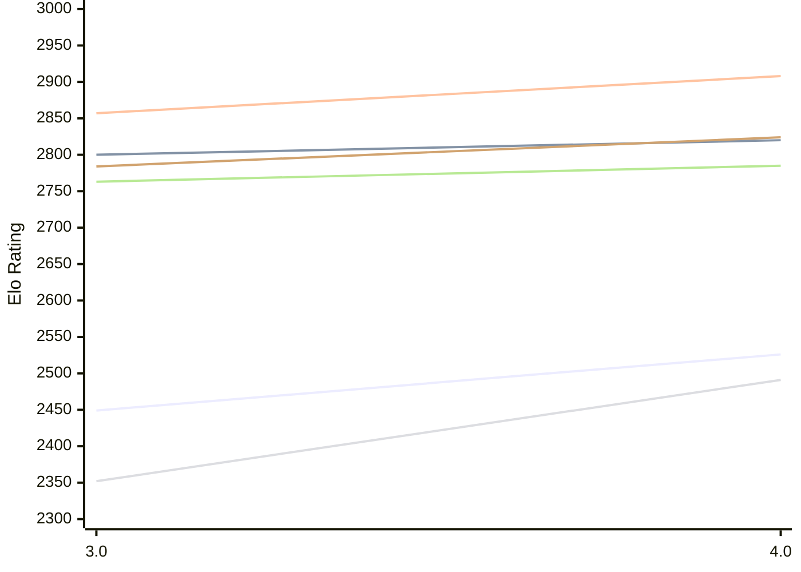
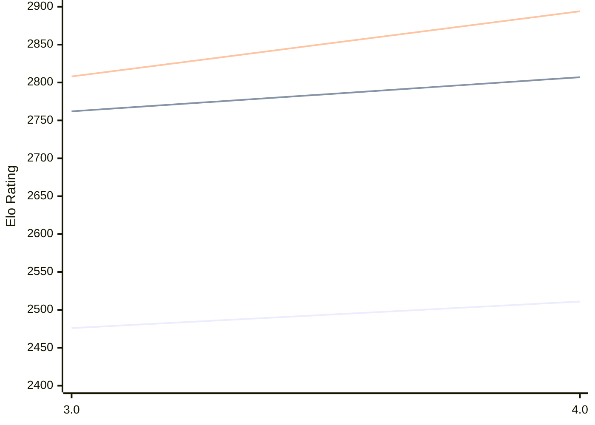

# Engine: Chess3

Author: Paul Sonkoly

Home: https://github.com/paulsonkoly/chess-3

## Elo Ratings E1 (Ultra 7 265T (1.50 GHz) - E-Core)

| Version | Published | STC 8.0+0.08s  | LTC 60.0+0.60s | VLTC 2m24s+1.12s | Comment |
| --- | --- | --- | --- | --- | --- |
| 4.0 | 2026-04-02 | 2526(+77) | 2820(+20) | 2908(+51) |  |
| 3.0 | 2026-01-17 | 2449 | 2800 | 2857 |  |
 | | | cElo (∆ prev) | cElo (∆ prev) | cElo (∆ prev) | 

## Elo Ratings P1 (Ultra 7 265T (1.50 GHz) - P-Core)

| Version | Published | STC 8.0+0.08s  | LTC 60.0+0.60s | VLTC 2m24s+1.12s | Comment |
| --- | --- | --- | --- | --- | --- |
| 4.0 | 2026-04-02 | 2491(+139) | 2785(+22) | 2824(+40) |  |
| 3.0 | 2026-01-17 | 2352 | 2763 | 2784 |  |
 | | | cElo (∆ prev) | cElo (∆ prev) | cElo (∆ prev) | 

## Elo Ratings T1 (i5-7500T 2.70GHz)

| Version | Published | STC 8.0+0.08s  | LTC 60.0+0.60s | VLTC 2m24s+1.12s | Comment |
| --- | --- | --- | --- | --- | --- |
| 4.0 | 2026-04-02 | 2511(+35) | 2807(+45) | 2894(+86) |  |
| 3.0 | 2026-01-17 | 2476 | 2762 | 2808 |  |
 | | | cElo (∆ prev) | cElo (∆ prev) | cElo (∆ prev) | 

<a href="https://github.com/computer-chess-index/cci/issues/new?template=submit-version.yml&title=[VERSION]+Chess3+<version>&body=###%20Engine%20name%0AChess3%0A%0A###%20Version%0A4.0" target="_blank">Submit new version</a>

 Test Conditions:

GUI/CLI: <a href=https://github.com/cutechess/cutechess target="_blank">Cute-Chess</a> 
Elo Calculation: <a href=https://www.remi-coulom.fr/Bayesian-Elo/ target="_blank">Bayesian-Elo</a> 
CPU for P1: Intel(R) Core(TM) Ultra 7 265T (1.50 GHz) - P-Core 
CPU for E1: Intel(R) Core(TM) Ultra 7 265T (1.50 GHz) - E-Core 
CPU for T1: Intel(R) Core(TM) i5-7500T 2.70GHz 
Opening book: 8_moves_v3 
\* STC: 8.0+0.08s, LTC: 60.0+0.60s, VLTC: 2m24s+1.12s

 Lists:
Ratings: <a href=https://github.com/computer-chess-index/cci/blob/main/lists/CCIRatings.csv target="_blank">Complete list</a>

Generated: 2026-11-20 05:37:08

## Ratings Verlauf E1 / P1

```mermaid
%%{init: {"theme":"base","themeVariables":{"seriesColors:['#a3a3a3','#222221','#faa371']}}}%%
xychart-beta
  x-axis ["3.0", "4.0"]
  y-axis "Elo Rating" 2300 --> 3000
  line "E1: STC (8.0+0.08s)" [2449, 2526]
  line "E1: LTC (60.0+0.60s)" [2800, 2820]
  line "E1: VLTC (2m24s+1.12s)" [2857, 2908]
  line "P1: STC (8.0+0.08s)" [2352, 2491]
  line "P1: LTC (60.0+0.60s)" [2763, 2785]
  line "P1: VLTC (2m24s+1.12s)" [2784, 2824]
```

## Ratings Verlauf T1

```mermaid
%%{init: {"theme":"base","themeVariables":{"seriesColors:['#a3a3a3','#222221','#faa371']}}}%%
xychart-beta
  x-axis ["3.0", "4.0"]
  y-axis "Elo Rating" 2400 --> 2900
  line "T1: STC (8.0+0.08s)" [2476, 2511]
  line "T1: LTC (60.0+0.60s)" [2762, 2807]
  line "T1: VLTC (2m24s+1.12s)" [2808, 2894]
```

## Detailed Evaluation Results

| Version | Time Control | Variant | Elo  | Range +/- | Matches | Score | Average Opponent Elo | Draws |
| --- | --- |--- | --- | --- | --- | --- | --- | --- |
| 4.0 | VLTC (2m24s+1.12s) | T1 | 2894 | 23 | 568 | 51% | 2882 | 40% |
|  |  | P1 | 2824 | 31 | 332 | 48% | 2839 | 36% |
|  |  | E1 | 2908 | 26 | 484 | 48% | 2909 | 38% |
|  | LTC (60.0+0.60s) | T1 | 2807 | 23 | 586 | 49% | 2812 | 38% |
|  |  | P1 | 2785 | 32 | 346 | 58% | 2611 | 31% |
|  |  | E1 | 2820 | 27 | 452 | 50% | 2800 | 33% |
|  | STC (8.0+0.08s) | T1 | 2511 | 24 | 604 | 49% | 2520 | 29% |
|  |  | P1 | 2491 | 35 | 280 | 49% | 2503 | 33% |
|  |  | E1 | 2526 | 29 | 394 | 49% | 2529 | 33% |
| --- | --- |--- | --- | --- | --- | --- | --- | --- |
| 3.0 | VLTC (2m24s+1.12s) | E1 | 2857 | 68 | 76 | 53% | 2819 | 32% |
|  |  | T1 | 2808 | 32 | 316 | 49% | 2820 | 34% |
|  |  | P1 | 2784 | 64 | 84 | 51% | 2711 | 36% |
|  | LTC (60.0+0.60s) | E1 | 2800 | 59 | 118 | 65% | 2595 | 27% |
|  |  | T1 | 2762 | 32 | 320 | 50% | 2758 | 35% |
|  |  | P1 | 2763 | 69 | 70 | 49% | 2751 | 36% |
|  | STC (8.0+0.08s) | T1 | 2476 | 27 | 440 | 49% | 2480 | 34% |
|  |  | P1 | 2352 | 73 | 82 | 55% | 2182 | 21% |
|  |  | E1 | 2449 | 57 | 112 | 52% | 2423 | 25% |