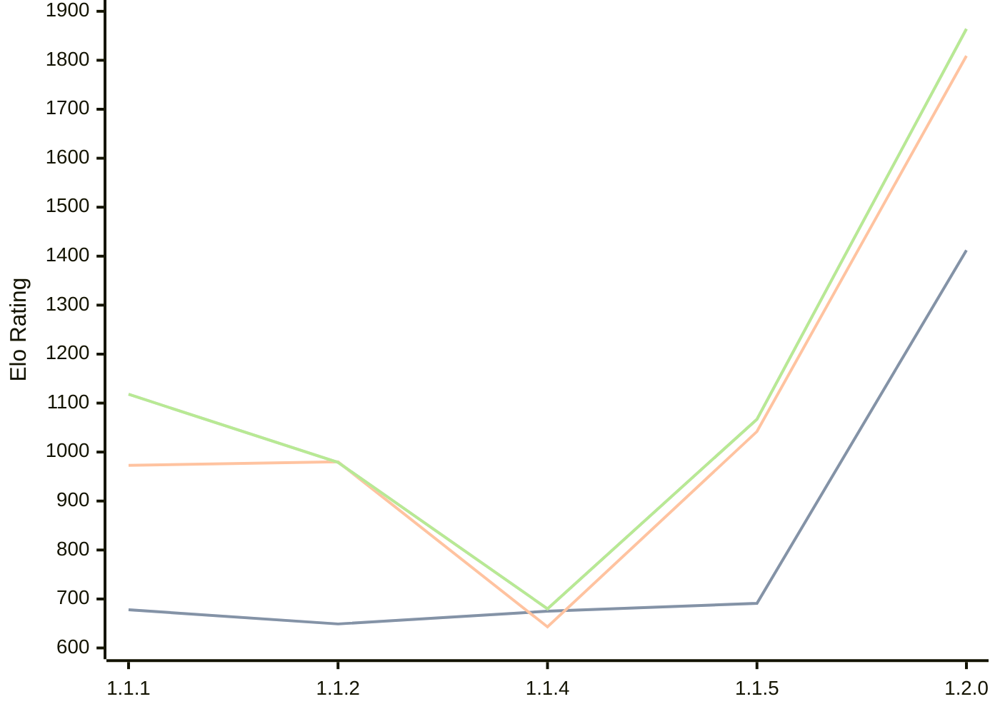

# Engine: ChessCore

Author: Adam Berent

Home: https://github.com/3583Bytes/ChessCore

## Elo Ratings

| Version | Published | STC 8.0+0.08s  | LTC 60.0+0.60s | VLTC 2m24s+1.12s | Comment |
| --- | --- | --- | --- | --- | --- |
| 1.2.0 | 2026-06-24 | 1412(+721) | 1809(+767) | 1864(+797) |  |
| 1.1.5 | 2026-05-25 | 691(+16) | 1042(+399) | 1067(+387) |  |
| 1.1.4 | 2026-05-21 | 675(+26) | 643(-337) | 680(-299) |  |
| 1.1.2 | 2026-05-19 | 649(-29) | 980(+7) | 979(-139) |  |
| 1.1.1 | 2026-05-14 | 678(+new) | 973(+new) | 1118(+new) |  |
| 1.1.0 | 2026-05-14 |  |  |  |  |
 | | | cElo (∆ prev) | cElo (∆ prev) | cElo (∆ prev) | 

<a href="https://github.com/computer-chess-index/cci/issues/new?template=submit-version.yml&title=[VERSION]+ChessCore+<version>&body=###%20Engine%20name%0AChessCore%0A%0A###%20Version%0A1.2.0" target="_blank">Submit new version</a>

 Test Conditions:

GUI/CLI: <a href=https://github.com/cutechess/cutechess target="_blank">Cute-Chess</a> 
Elo Calculation: <a href=https://www.remi-coulom.fr/Bayesian-Elo/ target="_blank">Bayesian-Elo</a> 
CPU: Intel(R) Core(TM) i5-7500T 2.70GHz 
Opening book: 8_moves_v3 
\* STC: 8.0+0.08s, LTC: 60.0+0.60s, VLTC: 2m24s+1.12s

 Lists:
Ratings: <a href=https://github.com/computer-chess-index/cci/blob/main/lists/CCIRatings.csv target="_blank">Complete list</a>

Generated: 2026-07-22 06:23:56

## Ratings Verlauf

⬛ STC (8.0+0.08s) &nbsp;&nbsp; 🟧 LTC (60.0+0.60s) &nbsp;&nbsp; 🟩 VLTC (2m24s+1.12s)

dark mode: 🟩STC (8.0+0.08s) 🟧LTC (60.0+0.60s) ⬜VLTC (2m24s+1.12s)

## Detailed Evaluation Results

| Version | Time Control | Elo  | Range +/- | Matches | Score | Average Opponent Elo | Draws |
| --- | --- | --- | --- | --- | --- | --- | --- |
| 1.2.0 | VLTC (2m24s+1.12s) | 1864 | 41 | 198 | 57% | 1786 | 38% |
| 1.2.0 | LTC (60.0+0.60s) | 1809 | 39 | 224 | 54% | 1747 | 34% |
| 1.2.0 | STC (8.0+0.08s) | 1412 | 44 | 196 | 56% | 1349 | 28% |
| --- | --- | --- | --- | --- | --- | --- | --- |
| 1.1.5 | VLTC (2m24s+1.12s) | 1067 | 60 | 102 | 49% | 1081 | 17% |
| 1.1.5 | LTC (60.0+0.60s) | 1042 | 59 | 104 | 57% | 971 | 20% |
| 1.1.5 | STC (8.0+0.08s) | 691 | 77 | 50 | 49% | 703 | 42% |
| --- | --- | --- | --- | --- | --- | --- | --- |
| 1.1.4 | VLTC (2m24s+1.12s) | 680 | 39 | 244 | 52% | 648 | 46% |
| 1.1.4 | LTC (60.0+0.60s) | 643 | 41 | 218 | 53% | 595 | 42% |
| 1.1.4 | STC (8.0+0.08s) | 675 | 42 | 234 | 52% | 626 | 21% |
| --- | --- | --- | --- | --- | --- | --- | --- |
| 1.1.2 | VLTC (2m24s+1.12s) | 979 | 53 | 120 | 53% | 956 | 27% |
| 1.1.2 | LTC (60.0+0.60s) | 980 | 57 | 104 | 53% | 952 | 25% |
| 1.1.2 | STC (8.0+0.08s) | 649 | 89 | 44 | 55% | 606 | 18% |
| --- | --- | --- | --- | --- | --- | --- | --- |
| 1.1.1 | VLTC (2m24s+1.12s) | 1118 | 31 | 412 | 49% | 1108 | 19% |
| 1.1.1 | LTC (60.0+0.60s) | 973 | 36 | 328 | 48% | 977 | 19% |
| 1.1.1 | STC (8.0+0.08s) | 678 | 42 | 248 | 45% | 717 | 23% |
| --- | --- | --- | --- | --- | --- | --- | --- |