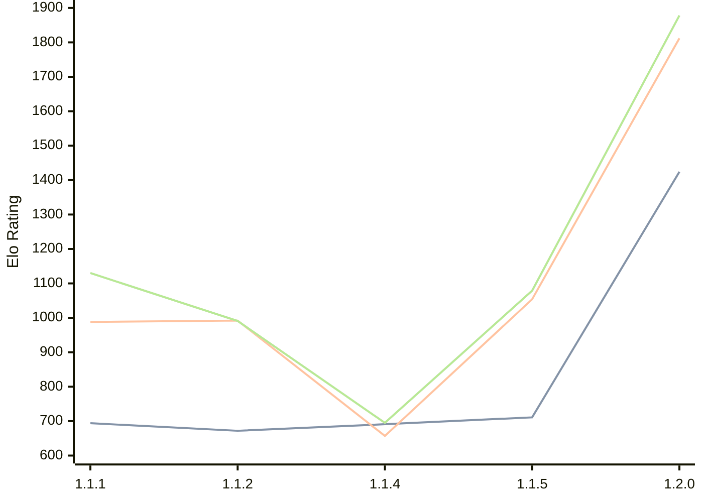

# Engine: ChessCore

Author: Adam Berent

Home: https://github.com/3583Bytes/ChessCore

## Elo Ratings

| Version | Published | STC 8.0+0.08s  | LTC 60.0+0.60s | VLTC 2m24s+1.12s | Comment |
| --- | --- | --- | --- | --- | --- |
| 1.2.0 | 2026-06-24 | 1424(+713) | 1812(+758) | 1878(+799) |  |
| 1.1.5 | 2026-05-25 | 711(+20) | 1054(+397) | 1079(+384) |  |
| 1.1.4 | 2026-05-21 | 691(+19) | 657(-335) | 695(-296) |  |
| 1.1.2 | 2026-05-19 | 672(-22) | 992(+4) | 991(-139) |  |
| 1.1.1 | 2026-05-14 | 694(+new) | 988(+new) | 1130(+new) |  |
| 1.1.0 | 2026-05-14 |  |  |  |  |
 | | | cElo (∆ prev) | cElo (∆ prev) | cElo (∆ prev) | 

<a href="https://github.com/computer-chess-index/cci/issues/new?template=submit-version.yml&title=[VERSION]+ChessCore+<version>&body=###%20Engine%20name%0AChessCore%0A%0A###%20Version%0A1.2.0" target="_blank">Submit new version</a>

 Test Conditions:

GUI/CLI: <a href=https://github.com/cutechess/cutechess target="_blank">Cute-Chess</a> 
Elo Calculation: <a href=https://www.remi-coulom.fr/Bayesian-Elo/ target="_blank">Bayesian-Elo</a> 
CPU: Intel(R) Core(TM) i5-7500T 2.70GHz 
Opening book: 8_moves_v3 
\* STC: 8.0+0.08s, LTC: 60.0+0.60s, VLTC: 2m24s+1.12s

 Lists:
Ratings: <a href=https://github.com/computer-chess-index/cci/blob/main/lists/CCIRatings.csv target="_blank">Complete list</a>

Generated: 2026-09-21 04:36:51

## Ratings Verlauf

## Detailed Evaluation Results

| Version | Time Control | Elo  | Range +/- | Matches | Score | Average Opponent Elo | Draws |
| --- | --- | --- | --- | --- | --- | --- | --- |
| 1.2.0 | VLTC (2m24s+1.12s) | 1878 | 33 | 290 | 55% | 1818 | 40% |
| 1.2.0 | LTC (60.0+0.60s) | 1812 | 31 | 338 | 54% | 1760 | 36% |
| 1.2.0 | STC (8.0+0.08s) | 1424 | 31 | 356 | 53% | 1389 | 31% |
| --- | --- | --- | --- | --- | --- | --- | --- |
| 1.1.5 | VLTC (2m24s+1.12s) | 1079 | 60 | 102 | 49% | 1095 | 17% |
| 1.1.5 | LTC (60.0+0.60s) | 1054 | 59 | 104 | 57% | 983 | 20% |
| 1.1.5 | STC (8.0+0.08s) | 711 | 77 | 50 | 49% | 725 | 42% |
| --- | --- | --- | --- | --- | --- | --- | --- |
| 1.1.4 | VLTC (2m24s+1.12s) | 695 | 39 | 244 | 52% | 663 | 46% |
| 1.1.4 | LTC (60.0+0.60s) | 657 | 41 | 218 | 53% | 610 | 42% |
| 1.1.4 | STC (8.0+0.08s) | 691 | 42 | 234 | 52% | 640 | 21% |
| --- | --- | --- | --- | --- | --- | --- | --- |
| 1.1.2 | VLTC (2m24s+1.12s) | 991 | 53 | 120 | 53% | 969 | 27% |
| 1.1.2 | LTC (60.0+0.60s) | 992 | 57 | 104 | 53% | 964 | 25% |
| 1.1.2 | STC (8.0+0.08s) | 672 | 90 | 44 | 55% | 630 | 18% |
| --- | --- | --- | --- | --- | --- | --- | --- |
| 1.1.1 | VLTC (2m24s+1.12s) | 1130 | 31 | 412 | 49% | 1122 | 19% |
| 1.1.1 | LTC (60.0+0.60s) | 988 | 36 | 328 | 48% | 991 | 19% |
| 1.1.1 | STC (8.0+0.08s) | 694 | 42 | 248 | 45% | 732 | 23% |
| --- | --- | --- | --- | --- | --- | --- | --- |