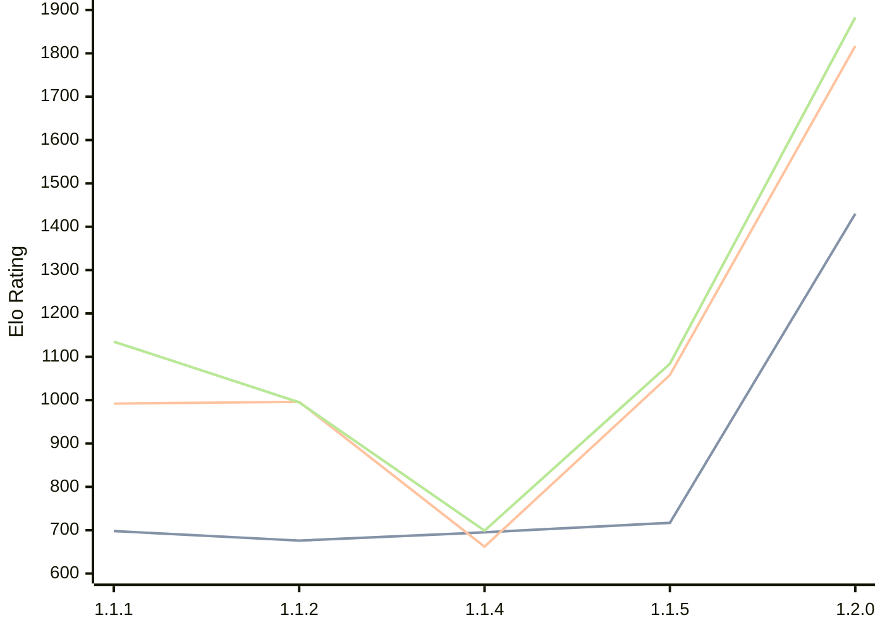

# Engine: ChessCore

Author: Adam Berent

Home: https://github.com/3583Bytes/ChessCore

## Elo Ratings E1

| Version | Published | STC 8.0+0.08s  | LTC 60.0+0.60s | VLTC 2m24s+1.12s | Comment |
| --- | --- | --- | --- | --- | --- |
| 1.2.0 | 2026-06-24 | 1291 | 1662 | 1785 |  |
 | | | cElo (∆ prev) | cElo (∆ prev) | cElo (∆ prev) | 

## Elo Ratings P1

| Version | Published | STC 8.0+0.08s  | LTC 60.0+0.60s | VLTC 2m24s+1.12s | Comment |
| --- | --- | --- | --- | --- | --- |
| 1.2.0 | 2026-06-24 | 1470 | 1827 | 1962 |  |
 | | | cElo (∆ prev) | cElo (∆ prev) | cElo (∆ prev) | 

## Elo Ratings T1

| Version | Published | STC 8.0+0.08s  | LTC 60.0+0.60s | VLTC 2m24s+1.12s | Comment |
| --- | --- | --- | --- | --- | --- |
| 1.2.0 | 2026-06-24 | 1430(+713) | 1817(+759) | 1883(+799) |  |
| 1.1.5 | 2026-05-25 | 717(+22) | 1058(+396) | 1084(+385) |  |
| 1.1.4 | 2026-05-21 | 695(+19) | 662(-334) | 699(-296) |  |
| 1.1.2 | 2026-05-19 | 676(-22) | 996(+4) | 995(-140) |  |
| 1.1.1 | 2026-05-14 | 698 | 992 | 1135 |  |
 | | | cElo (∆ prev) | cElo (∆ prev) | cElo (∆ prev) | 

<a href="https://github.com/computer-chess-index/cci/issues/new?template=submit-version.yml&title=[VERSION]+ChessCore+<version>&body=###%20Engine%20name%0AChessCore%0A%0A###%20Version%0A1.2.0" target="_blank">Submit new version</a>

 Test Conditions:

GUI/CLI: <a href=https://github.com/cutechess/cutechess target="_blank">Cute-Chess</a> 
Elo Calculation: <a href=https://www.remi-coulom.fr/Bayesian-Elo/ target="_blank">Bayesian-Elo</a> 
CPU for P1: Intel(R) Core(TM) Ultra 7 265T (1.50 GHz) - P-Core 
CPU for E1: Intel(R) Core(TM) Ultra 7 265T (1.50 GHz) - E-Core 
CPU for T1: Intel(R) Core(TM) i5-7500T 2.70GHz 
Opening book: 8_moves_v3 
\* STC: 8.0+0.08s, LTC: 60.0+0.60s, VLTC: 2m24s+1.12s

 Lists:
Ratings: <a href=https://github.com/computer-chess-index/cci/blob/main/lists/CCIRatings.csv target="_blank">Complete list</a>

Generated: 2026-10-10 04:37:11

## Ratings Verlauf

```mermaid
%%{init: {"theme":"base","themeVariables":{"seriesColors:['#a3a3a3','#222221','#faa371']}}}%%
xychart-beta
  x-axis ["1.1.1", "1.1.2", "1.1.4", "1.1.5", "1.2.0"]
  y-axis "Elo Rating" 600 --> 1900
  line "" [698, 676, 695, 717, 1430]
  line "STC (8.0+0.08s)" [698, 676, 695, 717, 1430]
  line "LTC (60.0+0.60s)" [992, 996, 662, 1058, 1817]
  line "" [1135, 995, 699, 1084, 1883]
  line "VLTC (2m24s+1.12s)" [1135, 995, 699, 1084, 1883]
```

## Detailed Evaluation Results

| Version | Time Control | Elo  | Range +/- | Matches | Score | Average Opponent Elo | Draws |
| --- | --- | --- | --- | --- | --- | --- | --- |
| 1.2.0 | VLTC (2m24s+1.12s) | 1785 | 44 | 180 | 42% | 1939 | 34% |
| 1.2.0 | VLTC (2m24s+1.12s) | 1883 | 33 | 290 | 55% | 1823 | 40% |
| 1.2.0 | VLTC (2m24s+1.12s) | 1962 | 46 | 152 | 44% | 2030 | 36% |
| 1.2.0 | LTC (60.0+0.60s) | 1662 | 49 | 132 | 46% | 1712 | 39% |
| 1.2.0 | LTC (60.0+0.60s) | 1817 | 31 | 338 | 54% | 1766 | 36% |
| 1.2.0 | LTC (60.0+0.60s) | 1827 | 51 | 132 | 41% | 1949 | 36% |
| 1.2.0 | STC (8.0+0.08s) | 1291 | 41 | 198 | 46% | 1330 | 31% |
| --- | --- | --- | --- | --- | --- | --- | --- |
| 1.2.0 | STC (8.0+0.08s) | 1430 | 31 | 360 | 54% | 1382 | 30% |
| --- | --- | --- | --- | --- | --- | --- | --- |
| 1.2.0 | STC (8.0+0.08s) | 1470 | 50 | 132 | 45% | 1562 | 32% |
| --- | --- | --- | --- | --- | --- | --- | --- |
| 1.1.5 | VLTC (2m24s+1.12s) | 1084 | 60 | 102 | 49% | 1099 | 17% |
| 1.1.5 | LTC (60.0+0.60s) | 1058 | 59 | 104 | 57% | 987 | 20% |
| 1.1.5 | STC (8.0+0.08s) | 717 | 77 | 50 | 49% | 730 | 42% |
| --- | --- | --- | --- | --- | --- | --- | --- |
| 1.1.4 | VLTC (2m24s+1.12s) | 699 | 39 | 244 | 52% | 667 | 46% |
| 1.1.4 | LTC (60.0+0.60s) | 662 | 41 | 218 | 53% | 614 | 42% |
| 1.1.4 | STC (8.0+0.08s) | 695 | 42 | 234 | 52% | 645 | 21% |
| --- | --- | --- | --- | --- | --- | --- | --- |
| 1.1.2 | VLTC (2m24s+1.12s) | 995 | 53 | 120 | 53% | 973 | 27% |
| 1.1.2 | LTC (60.0+0.60s) | 996 | 57 | 104 | 53% | 969 | 25% |
| 1.1.2 | STC (8.0+0.08s) | 676 | 90 | 44 | 55% | 635 | 18% |
| --- | --- | --- | --- | --- | --- | --- | --- |
| 1.1.1 | VLTC (2m24s+1.12s) | 1135 | 31 | 412 | 49% | 1127 | 19% |
| 1.1.1 | LTC (60.0+0.60s) | 992 | 36 | 328 | 48% | 996 | 19% |
| 1.1.1 | STC (8.0+0.08s) | 698 | 42 | 248 | 45% | 736 | 23% |
| --- | --- | --- | --- | --- | --- | --- | --- |