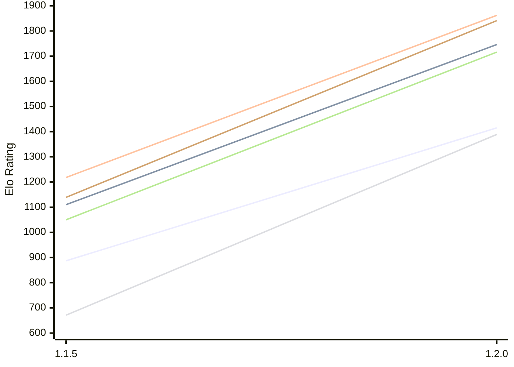
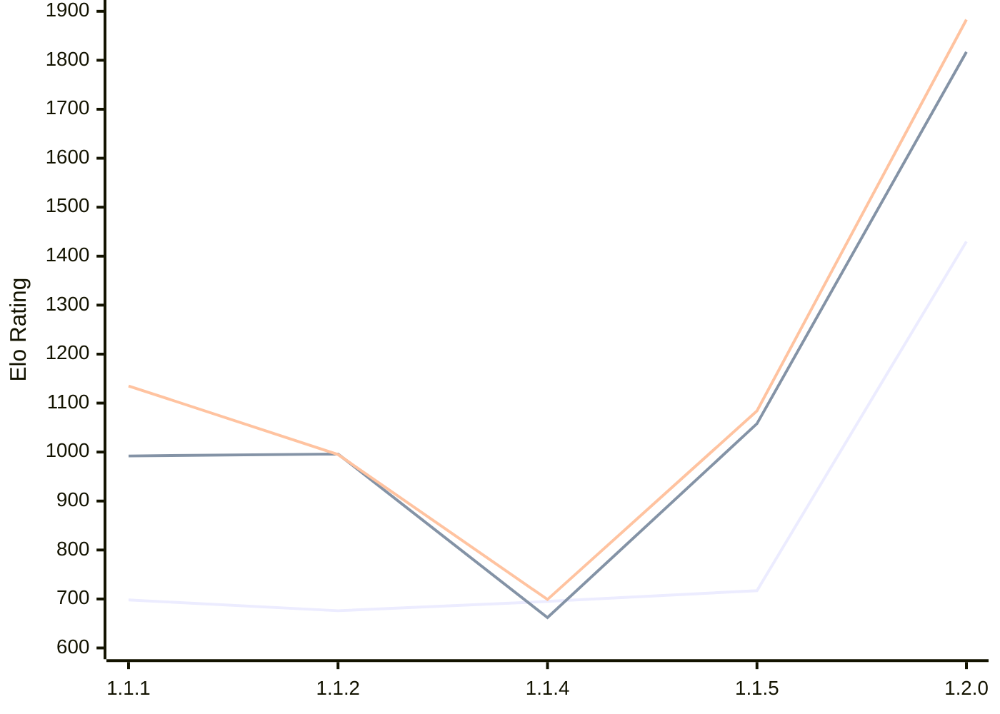

# Engine: ChessCore

Author: Adam Berent

Home: https://github.com/3583Bytes/ChessCore

## Elo Ratings E1 (Ultra 7 265T (1.50 GHz) - E-Core)

| Version | Published | STC 8.0+0.08s  | LTC 60.0+0.60s | VLTC 2m24s+1.12s | Comment |
| --- | --- | --- | --- | --- | --- |
| 1.2.0 | 2026-06-24 | 1415(+528) | 1746(+636) | 1862(+644) |  |
| 1.1.5 | 2026-05-25 | 887 | 1110 | 1218 |  |
 | | | cElo (∆ prev) | cElo (∆ prev) | cElo (∆ prev) | 

## Elo Ratings P1 (Ultra 7 265T (1.50 GHz) - P-Core)

| Version | Published | STC 8.0+0.08s  | LTC 60.0+0.60s | VLTC 2m24s+1.12s | Comment |
| --- | --- | --- | --- | --- | --- |
| 1.2.0 | 2026-06-24 | 1389(+718) | 1716(+666) | 1841(+702) |  |
| 1.1.5 | 2026-05-25 | 671 | 1050 | 1139 |  |
 | | | cElo (∆ prev) | cElo (∆ prev) | cElo (∆ prev) | 

## Elo Ratings T1 (i5-7500T 2.70GHz)

| Version | Published | STC 8.0+0.08s  | LTC 60.0+0.60s | VLTC 2m24s+1.12s | Comment |
| --- | --- | --- | --- | --- | --- |
| 1.2.0 | 2026-06-24 | 1430(+713) | 1817(+759) | 1883(+799) |  |
| 1.1.5 | 2026-05-25 | 717(+22) | 1058(+396) | 1084(+385) |  |
| 1.1.4 | 2026-05-21 | 695(+19) | 662(-334) | 699(-296) |  |
| 1.1.2 | 2026-05-19 | 676(-22) | 996(+4) | 995(-140) |  |
| 1.1.1 | 2026-05-14 | 698 | 992 | 1135 |  |
 | | | cElo (∆ prev) | cElo (∆ prev) | cElo (∆ prev) | 

<a href="https://github.com/computer-chess-index/cci/issues/new?template=submit-version.yml&title=[VERSION]+ChessCore+<version>&body=###%20Engine%20name%0AChessCore%0A%0A###%20Version%0A1.2.0" target="_blank">Submit new version</a>

 Test Conditions:

GUI/CLI: <a href=https://github.com/cutechess/cutechess target="_blank">Cute-Chess</a> 
Elo Calculation: <a href=https://www.remi-coulom.fr/Bayesian-Elo/ target="_blank">Bayesian-Elo</a> 
CPU for P1: Intel(R) Core(TM) Ultra 7 265T (1.50 GHz) - P-Core 
CPU for E1: Intel(R) Core(TM) Ultra 7 265T (1.50 GHz) - E-Core 
CPU for T1: Intel(R) Core(TM) i5-7500T 2.70GHz 
Opening book: 8_moves_v3 
\* STC: 8.0+0.08s, LTC: 60.0+0.60s, VLTC: 2m24s+1.12s

 Lists:
Ratings: <a href=https://github.com/computer-chess-index/cci/blob/main/lists/CCIRatings.csv target="_blank">Complete list</a>

Generated: 2026-11-16 05:37:14

## Ratings Verlauf E1 / P1

```mermaid
%%{init: {"theme":"base","themeVariables":{"seriesColors:['#a3a3a3','#222221','#faa371']}}}%%
xychart-beta
  x-axis ["1.1.5", "1.2.0"]
  y-axis "Elo Rating" 600 --> 1900
  line "E1: STC (8.0+0.08s)" [887, 1415]
  line "E1: LTC (60.0+0.60s)" [1110, 1746]
  line "E1: VLTC (2m24s+1.12s)" [1218, 1862]
  line "P1: STC (8.0+0.08s)" [671, 1389]
  line "P1: LTC (60.0+0.60s)" [1050, 1716]
  line "P1: VLTC (2m24s+1.12s)" [1139, 1841]
```

## Ratings Verlauf T1

```mermaid
%%{init: {"theme":"base","themeVariables":{"seriesColors:['#a3a3a3','#222221','#faa371']}}}%%
xychart-beta
  x-axis ["1.1.1", "1.1.2", "1.1.4", "1.1.5", "1.2.0"]
  y-axis "Elo Rating" 600 --> 1900
  line "T1: STC (8.0+0.08s)" [698, 676, 695, 717, 1430]
  line "T1: LTC (60.0+0.60s)" [992, 996, 662, 1058, 1817]
  line "T1: VLTC (2m24s+1.12s)" [1135, 995, 699, 1084, 1883]
```

## Detailed Evaluation Results

| Version | Time Control | Variant | Elo  | Range +/- | Matches | Score | Average Opponent Elo | Draws |
| --- | --- |--- | --- | --- | --- | --- | --- | --- |
| 1.2.0 | VLTC (2m24s+1.12s) | T1 | 1883 | 33 | 290 | 55% | 1823 | 40% |
|  |  | P1 | 1841 | 37 | 244 | 47% | 1902 | 35% |
|  |  | E1 | 1862 | 30 | 380 | 48% | 1925 | 34% |
|  | LTC (60.0+0.60s) | T1 | 1817 | 31 | 338 | 54% | 1766 | 36% |
|  |  | P1 | 1716 | 39 | 232 | 48% | 1748 | 31% |
|  |  | E1 | 1746 | 30 | 344 | 49% | 1773 | 40% |
|  | STC (8.0+0.08s) | T1 | 1430 | 31 | 360 | 54% | 1382 | 30% |
|  |  | P1 | 1389 | 38 | 236 | 50% | 1413 | 30% |
|  |  | E1 | 1415 | 29 | 388 | 51% | 1431 | 35% |
| --- | --- |--- | --- | --- | --- | --- | --- | --- |
| 1.1.5 | VLTC (2m24s+1.12s) | P1 | 1139 | 82 | 86 | 28% | 1592 | 5% |
|  |  | E1 | 1218 | 64 | 122 | 39% | 1508 | 8% |
|  |  | T1 | 1084 | 60 | 102 | 49% | 1099 | 17% |
|  | LTC (60.0+0.60s) | P1 | 1050 | 67 | 94 | 36% | 1327 | 18% |
|  |  | E1 | 1110 | 52 | 158 | 39% | 1314 | 16% |
|  |  | T1 | 1058 | 59 | 104 | 57% | 987 | 20% |
|  | STC (8.0+0.08s) | P1 | 671 | 84 | 80 | 29% | 1199 | 15% |
|  |  | E1 | 887 | 69 | 94 | 40% | 1118 | 17% |
|  |  | T1 | 717 | 77 | 50 | 49% | 730 | 42% |
| --- | --- |--- | --- | --- | --- | --- | --- | --- |
| 1.1.4 | VLTC (2m24s+1.12s) | T1 | 699 | 39 | 244 | 52% | 667 | 46% |
|  | LTC (60.0+0.60s) | T1 | 662 | 41 | 218 | 53% | 614 | 42% |
|  | STC (8.0+0.08s) | T1 | 695 | 42 | 234 | 52% | 645 | 21% |
| --- | --- |--- | --- | --- | --- | --- | --- | --- |
| 1.1.2 | VLTC (2m24s+1.12s) | T1 | 995 | 53 | 120 | 53% | 973 | 27% |
|  | LTC (60.0+0.60s) | T1 | 996 | 57 | 104 | 53% | 969 | 25% |
|  | STC (8.0+0.08s) | T1 | 676 | 90 | 44 | 55% | 635 | 18% |
| --- | --- |--- | --- | --- | --- | --- | --- | --- |
| 1.1.1 | VLTC (2m24s+1.12s) | T1 | 1135 | 31 | 412 | 49% | 1127 | 19% |
|  | LTC (60.0+0.60s) | T1 | 992 | 36 | 328 | 48% | 996 | 19% |
|  | STC (8.0+0.08s) | T1 | 698 | 42 | 248 | 45% | 736 | 23% |