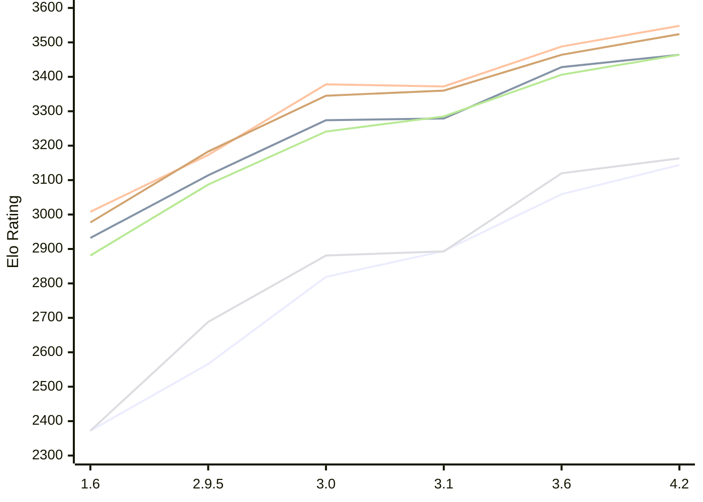

# Engine: Chessenger

Author: Dariusz Domagała

Home: https://github.com/chessengeriadoteu/chessenger

## Elo Ratings E1 (Ultra 7 265T (1.50 GHz) - E-Core)

| Version | Published | STC 8.0+0.08s  | LTC 60.0+0.60s | VLTC 2m24s+1.12s | Comment |
| --- | --- | --- | --- | --- | --- |
| 4.2 | 2026-11-12 | 3144(+85) | 3464(+36) | 3548(+60) |  |
| 3.6 | 2026-11-01 | 3059(+165) | 3428(+149) | 3488(+116) |  |
| 3.1 | 2026-10-21 | 2894(+75) | 3279(+5) | 3372(-6) |  |
| 3.0 | 2026-10-17 | 2819(+253) | 3274(+160) | 3378(+205) |  |
| 2.9.5 | 2026-10-15 | 2566(+194) | 3114(+182) | 3173(+165) |  |
| 1.6 | 2026-10-07 | 2372 | 2932 | 3008 |  |
 | | | cElo (∆ prev) | cElo (∆ prev) | cElo (∆ prev) | 

## Elo Ratings P1 (Ultra 7 265T (1.50 GHz) - P-Core)

| Version | Published | STC 8.0+0.08s  | LTC 60.0+0.60s | VLTC 2m24s+1.12s | Comment |
| --- | --- | --- | --- | --- | --- |
| 4.2 | 2026-11-12 | 3163(+43) | 3464(+58) | 3524(+60) |  |
| 3.6 | 2026-11-01 | 3120(+227) | 3406(+121) | 3464(+104) |  |
| 3.1 | 2026-10-21 | 2893(+12) | 3285(+44) | 3360(+15) |  |
| 3.0 | 2026-10-17 | 2881(+193) | 3241(+154) | 3345(+162) |  |
| 2.9.5 | 2026-10-15 | 2688(+316) | 3087(+206) | 3183(+206) |  |
| 1.6 | 2026-10-07 | 2372 | 2881 | 2977 |  |
 | | | cElo (∆ prev) | cElo (∆ prev) | cElo (∆ prev) | 

## Elo Ratings T1 (i5-7500T 2.70GHz)

| Version | Published | STC 8.0+0.08s  | LTC 60.0+0.60s | VLTC 2m24s+1.12s | Comment |
| --- | --- | --- | --- | --- | --- |
| 1.6 | 2026-10-07 | 2372 | 2881 | 2977 |  |
 | | | cElo (∆ prev) | cElo (∆ prev) | cElo (∆ prev) | 

<a href="https://github.com/computer-chess-index/cci/issues/new?template=submit-version.yml&title=[VERSION]+Chessenger+<version>&body=###%20Engine%20name%0AChessenger%0A%0A###%20Version%0A4.2" target="_blank">Submit new version</a>

 Test Conditions:

GUI/CLI: <a href=https://github.com/cutechess/cutechess target="_blank">Cute-Chess</a> 
Elo Calculation: <a href=https://www.remi-coulom.fr/Bayesian-Elo/ target="_blank">Bayesian-Elo</a> 
CPU for P1: Intel(R) Core(TM) Ultra 7 265T (1.50 GHz) - P-Core 
CPU for E1: Intel(R) Core(TM) Ultra 7 265T (1.50 GHz) - E-Core 
CPU for T1: Intel(R) Core(TM) i5-7500T 2.70GHz 
Opening book: 8_moves_v3 
\* STC: 8.0+0.08s, LTC: 60.0+0.60s, VLTC: 2m24s+1.12s

 Lists:
Ratings: <a href=https://github.com/computer-chess-index/cci/blob/main/lists/CCIRatings.csv target="_blank">Complete list</a>

Generated: 2026-11-24 05:37:21

## Ratings Verlauf E1 / P1

```mermaid
%%{init: {"theme":"base","themeVariables":{"seriesColors:['#a3a3a3','#222221','#faa371']}}}%%
xychart-beta
  x-axis ["1.6", "2.9.5", "3.0", "3.1", "3.6", "4.2"]
  y-axis "Elo Rating" 2300 --> 3600
  line "E1: STC (8.0+0.08s)" [2372, 2566, 2819, 2894, 3059, 3144]
  line "E1: LTC (60.0+0.60s)" [2932, 3114, 3274, 3279, 3428, 3464]
  line "E1: VLTC (2m24s+1.12s)" [3008, 3173, 3378, 3372, 3488, 3548]
  line "P1: STC (8.0+0.08s)" [2372, 2688, 2881, 2893, 3120, 3163]
  line "P1: LTC (60.0+0.60s)" [2881, 3087, 3241, 3285, 3406, 3464]
  line "P1: VLTC (2m24s+1.12s)" [2977, 3183, 3345, 3360, 3464, 3524]
```

## Detailed Evaluation Results

| Version | Time Control | Variant | Elo  | Range +/- | Matches | Score | Average Opponent Elo | Draws |
| --- | --- |--- | --- | --- | --- | --- | --- | --- |
| 4.2 | VLTC (2m24s+1.12s) | P1 | 3524 | 57 | 72 | 52% | 3510 | 82% |
|  |  | E1 | 3548 | 35 | 194 | 51% | 3541 | 80% |
|  | LTC (60.0+0.60s) | P1 | 3464 | 41 | 140 | 54% | 3441 | 80% |
|  |  | E1 | 3464 | 40 | 148 | 50% | 3467 | 79% |
|  | STC (8.0+0.08s) | P1 | 3163 | 47 | 120 | 50% | 3164 | 59% |
|  |  | E1 | 3144 | 36 | 220 | 52% | 3129 | 53% |
| --- | --- |--- | --- | --- | --- | --- | --- | --- |
| 3.6 | VLTC (2m24s+1.12s) | P1 | 3464 | 36 | 184 | 52% | 3448 | 77% |
|  |  | E1 | 3488 | 30 | 280 | 53% | 3468 | 75% |
|  | LTC (60.0+0.60s) | P1 | 3406 | 37 | 180 | 51% | 3397 | 75% |
|  |  | E1 | 3428 | 27 | 338 | 52% | 3413 | 73% |
|  | STC (8.0+0.08s) | E1 | 3059 | 32 | 278 | 52% | 3040 | 50% |
|  |  | P1 | 3120 | 38 | 196 | 51% | 3109 | 54% |
| --- | --- |--- | --- | --- | --- | --- | --- | --- |
| 3.1 | VLTC (2m24s+1.12s) | P1 | 3360 | 29 | 300 | 54% | 3333 | 68% |
|  |  | E1 | 3372 | 29 | 306 | 52% | 3355 | 61% |
|  | LTC (60.0+0.60s) | P1 | 3285 | 34 | 232 | 50% | 3287 | 62% |
|  |  | E1 | 3279 | 34 | 224 | 50% | 3283 | 60% |
|  | STC (8.0+0.08s) | P1 | 2893 | 50 | 116 | 47% | 2920 | 47% |
|  |  | E1 | 2894 | 33 | 284 | 49% | 2898 | 36% |
| --- | --- |--- | --- | --- | --- | --- | --- | --- |
| 3.0 | VLTC (2m24s+1.12s) | P1 | 3345 | 46 | 122 | 50% | 3347 | 68% |
|  |  | E1 | 3378 | 31 | 270 | 50% | 3376 | 64% |
|  | LTC (60.0+0.60s) | P1 | 3241 | 49 | 106 | 56% | 3195 | 69% |
|  |  | E1 | 3274 | 31 | 274 | 49% | 3283 | 64% |
|  | STC (8.0+0.08s) | P1 | 2881 | 52 | 116 | 57% | 2823 | 38% |
|  |  | E1 | 2819 | 41 | 174 | 53% | 2789 | 45% |
| --- | --- |--- | --- | --- | --- | --- | --- | --- |
| 2.9.5 | VLTC (2m24s+1.12s) | P1 | 3183 | 37 | 196 | 52% | 3170 | 61% |
|  |  | E1 | 3173 | 34 | 244 | 50% | 3174 | 48% |
|  | LTC (60.0+0.60s) | E1 | 3114 | 41 | 168 | 51% | 3104 | 50% |
|  |  | P1 | 3087 | 50 | 118 | 54% | 3055 | 45% |
|  | STC (8.0+0.08s) | E1 | 2566 | 37 | 254 | 55% | 2520 | 27% |
|  |  | P1 | 2688 | 41 | 196 | 53% | 2658 | 34% |
| --- | --- |--- | --- | --- | --- | --- | --- | --- |
| 1.6 | VLTC (2m24s+1.12s) | P1 | 2977 | 50 | 130 | 55% | 2911 | 40% |
|  |  | E1 | 3008 | 43 | 168 | 55% | 2939 | 43% |
|  | LTC (60.0+0.60s) | P1 | 2881 | 57 | 116 | 63% | 2614 | 33% |
|  |  | E1 | 2932 | 40 | 218 | 57% | 2785 | 35% |
|  | STC (8.0+0.08s) | E1 | 2372 | 46 | 184 | 57% | 2252 | 23% |
|  |  | P1 | 2372 | 62 | 90 | 43% | 2435 | 24% |