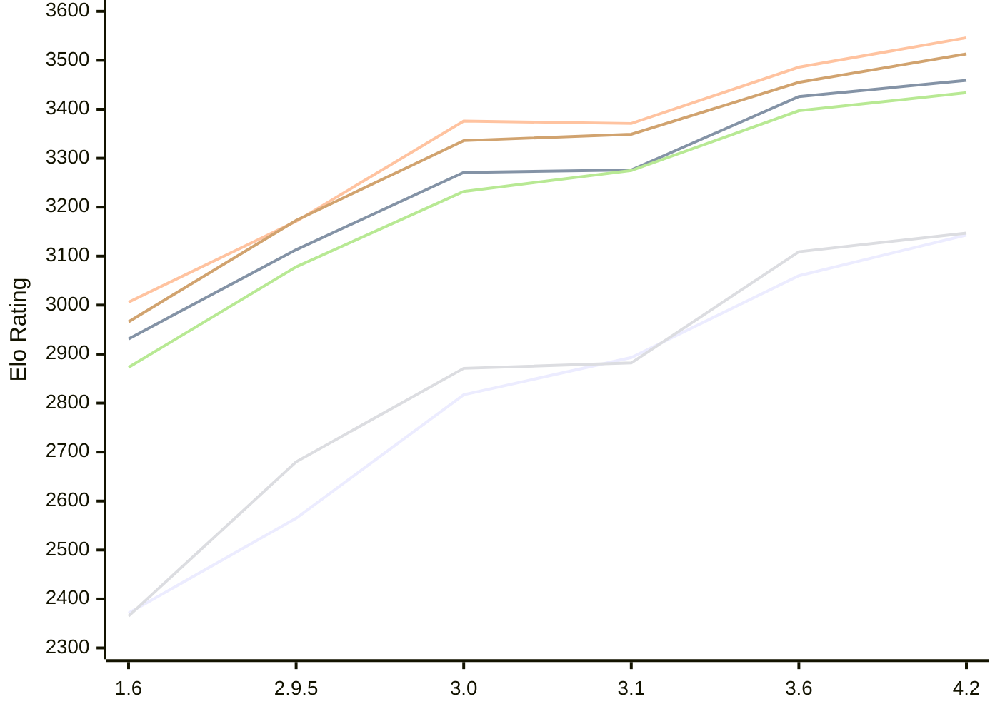

# Engine: Chessenger

Author: Dariusz Domagała

Home: https://github.com/chessengeriadoteu/chessenger

## Elo Ratings E1 (Ultra 7 265T (1.50 GHz) - E-Core)

| Version | Published | STC 8.0+0.08s  | LTC 60.0+0.60s | VLTC 2m24s+1.12s | Comment |
| --- | --- | --- | --- | --- | --- |
| 4.2 | 2026-11-12 | 3143(+83) | 3459(+33) | 3546(+60) |  |
| 3.6 | 2026-11-01 | 3060(+167) | 3426(+150) | 3486(+115) |  |
| 3.1 | 2026-10-21 | 2893(+76) | 3276(+5) | 3371(-5) |  |
| 3.0 | 2026-10-17 | 2817(+252) | 3271(+158) | 3376(+205) |  |
| 2.9.5 | 2026-10-15 | 2565(+194) | 3113(+182) | 3171(+165) |  |
| 1.6 | 2026-10-07 | 2371 | 2931 | 3006 |  |
 | | | cElo (∆ prev) | cElo (∆ prev) | cElo (∆ prev) | 

## Elo Ratings P1 (Ultra 7 265T (1.50 GHz) - P-Core)

| Version | Published | STC 8.0+0.08s  | LTC 60.0+0.60s | VLTC 2m24s+1.12s | Comment |
| --- | --- | --- | --- | --- | --- |
| 4.2 | 2026-11-12 | 3147(+38) | 3434(+37) | 3513(+58) |  |
| 3.6 | 2026-11-01 | 3109(+227) | 3397(+122) | 3455(+106) |  |
| 3.1 | 2026-10-21 | 2882(+11) | 3275(+43) | 3349(+13) |  |
| 3.0 | 2026-10-17 | 2871(+191) | 3232(+154) | 3336(+163) |  |
| 2.9.5 | 2026-10-15 | 2680(+315) | 3078(+205) | 3173(+207) |  |
| 1.6 | 2026-10-07 | 2365 | 2873 | 2966 |  |
 | | | cElo (∆ prev) | cElo (∆ prev) | cElo (∆ prev) | 

## Elo Ratings T1 (i5-7500T 2.70GHz)

| Version | Published | STC 8.0+0.08s  | LTC 60.0+0.60s | VLTC 2m24s+1.12s | Comment |
| --- | --- | --- | --- | --- | --- |
| 1.6 | 2026-10-07 | 2365 | 2873 | 2966 |  |
 | | | cElo (∆ prev) | cElo (∆ prev) | cElo (∆ prev) | 

<a href="https://github.com/computer-chess-index/cci/issues/new?template=submit-version.yml&title=[VERSION]+Chessenger+<version>&body=###%20Engine%20name%0AChessenger%0A%0A###%20Version%0A4.2" target="_blank">Submit new version</a>

 Test Conditions:

GUI/CLI: <a href=https://github.com/cutechess/cutechess target="_blank">Cute-Chess</a> 
Elo Calculation: <a href=https://www.remi-coulom.fr/Bayesian-Elo/ target="_blank">Bayesian-Elo</a> 
CPU for P1: Intel(R) Core(TM) Ultra 7 265T (1.50 GHz) - P-Core 
CPU for E1: Intel(R) Core(TM) Ultra 7 265T (1.50 GHz) - E-Core 
CPU for T1: Intel(R) Core(TM) i5-7500T 2.70GHz 
Opening book: 8_moves_v3 
\* STC: 8.0+0.08s, LTC: 60.0+0.60s, VLTC: 2m24s+1.12s

 Lists:
Ratings: <a href=https://github.com/computer-chess-index/cci/blob/main/lists/CCIRatings.csv target="_blank">Complete list</a>

Generated: 2026-11-21 05:37:18

## Ratings Verlauf E1 / P1

```mermaid
%%{init: {"theme":"base","themeVariables":{"seriesColors:['#a3a3a3','#222221','#faa371']}}}%%
xychart-beta
  x-axis ["1.6", "2.9.5", "3.0", "3.1", "3.6", "4.2"]
  y-axis "Elo Rating" 2300 --> 3600
  line "E1: STC (8.0+0.08s)" [2371, 2565, 2817, 2893, 3060, 3143]
  line "E1: LTC (60.0+0.60s)" [2931, 3113, 3271, 3276, 3426, 3459]
  line "E1: VLTC (2m24s+1.12s)" [3006, 3171, 3376, 3371, 3486, 3546]
  line "P1: STC (8.0+0.08s)" [2365, 2680, 2871, 2882, 3109, 3147]
  line "P1: LTC (60.0+0.60s)" [2873, 3078, 3232, 3275, 3397, 3434]
  line "P1: VLTC (2m24s+1.12s)" [2966, 3173, 3336, 3349, 3455, 3513]
```

## Detailed Evaluation Results

| Version | Time Control | Variant | Elo  | Range +/- | Matches | Score | Average Opponent Elo | Draws |
| --- | --- |--- | --- | --- | --- | --- | --- | --- |
| 4.2 | VLTC (2m24s+1.12s) | P1 | 3513 | 57 | 72 | 52% | 3501 | 82% |
|  |  | E1 | 3546 | 35 | 190 | 51% | 3538 | 80% |
|  | LTC (60.0+0.60s) | E1 | 3459 | 41 | 140 | 49% | 3467 | 79% |
|  |  | P1 | 3434 | 57 | 72 | 53% | 3418 | 81% |
|  | STC (8.0+0.08s) | E1 | 3143 | 36 | 218 | 52% | 3128 | 52% |
|  |  | P1 | 3147 | 61 | 72 | 49% | 3155 | 58% |
| --- | --- |--- | --- | --- | --- | --- | --- | --- |
| 3.6 | VLTC (2m24s+1.12s) | P1 | 3455 | 36 | 184 | 52% | 3438 | 77% |
|  |  | E1 | 3486 | 30 | 276 | 53% | 3467 | 75% |
|  | LTC (60.0+0.60s) | P1 | 3397 | 37 | 180 | 51% | 3387 | 75% |
|  |  | E1 | 3426 | 27 | 334 | 52% | 3411 | 73% |
|  | STC (8.0+0.08s) | P1 | 3109 | 38 | 196 | 51% | 3098 | 54% |
|  |  | E1 | 3060 | 33 | 270 | 52% | 3040 | 51% |
| --- | --- |--- | --- | --- | --- | --- | --- | --- |
| 3.1 | VLTC (2m24s+1.12s) | P1 | 3349 | 29 | 300 | 54% | 3322 | 68% |
|  |  | E1 | 3371 | 29 | 306 | 52% | 3353 | 61% |
|  | LTC (60.0+0.60s) | P1 | 3275 | 34 | 232 | 50% | 3276 | 62% |
|  |  | E1 | 3276 | 34 | 224 | 50% | 3282 | 60% |
|  | STC (8.0+0.08s) | P1 | 2882 | 50 | 116 | 47% | 2911 | 47% |
|  |  | E1 | 2893 | 33 | 284 | 49% | 2897 | 36% |
| --- | --- |--- | --- | --- | --- | --- | --- | --- |
| 3.0 | VLTC (2m24s+1.12s) | E1 | 3376 | 31 | 270 | 50% | 3375 | 64% |
|  |  | P1 | 3336 | 46 | 122 | 50% | 3337 | 68% |
|  | LTC (60.0+0.60s) | P1 | 3232 | 49 | 106 | 56% | 3186 | 69% |
|  |  | E1 | 3271 | 31 | 274 | 49% | 3282 | 64% |
|  | STC (8.0+0.08s) | P1 | 2871 | 52 | 116 | 57% | 2813 | 38% |
|  |  | E1 | 2817 | 41 | 174 | 53% | 2788 | 45% |
| --- | --- |--- | --- | --- | --- | --- | --- | --- |
| 2.9.5 | VLTC (2m24s+1.12s) | P1 | 3173 | 37 | 196 | 52% | 3160 | 61% |
|  |  | E1 | 3171 | 34 | 244 | 50% | 3174 | 48% |
|  | LTC (60.0+0.60s) | P1 | 3078 | 50 | 118 | 54% | 3046 | 45% |
|  |  | E1 | 3113 | 41 | 168 | 51% | 3104 | 50% |
|  | STC (8.0+0.08s) | P1 | 2680 | 41 | 196 | 53% | 2650 | 34% |
|  |  | E1 | 2565 | 37 | 254 | 55% | 2519 | 27% |
| --- | --- |--- | --- | --- | --- | --- | --- | --- |
| 1.6 | VLTC (2m24s+1.12s) | P1 | 2966 | 50 | 130 | 55% | 2900 | 40% |
|  |  | E1 | 3006 | 43 | 168 | 55% | 2938 | 43% |
|  | LTC (60.0+0.60s) | P1 | 2873 | 57 | 116 | 63% | 2606 | 33% |
|  |  | E1 | 2931 | 40 | 218 | 57% | 2785 | 35% |
|  | STC (8.0+0.08s) | P1 | 2365 | 62 | 90 | 43% | 2429 | 24% |
|  |  | E1 | 2371 | 46 | 184 | 57% | 2249 | 23% |