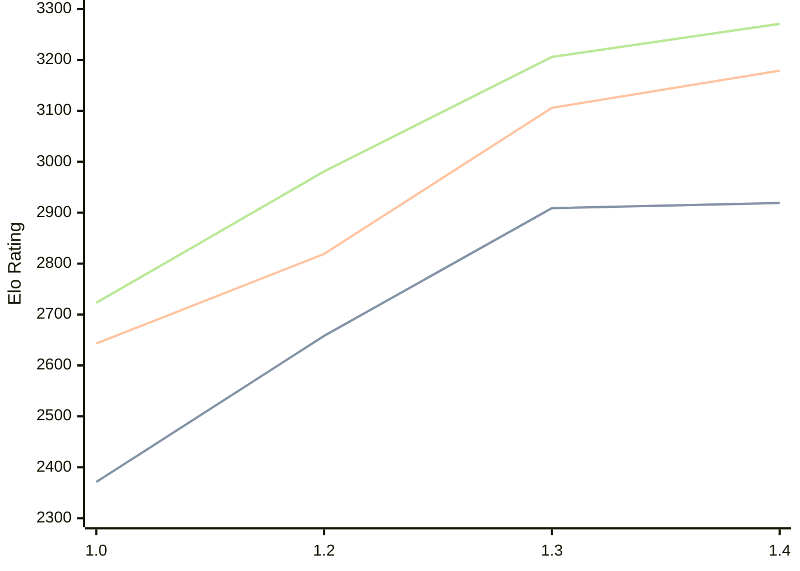

# Engine: Chessnix

Author: Langedijk Eric

Home: https://github.com/ericlangedijk/chessnix/

## Ratings nach Version

| Version | Published | STC 8.0+0.08s  | LTC 60.0+0.60s | VLTC 2m24s+1.12s | Comment |
| --- | --- | --- | --- | --- | --- |
| 1.4 | 2026-04-28 | 2919(+new) | 3179(+new) | 3271(+new) |  |
| 0.0 | 2026-02-25 |  |  |  |  |
| 1.3 | 2026-02-15 | 2909(+251) | 3106(+287) | 3206(+225) |  |
| 1.2 | 2025-12-12 | 2658(+287) | 2819(+176) | 2981(+258) |  |
| 1.0 | 2025-11-08 | 2371(+new) | 2643(+new) | 2723(+new) | too many irregular games |
| 0.1 | 2025-10-03 |  |  |  |  |
 | | | cElo (∆ prev) | cElo (∆ prev) | cElo (∆ prev) | 

<a href="https://github.com/computer-chess-index/cci/issues/new?template=submit-version.yml&title=[VERSION]+Chessnix+<version>&body=###%20Engine%20name%0AChessnix%0A%0A###%20Version%0A1.4" target="_blank">Submit new version</a>

 Test Conditions:

GUI/CLI: <a href=https://github.com/cutechess/cutechess target="_blank">Cute-Chess</a> 
Elo Calculation: <a href=https://www.remi-coulom.fr/Bayesian-Elo/ target="_blank">Bayesian-Elo</a> 
CPU: Intel(R) Core(TM) i5-7500T 2.70GHz 
Opening book: 8_moves_v3 
\* STC: 8.0+0.08s, LTC: 60.0+0.60s, VLTC: 2m24s+1.12s

 Lists:
Ratings: <a href=https://github.com/computer-chess-index/cci/blob/main/lists/CCIRatings.csv target="_blank">Complete list</a>

Generated: 2026-04-30 06:23:21

## Ratings Verlauf

⬛ STC (8.0+0.08s) &nbsp;&nbsp; 🟧 LTC (60.0+0.60s) &nbsp;&nbsp; 🟩 VLTC (2m24s+1.12s)

dark mode: 🟩STC (8.0+0.08s) 🟧LTC (60.0+0.60s) ⬜VLTC (2m24s+1.12s)

