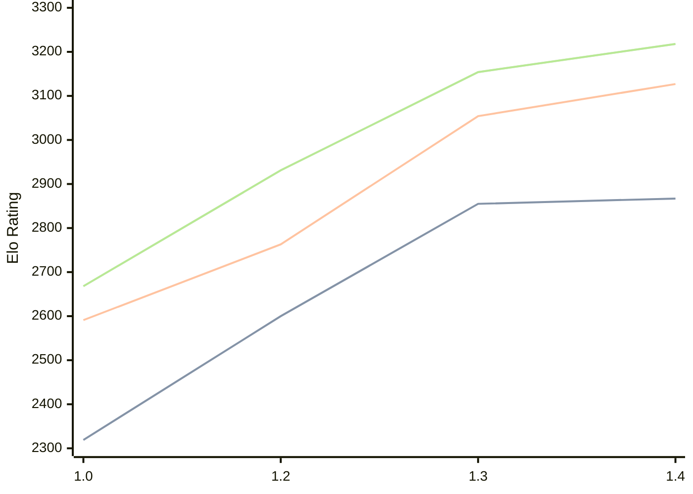

# Engine: Chessnix

Author: Langedijk Eric

Home: https://github.com/ericlangedijk/chessnix/

## Elo Ratings

| Version | Published | STC 8.0+0.08s  | LTC 60.0+0.60s | VLTC 2m24s+1.12s | Comment |
| --- | --- | --- | --- | --- | --- |
| 1.4 | 2026-04-28 | 2867(+new) | 3127(+new) | 3218(+new) |  |
| 0.0 | 2026-02-25 |  |  |  |  |
| 1.3 | 2026-02-15 | 2855(+255) | 3054(+291) | 3154(+223) |  |
| 1.2 | 2025-12-12 | 2600(+281) | 2763(+172) | 2931(+263) |  |
| 1.0 | 2025-11-08 | 2319(+new) | 2591(+new) | 2668(+new) | too many irregular games |
| 0.1 | 2025-10-03 |  |  |  |  |
 | | | cElo (∆ prev) | cElo (∆ prev) | cElo (∆ prev) | 

<a href="https://github.com/computer-chess-index/cci/issues/new?template=submit-version.yml&title=[VERSION]+Chessnix+<version>&body=###%20Engine%20name%0AChessnix%0A%0A###%20Version%0A1.4" target="_blank">Submit new version</a>

 Test Conditions:

GUI/CLI: <a href=https://github.com/cutechess/cutechess target="_blank">Cute-Chess</a> 
Elo Calculation: <a href=https://www.remi-coulom.fr/Bayesian-Elo/ target="_blank">Bayesian-Elo</a> 
CPU: Intel(R) Core(TM) i5-7500T 2.70GHz 
Opening book: 8_moves_v3 
\* STC: 8.0+0.08s, LTC: 60.0+0.60s, VLTC: 2m24s+1.12s

 Lists:
Ratings: <a href=https://github.com/computer-chess-index/cci/blob/main/lists/CCIRatings.csv target="_blank">Complete list</a>

Generated: 2026-05-21 06:23:29

## Ratings Verlauf

⬛ STC (8.0+0.08s) &nbsp;&nbsp; 🟧 LTC (60.0+0.60s) &nbsp;&nbsp; 🟩 VLTC (2m24s+1.12s)

dark mode: 🟩STC (8.0+0.08s) 🟧LTC (60.0+0.60s) ⬜VLTC (2m24s+1.12s)

## Detailed Evaluation Results

| Version | Time Control | Elo  | Range +/- | Matches | Score | Average Opponent Elo | Draws |
| --- | --- | --- | --- | --- | --- | --- | --- |
| 1.4 | VLTC (2m24s+1.12s) | 3218 | 41 | 160 | 53% | 3200 | 56% |
| 1.4 | LTC (60.0+0.60s) | 3127 | 43 | 164 | 51% | 3117 | 43% |
| 1.4 | STC (8.0+0.08s) | 2867 | 44 | 156 | 49% | 2878 | 40% |
| --- | --- | --- | --- | --- | --- | --- | --- |
| 1.3 | VLTC (2m24s+1.12s) | 3154 | 100 | 26 | 56% | 3110 | 58% |
| 1.3 | LTC (60.0+0.60s) | 3054 | 75 | 52 | 46% | 3078 | 46% |
| 1.3 | STC (8.0+0.08s) | 2855 | 123 | 22 | 52% | 2832 | 23% |
| --- | --- | --- | --- | --- | --- | --- | --- |
| 1.2 | VLTC (2m24s+1.12s) | 2931 | 158 | 12 | 46% | 2967 | 25% |
| 1.2 | LTC (60.0+0.60s) | 2763 | 79 | 52 | 52% | 2747 | 31% |
| 1.2 | STC (8.0+0.08s) | 2600 | 149 | 16 | 63% | 2480 | 13% |
| --- | --- | --- | --- | --- | --- | --- | --- |
| 1.0 | VLTC (2m24s+1.12s) | 2668 | 100 | 32 | 33% | 2811 | 41% |
| 1.0 | LTC (60.0+0.60s) | 2591 | 145 | 16 | 41% | 2677 | 19% |
| 1.0 | STC (8.0+0.08s) | 2319 | 71 | 70 | 41% | 2395 | 23% |
| --- | --- | --- | --- | --- | --- | --- | --- |