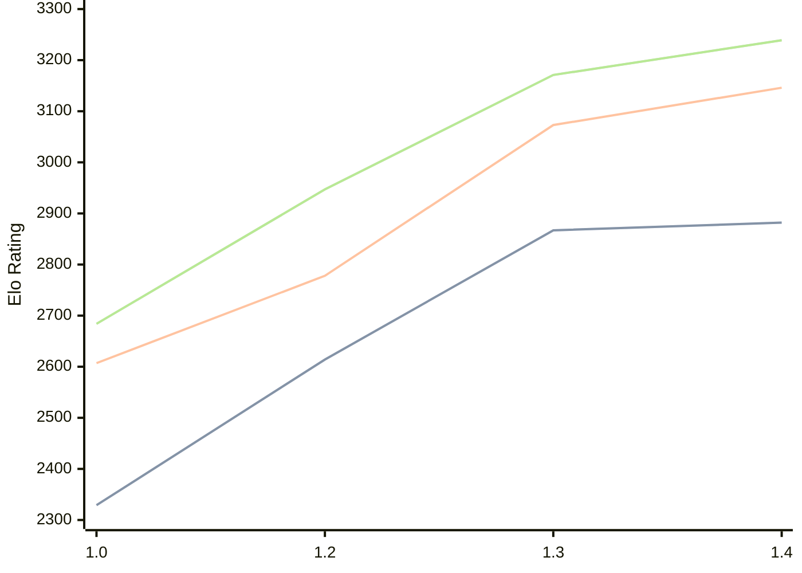

# Engine: Chessnix

Author: Langedijk Eric

Home: https://github.com/ericlangedijk/chessnix/

## Elo Ratings

| Version | Published | STC 8.0+0.08s  | LTC 60.0+0.60s | VLTC 2m24s+1.12s | Comment |
| --- | --- | --- | --- | --- | --- |
| 1.4 | 2026-04-28 | 2882(+15) | 3146(+73) | 3239(+68) |  |
| 1.3 | 2026-02-15 | 2867(+253) | 3073(+295) | 3171(+224) |  |
| 1.2 | 2025-12-12 | 2614(+285) | 2778(+171) | 2947(+263) |  |
| 1.0 | 2025-11-08 | 2329 | 2607 | 2684 | too many irregular games |
 | | | cElo (∆ prev) | cElo (∆ prev) | cElo (∆ prev) | 

<a href="https://github.com/computer-chess-index/cci/issues/new?template=submit-version.yml&title=[VERSION]+Chessnix+<version>&body=###%20Engine%20name%0AChessnix%0A%0A###%20Version%0A1.4" target="_blank">Submit new version</a>

 Test Conditions:

GUI/CLI: <a href=https://github.com/cutechess/cutechess target="_blank">Cute-Chess</a> 
Elo Calculation: <a href=https://www.remi-coulom.fr/Bayesian-Elo/ target="_blank">Bayesian-Elo</a> 
CPU: Intel(R) Core(TM) i5-7500T 2.70GHz 
Opening book: 8_moves_v3 
\* STC: 8.0+0.08s, LTC: 60.0+0.60s, VLTC: 2m24s+1.12s

 Lists:
Ratings: <a href=https://github.com/computer-chess-index/cci/blob/main/lists/CCIRatings.csv target="_blank">Complete list</a>

Generated: 2026-09-25 04:37:10

## Ratings Verlauf

## Detailed Evaluation Results

| Version | Time Control | Elo  | Range +/- | Matches | Score | Average Opponent Elo | Draws |
| --- | --- | --- | --- | --- | --- | --- | --- |
| 1.4 | VLTC (2m24s+1.12s) | 3239 | 41 | 160 | 53% | 3220 | 56% |
| 1.4 | LTC (60.0+0.60s) | 3146 | 43 | 164 | 51% | 3136 | 43% |
| 1.4 | STC (8.0+0.08s) | 2882 | 44 | 156 | 49% | 2894 | 40% |
| --- | --- | --- | --- | --- | --- | --- | --- |
| 1.3 | VLTC (2m24s+1.12s) | 3171 | 100 | 26 | 56% | 3129 | 58% |
| 1.3 | LTC (60.0+0.60s) | 3073 | 75 | 52 | 46% | 3097 | 46% |
| 1.3 | STC (8.0+0.08s) | 2867 | 123 | 22 | 52% | 2846 | 23% |
| --- | --- | --- | --- | --- | --- | --- | --- |
| 1.2 | VLTC (2m24s+1.12s) | 2947 | 158 | 12 | 46% | 2984 | 25% |
| 1.2 | LTC (60.0+0.60s) | 2778 | 79 | 52 | 52% | 2762 | 31% |
| 1.2 | STC (8.0+0.08s) | 2614 | 150 | 16 | 63% | 2492 | 13% |
| --- | --- | --- | --- | --- | --- | --- | --- |
| 1.0 | VLTC (2m24s+1.12s) | 2684 | 101 | 32 | 33% | 2827 | 41% |
| 1.0 | LTC (60.0+0.60s) | 2607 | 146 | 16 | 41% | 2692 | 19% |
| 1.0 | STC (8.0+0.08s) | 2329 | 71 | 70 | 41% | 2404 | 23% |
| --- | --- | --- | --- | --- | --- | --- | --- |