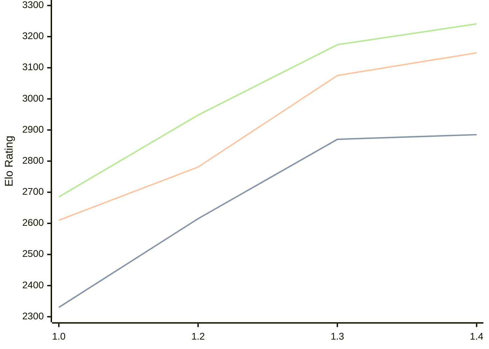

# Engine: Chessnix

Author: Langedijk Eric

Home: https://github.com/ericlangedijk/chessnix/

## Elo Ratings E1

| Version | Published | STC 8.0+0.08s  | LTC 60.0+0.60s | VLTC 2m24s+1.12s | Comment |
| --- | --- | --- | --- | --- | --- |
|  |  |  |  |  |  |
 | | | cElo (∆ prev) | cElo (∆ prev) | cElo (∆ prev) | 

## Elo Ratings P1

| Version | Published | STC 8.0+0.08s  | LTC 60.0+0.60s | VLTC 2m24s+1.12s | Comment |
| --- | --- | --- | --- | --- | --- |
|  |  |  |  |  |  |
 | | | cElo (∆ prev) | cElo (∆ prev) | cElo (∆ prev) | 

## Elo Ratings T1

| Version | Published | STC 8.0+0.08s  | LTC 60.0+0.60s | VLTC 2m24s+1.12s | Comment |
| --- | --- | --- | --- | --- | --- |
| 1.4 | 2026-04-28 | 2885(+15) | 3148(+73) | 3241(+67) |  |
| 1.3 | 2026-02-15 | 2870(+255) | 3075(+294) | 3174(+226) |  |
| 1.2 | 2025-12-12 | 2615(+285) | 2781(+171) | 2948(+263) |  |
| 1.0 | 2025-11-08 | 2330 | 2610 | 2685 | too many irregular games |
 | | | cElo (∆ prev) | cElo (∆ prev) | cElo (∆ prev) | 

<a href="https://github.com/computer-chess-index/cci/issues/new?template=submit-version.yml&title=[VERSION]+Chessnix+<version>&body=###%20Engine%20name%0AChessnix%0A%0A###%20Version%0A1.4" target="_blank">Submit new version</a>

 Test Conditions:

GUI/CLI: <a href=https://github.com/cutechess/cutechess target="_blank">Cute-Chess</a> 
Elo Calculation: <a href=https://www.remi-coulom.fr/Bayesian-Elo/ target="_blank">Bayesian-Elo</a> 
CPU for P1: Intel(R) Core(TM) Ultra 7 265T (1.50 GHz) - P-Core 
CPU for E1: Intel(R) Core(TM) Ultra 7 265T (1.50 GHz) - E-Core 
CPU for T1: Intel(R) Core(TM) i5-7500T 2.70GHz 
Opening book: 8_moves_v3 
\* STC: 8.0+0.08s, LTC: 60.0+0.60s, VLTC: 2m24s+1.12s

 Lists:
Ratings: <a href=https://github.com/computer-chess-index/cci/blob/main/lists/CCIRatings.csv target="_blank">Complete list</a>

Generated: 2026-10-10 04:37:14

## Ratings Verlauf

```mermaid
%%{init: {"theme":"base","themeVariables":{"seriesColors:['#a3a3a3','#222221','#faa371']}}}%%
xychart-beta
  x-axis ["1.0", "1.2", "1.3", "1.4"]
  y-axis "Elo Rating" 2300 --> 3300
  line "" [2330, 2615, 2870, 2885]
  line "STC (8.0+0.08s)" [2330, 2615, 2870, 2885]
  line "LTC (60.0+0.60s)" [2610, 2781, 3075, 3148]
  line "" [2685, 2948, 3174, 3241]
  line "VLTC (2m24s+1.12s)" [2685, 2948, 3174, 3241]
```

## Detailed Evaluation Results

| Version | Time Control | Elo  | Range +/- | Matches | Score | Average Opponent Elo | Draws |
| --- | --- | --- | --- | --- | --- | --- | --- |
| 1.4 | VLTC (2m24s+1.12s) | 3241 | 41 | 160 | 53% | 3221 | 56% |
| 1.4 | LTC (60.0+0.60s) | 3148 | 43 | 164 | 51% | 3139 | 43% |
| 1.4 | STC (8.0+0.08s) | 2885 | 44 | 156 | 49% | 2896 | 40% |
| --- | --- | --- | --- | --- | --- | --- | --- |
| 1.3 | VLTC (2m24s+1.12s) | 3174 | 100 | 26 | 56% | 3132 | 58% |
| 1.3 | LTC (60.0+0.60s) | 3075 | 75 | 52 | 46% | 3100 | 46% |
| 1.3 | STC (8.0+0.08s) | 2870 | 123 | 22 | 52% | 2847 | 23% |
| --- | --- | --- | --- | --- | --- | --- | --- |
| 1.2 | VLTC (2m24s+1.12s) | 2948 | 158 | 12 | 46% | 2986 | 25% |
| 1.2 | LTC (60.0+0.60s) | 2781 | 79 | 52 | 52% | 2763 | 31% |
| 1.2 | STC (8.0+0.08s) | 2615 | 150 | 16 | 63% | 2495 | 13% |
| --- | --- | --- | --- | --- | --- | --- | --- |
| 1.0 | VLTC (2m24s+1.12s) | 2685 | 101 | 32 | 33% | 2828 | 41% |
| 1.0 | LTC (60.0+0.60s) | 2610 | 146 | 16 | 41% | 2695 | 19% |
| 1.0 | STC (8.0+0.08s) | 2330 | 71 | 70 | 41% | 2406 | 23% |
| --- | --- | --- | --- | --- | --- | --- | --- |