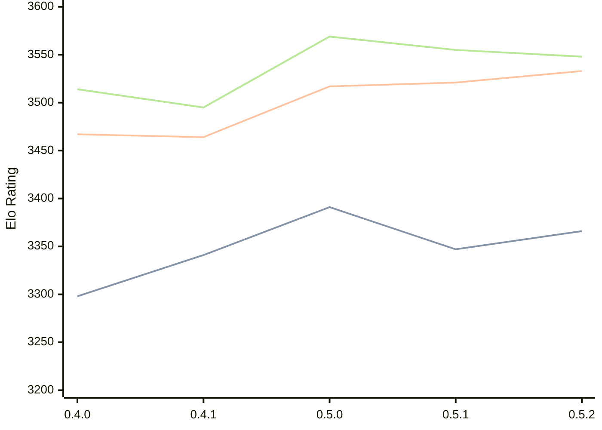

# Engine: Cinder

Author: Bruno Dutra

Home: https://github.com/brunocodutra/cinder

## Elo Ratings

| Version | Published | STC 8.0+0.08s  | LTC 60.0+0.60s | VLTC 2m24s+1.12s | Comment |
| --- | --- | --- | --- | --- | --- |
| 0.5.2 | 2026-07-12 | 3366(+19) | 3533(+12) | 3548(-7) |  |
| 0.5.1 | 2026-07-08 | 3347(-44) | 3521(+4) | 3555(-14) |  |
| 0.5.0 | 2026-07-04 | 3391(+50) | 3517(+53) | 3569(+74) |  |
| 0.4.1 | 2025-12-05 | 3341(+43) | 3464(-3) | 3495(-19) |  |
| 0.4.0 | 2025-12-04 | 3298(+new) | 3467(+new) | 3514(+new) |  |
| 0.3.1 | 2025-08-16 |  |  |  |  |
| 0.3.0 | 2025-08-16 |  |  |  |  |
| 0.2.0 | 2025-05-29 |  |  |  |  |
| 0.1.4 | 2025-04-10 |  |  |  |  |
| 0.1.3 | 2025-02-28 |  |  |  |  |
| 0.1.2 | 2025-02-25 |  |  |  |  |
| 0.1.1 | 2025-02-23 |  |  |  |  |
| 0.1.0 | 2025-02-23 |  |  |  |  |
 | | | cElo (∆ prev) | cElo (∆ prev) | cElo (∆ prev) | 

<a href="https://github.com/computer-chess-index/cci/issues/new?template=submit-version.yml&title=[VERSION]+Cinder+<version>&body=###%20Engine%20name%0ACinder%0A%0A###%20Version%0A0.5.2" target="_blank">Submit new version</a>

 Test Conditions:

GUI/CLI: <a href=https://github.com/cutechess/cutechess target="_blank">Cute-Chess</a> 
Elo Calculation: <a href=https://www.remi-coulom.fr/Bayesian-Elo/ target="_blank">Bayesian-Elo</a> 
CPU: Intel(R) Core(TM) i5-7500T 2.70GHz 
Opening book: 8_moves_v3 
\* STC: 8.0+0.08s, LTC: 60.0+0.60s, VLTC: 2m24s+1.12s

 Lists:
Ratings: <a href=https://github.com/computer-chess-index/cci/blob/main/lists/CCIRatings.csv target="_blank">Complete list</a>

Generated: 2026-08-04 06:24:00

## Ratings Verlauf

⬛ STC (8.0+0.08s) &nbsp;&nbsp; 🟧 LTC (60.0+0.60s) &nbsp;&nbsp; 🟩 VLTC (2m24s+1.12s)

dark mode: 🟩STC (8.0+0.08s) 🟧LTC (60.0+0.60s) ⬜VLTC (2m24s+1.12s)

## Detailed Evaluation Results

| Version | Time Control | Elo  | Range +/- | Matches | Score | Average Opponent Elo | Draws |
| --- | --- | --- | --- | --- | --- | --- | --- |
| 0.5.2 | VLTC (2m24s+1.12s) | 3548 | 30 | 252 | 50% | 3549 | 91% |
| 0.5.2 | LTC (60.0+0.60s) | 3533 | 26 | 342 | 51% | 3525 | 91% |
| 0.5.2 | STC (8.0+0.08s) | 3366 | 28 | 294 | 48% | 3376 | 83% |
| --- | --- | --- | --- | --- | --- | --- | --- |
| 0.5.1 | VLTC (2m24s+1.12s) | 3555 | 39 | 152 | 49% | 3561 | 89% |
| 0.5.1 | LTC (60.0+0.60s) | 3521 | 43 | 120 | 50% | 3521 | 93% |
| 0.5.1 | STC (8.0+0.08s) | 3347 | 44 | 124 | 49% | 3355 | 78% |
| --- | --- | --- | --- | --- | --- | --- | --- |
| 0.5.0 | VLTC (2m24s+1.12s) | 3569 | 44 | 118 | 50% | 3565 | 89% |
| 0.5.0 | LTC (60.0+0.60s) | 3517 | 44 | 120 | 52% | 3506 | 85% |
| 0.5.0 | STC (8.0+0.08s) | 3391 | 35 | 192 | 48% | 3403 | 80% |
| --- | --- | --- | --- | --- | --- | --- | --- |
| 0.4.1 | VLTC (2m24s+1.12s) | 3495 | 23 | 424 | 50% | 3494 | 86% |
| 0.4.1 | LTC (60.0+0.60s) | 3464 | 25 | 368 | 50% | 3464 | 86% |
| 0.4.1 | STC (8.0+0.08s) | 3341 | 21 | 564 | 49% | 3348 | 70% |
| --- | --- | --- | --- | --- | --- | --- | --- |
| 0.4.0 | VLTC (2m24s+1.12s) | 3514 | 43 | 128 | 54% | 3479 | 82% |
| 0.4.0 | LTC (60.0+0.60s) | 3467 | 50 | 108 | 56% | 3363 | 71% |
| 0.4.0 | STC (8.0+0.08s) | 3298 | 68 | 72 | 65% | 3051 | 51% |
| --- | --- | --- | --- | --- | --- | --- | --- |