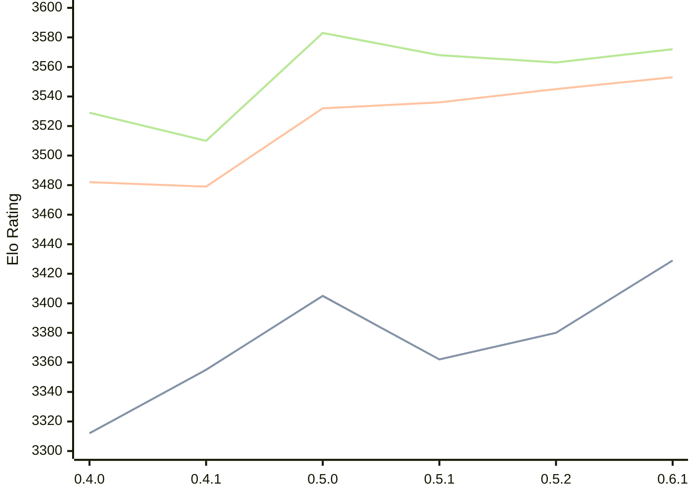

# Engine: Cinder

Author: Bruno Dutra

Home: https://github.com/brunocodutra/cinder

## Elo Ratings

| Version | Published | STC 8.0+0.08s  | LTC 60.0+0.60s | VLTC 2m24s+1.12s | Comment |
| --- | --- | --- | --- | --- | --- |
| 0.6.1 | 2026-08-16 | 3429(+49) | 3553(+8) | 3572(+9) |  |
| 0.5.2 | 2026-07-12 | 3380(+18) | 3545(+9) | 3563(-5) |  |
| 0.5.1 | 2026-07-08 | 3362(-43) | 3536(+4) | 3568(-15) |  |
| 0.5.0 | 2026-07-04 | 3405(+50) | 3532(+53) | 3583(+73) |  |
| 0.4.1 | 2025-12-05 | 3355(+43) | 3479(-3) | 3510(-19) |  |
| 0.4.0 | 2025-12-04 | 3312(+new) | 3482(+new) | 3529(+new) |  |
| 0.3.1 | 2025-08-16 |  |  |  |  |
 | | | cElo (∆ prev) | cElo (∆ prev) | cElo (∆ prev) | 

<a href="https://github.com/computer-chess-index/cci/issues/new?template=submit-version.yml&title=[VERSION]+Cinder+<version>&body=###%20Engine%20name%0ACinder%0A%0A###%20Version%0A0.6.1" target="_blank">Submit new version</a>

 Test Conditions:

GUI/CLI: <a href=https://github.com/cutechess/cutechess target="_blank">Cute-Chess</a> 
Elo Calculation: <a href=https://www.remi-coulom.fr/Bayesian-Elo/ target="_blank">Bayesian-Elo</a> 
CPU: Intel(R) Core(TM) i5-7500T 2.70GHz 
Opening book: 8_moves_v3 
\* STC: 8.0+0.08s, LTC: 60.0+0.60s, VLTC: 2m24s+1.12s

 Lists:
Ratings: <a href=https://github.com/computer-chess-index/cci/blob/main/lists/CCIRatings.csv target="_blank">Complete list</a>

Generated: 2026-09-06 06:23:29

## Ratings Verlauf

## Detailed Evaluation Results

| Version | Time Control | Elo  | Range +/- | Matches | Score | Average Opponent Elo | Draws |
| --- | --- | --- | --- | --- | --- | --- | --- |
| 0.6.1 | VLTC (2m24s+1.12s) | 3572 | 34 | 188 | 51% | 3564 | 93% |
| 0.6.1 | LTC (60.0+0.60s) | 3553 | 31 | 238 | 50% | 3553 | 87% |
| 0.6.1 | STC (8.0+0.08s) | 3429 | 28 | 312 | 49% | 3433 | 76% |
| --- | --- | --- | --- | --- | --- | --- | --- |
| 0.5.2 | VLTC (2m24s+1.12s) | 3563 | 29 | 264 | 50% | 3563 | 91% |
| 0.5.2 | LTC (60.0+0.60s) | 3545 | 25 | 354 | 51% | 3540 | 91% |
| 0.5.2 | STC (8.0+0.08s) | 3380 | 27 | 322 | 49% | 3390 | 83% |
| --- | --- | --- | --- | --- | --- | --- | --- |
| 0.5.1 | VLTC (2m24s+1.12s) | 3568 | 39 | 152 | 49% | 3575 | 89% |
| 0.5.1 | LTC (60.0+0.60s) | 3536 | 43 | 120 | 50% | 3536 | 93% |
| 0.5.1 | STC (8.0+0.08s) | 3362 | 44 | 124 | 49% | 3368 | 78% |
| --- | --- | --- | --- | --- | --- | --- | --- |
| 0.5.0 | VLTC (2m24s+1.12s) | 3583 | 44 | 118 | 50% | 3580 | 89% |
| 0.5.0 | LTC (60.0+0.60s) | 3532 | 44 | 120 | 52% | 3521 | 85% |
| 0.5.0 | STC (8.0+0.08s) | 3405 | 35 | 192 | 48% | 3417 | 80% |
| --- | --- | --- | --- | --- | --- | --- | --- |
| 0.4.1 | VLTC (2m24s+1.12s) | 3510 | 23 | 424 | 50% | 3509 | 86% |
| 0.4.1 | LTC (60.0+0.60s) | 3479 | 25 | 368 | 50% | 3479 | 86% |
| 0.4.1 | STC (8.0+0.08s) | 3355 | 21 | 564 | 49% | 3362 | 70% |
| --- | --- | --- | --- | --- | --- | --- | --- |
| 0.4.0 | VLTC (2m24s+1.12s) | 3529 | 43 | 128 | 54% | 3494 | 82% |
| 0.4.0 | LTC (60.0+0.60s) | 3482 | 50 | 108 | 56% | 3378 | 71% |
| 0.4.0 | STC (8.0+0.08s) | 3312 | 68 | 72 | 65% | 3065 | 51% |
| --- | --- | --- | --- | --- | --- | --- | --- |