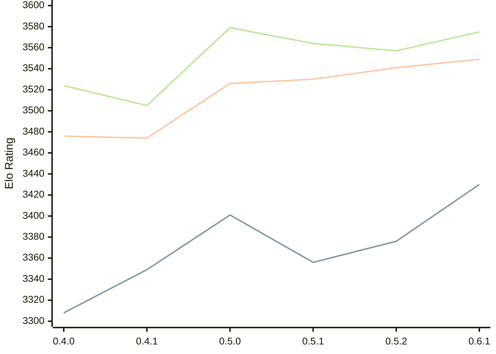

# Engine: Cinder

Author: Bruno Dutra

Home: https://github.com/brunocodutra/cinder

## Elo Ratings

| Version | Published | STC 8.0+0.08s  | LTC 60.0+0.60s | VLTC 2m24s+1.12s | Comment |
| --- | --- | --- | --- | --- | --- |
| 0.6.1 | 2026-08-16 | 3430(+54) | 3549(+8) | 3575(+18) |  |
| 0.5.2 | 2026-07-12 | 3376(+20) | 3541(+11) | 3557(-7) |  |
| 0.5.1 | 2026-07-08 | 3356(-45) | 3530(+4) | 3564(-15) |  |
| 0.5.0 | 2026-07-04 | 3401(+52) | 3526(+52) | 3579(+74) |  |
| 0.4.1 | 2025-12-05 | 3349(+41) | 3474(-2) | 3505(-19) |  |
| 0.4.0 | 2025-12-04 | 3308(+new) | 3476(+new) | 3524(+new) |  |
| 0.3.1 | 2025-08-16 |  |  |  |  |
 | | | cElo (∆ prev) | cElo (∆ prev) | cElo (∆ prev) | 

<a href="https://github.com/computer-chess-index/cci/issues/new?template=submit-version.yml&title=[VERSION]+Cinder+<version>&body=###%20Engine%20name%0ACinder%0A%0A###%20Version%0A0.6.1" target="_blank">Submit new version</a>

 Test Conditions:

GUI/CLI: <a href=https://github.com/cutechess/cutechess target="_blank">Cute-Chess</a> 
Elo Calculation: <a href=https://www.remi-coulom.fr/Bayesian-Elo/ target="_blank">Bayesian-Elo</a> 
CPU: Intel(R) Core(TM) i5-7500T 2.70GHz 
Opening book: 8_moves_v3 
\* STC: 8.0+0.08s, LTC: 60.0+0.60s, VLTC: 2m24s+1.12s

 Lists:
Ratings: <a href=https://github.com/computer-chess-index/cci/blob/main/lists/CCIRatings.csv target="_blank">Complete list</a>

Generated: 2026-08-22 06:24:06

## Ratings Verlauf

⬛ STC (8.0+0.08s) &nbsp;&nbsp; 🟧 LTC (60.0+0.60s) &nbsp;&nbsp; 🟩 VLTC (2m24s+1.12s)

dark mode: 🟩STC (8.0+0.08s) 🟧LTC (60.0+0.60s) ⬜VLTC (2m24s+1.12s)

## Detailed Evaluation Results

| Version | Time Control | Elo  | Range +/- | Matches | Score | Average Opponent Elo | Draws |
| --- | --- | --- | --- | --- | --- | --- | --- |
| 0.6.1 | VLTC (2m24s+1.12s) | 3575 | 40 | 136 | 51% | 3568 | 92% |
| 0.6.1 | LTC (60.0+0.60s) | 3549 | 34 | 198 | 50% | 3551 | 88% |
| 0.6.1 | STC (8.0+0.08s) | 3430 | 35 | 200 | 50% | 3432 | 78% |
| --- | --- | --- | --- | --- | --- | --- | --- |
| 0.5.2 | VLTC (2m24s+1.12s) | 3557 | 29 | 264 | 50% | 3559 | 91% |
| 0.5.2 | LTC (60.0+0.60s) | 3541 | 25 | 354 | 51% | 3534 | 91% |
| 0.5.2 | STC (8.0+0.08s) | 3376 | 27 | 322 | 49% | 3384 | 83% |
| --- | --- | --- | --- | --- | --- | --- | --- |
| 0.5.1 | VLTC (2m24s+1.12s) | 3564 | 39 | 152 | 49% | 3571 | 89% |
| 0.5.1 | LTC (60.0+0.60s) | 3530 | 43 | 120 | 50% | 3530 | 93% |
| 0.5.1 | STC (8.0+0.08s) | 3356 | 44 | 124 | 49% | 3364 | 78% |
| --- | --- | --- | --- | --- | --- | --- | --- |
| 0.5.0 | VLTC (2m24s+1.12s) | 3579 | 44 | 118 | 50% | 3575 | 89% |
| 0.5.0 | LTC (60.0+0.60s) | 3526 | 44 | 120 | 52% | 3515 | 85% |
| 0.5.0 | STC (8.0+0.08s) | 3401 | 35 | 192 | 48% | 3413 | 80% |
| --- | --- | --- | --- | --- | --- | --- | --- |
| 0.4.1 | VLTC (2m24s+1.12s) | 3505 | 23 | 424 | 50% | 3503 | 86% |
| 0.4.1 | LTC (60.0+0.60s) | 3474 | 25 | 368 | 50% | 3474 | 86% |
| 0.4.1 | STC (8.0+0.08s) | 3349 | 21 | 564 | 49% | 3357 | 70% |
| --- | --- | --- | --- | --- | --- | --- | --- |
| 0.4.0 | VLTC (2m24s+1.12s) | 3524 | 43 | 128 | 54% | 3488 | 82% |
| 0.4.0 | LTC (60.0+0.60s) | 3476 | 50 | 108 | 56% | 3372 | 71% |
| 0.4.0 | STC (8.0+0.08s) | 3308 | 68 | 72 | 65% | 3059 | 51% |
| --- | --- | --- | --- | --- | --- | --- | --- |