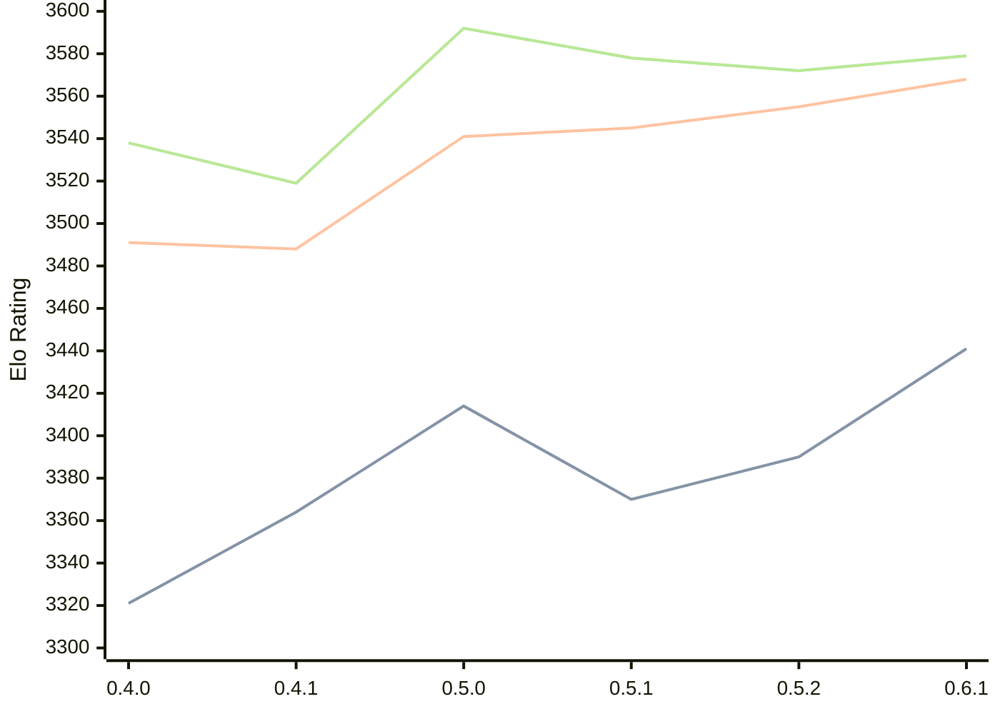

# Engine: Cinder

Author: Bruno Dutra

Home: https://github.com/brunocodutra/cinder

## Elo Ratings

| Version | Published | STC 8.0+0.08s  | LTC 60.0+0.60s | VLTC 2m24s+1.12s | Comment |
| --- | --- | --- | --- | --- | --- |
| 0.6.1 | 2026-08-16 | 3441(+51) | 3568(+13) | 3579(+7) |  |
| 0.5.2 | 2026-07-12 | 3390(+20) | 3555(+10) | 3572(-6) |  |
| 0.5.1 | 2026-07-08 | 3370(-44) | 3545(+4) | 3578(-14) |  |
| 0.5.0 | 2026-07-04 | 3414(+50) | 3541(+53) | 3592(+73) |  |
| 0.4.1 | 2025-12-05 | 3364(+43) | 3488(-3) | 3519(-19) |  |
| 0.4.0 | 2025-12-04 | 3321(+new) | 3491(+new) | 3538(+new) |  |
| 0.3.1 | 2025-08-16 |  |  |  |  |
 | | | cElo (∆ prev) | cElo (∆ prev) | cElo (∆ prev) | 

<a href="https://github.com/computer-chess-index/cci/issues/new?template=submit-version.yml&title=[VERSION]+Cinder+<version>&body=###%20Engine%20name%0ACinder%0A%0A###%20Version%0A0.6.1" target="_blank">Submit new version</a>

 Test Conditions:

GUI/CLI: <a href=https://github.com/cutechess/cutechess target="_blank">Cute-Chess</a> 
Elo Calculation: <a href=https://www.remi-coulom.fr/Bayesian-Elo/ target="_blank">Bayesian-Elo</a> 
CPU: Intel(R) Core(TM) i5-7500T 2.70GHz 
Opening book: 8_moves_v3 
\* STC: 8.0+0.08s, LTC: 60.0+0.60s, VLTC: 2m24s+1.12s

 Lists:
Ratings: <a href=https://github.com/computer-chess-index/cci/blob/main/lists/CCIRatings.csv target="_blank">Complete list</a>

Generated: 2026-10-09 04:37:15

## Ratings Verlauf

```mermaid
%%{init: {"theme":"base","themeVariables":{"seriesColors:['#a3a3a3','#222221','#faa371']}}}%%
xychart-beta
  x-axis ["0.4.0", "0.4.1", "0.5.0", "0.5.1", "0.5.2", "0.6.1"]
  y-axis "Elo Rating" 3300 --> 3600
  line "" [3321, 3364, 3414, 3370, 3390, 3441]
  line "STC (8.0+0.08s)" [3321, 3364, 3414, 3370, 3390, 3441]
  line "LTC (60.0+0.60s)" [3491, 3488, 3541, 3545, 3555, 3568]
  line "" [3538, 3519, 3592, 3578, 3572, 3579]
  line "VLTC (2m24s+1.12s)" [3538, 3519, 3592, 3578, 3572, 3579]
```

## Detailed Evaluation Results

| Version | Time Control | Elo  | Range +/- | Matches | Score | Average Opponent Elo | Draws |
| --- | --- | --- | --- | --- | --- | --- | --- |
| 0.6.1 | VLTC (2m24s+1.12s) | 3579 | 32 | 220 | 51% | 3573 | 92% |
| 0.6.1 | LTC (60.0+0.60s) | 3568 | 29 | 276 | 51% | 3563 | 88% |
| 0.6.1 | STC (8.0+0.08s) | 3441 | 27 | 330 | 50% | 3443 | 76% |
| --- | --- | --- | --- | --- | --- | --- | --- |
| 0.5.2 | VLTC (2m24s+1.12s) | 3572 | 29 | 264 | 50% | 3572 | 91% |
| 0.5.2 | LTC (60.0+0.60s) | 3555 | 25 | 354 | 51% | 3549 | 91% |
| 0.5.2 | STC (8.0+0.08s) | 3390 | 27 | 322 | 49% | 3399 | 83% |
| --- | --- | --- | --- | --- | --- | --- | --- |
| 0.5.1 | VLTC (2m24s+1.12s) | 3578 | 39 | 152 | 49% | 3584 | 89% |
| 0.5.1 | LTC (60.0+0.60s) | 3545 | 43 | 120 | 50% | 3545 | 93% |
| 0.5.1 | STC (8.0+0.08s) | 3370 | 44 | 124 | 49% | 3378 | 78% |
| --- | --- | --- | --- | --- | --- | --- | --- |
| 0.5.0 | VLTC (2m24s+1.12s) | 3592 | 44 | 118 | 50% | 3588 | 89% |
| 0.5.0 | LTC (60.0+0.60s) | 3541 | 44 | 120 | 52% | 3530 | 85% |
| 0.5.0 | STC (8.0+0.08s) | 3414 | 35 | 192 | 48% | 3426 | 80% |
| --- | --- | --- | --- | --- | --- | --- | --- |
| 0.4.1 | VLTC (2m24s+1.12s) | 3519 | 23 | 424 | 50% | 3518 | 86% |
| 0.4.1 | LTC (60.0+0.60s) | 3488 | 25 | 368 | 50% | 3488 | 86% |
| 0.4.1 | STC (8.0+0.08s) | 3364 | 21 | 564 | 49% | 3371 | 70% |
| --- | --- | --- | --- | --- | --- | --- | --- |
| 0.4.0 | VLTC (2m24s+1.12s) | 3538 | 43 | 128 | 54% | 3503 | 82% |
| 0.4.0 | LTC (60.0+0.60s) | 3491 | 50 | 108 | 56% | 3386 | 71% |
| 0.4.0 | STC (8.0+0.08s) | 3321 | 68 | 72 | 65% | 3073 | 51% |
| --- | --- | --- | --- | --- | --- | --- | --- |