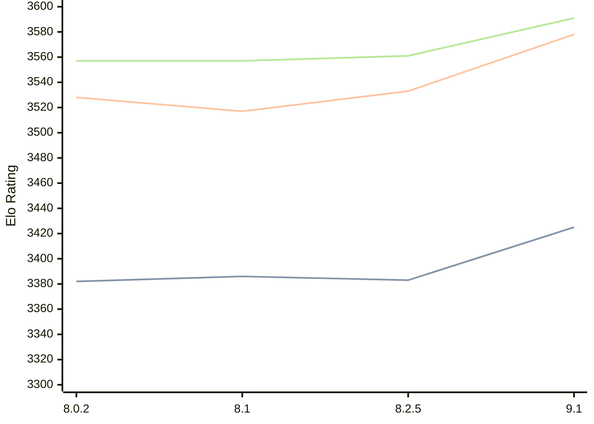

# Engine: Clover

Author: Luca Metehau

Home: https://github.com/lucametehau/CloverEngine

## Elo Ratings

| Version | Published | STC 8.0+0.08s  | LTC 60.0+0.60s | VLTC 2m24s+1.12s | Comment |
| --- | --- | --- | --- | --- | --- |
| 9.1 | 2025-09-14 | 3425(+new) | 3578(+new) | 3591(+new) |  |
| 9.0 | 2025-08-19 |  |  |  |  |
| 8.2.5 | 2025-07-14 | 3383(+new) | 3533(+new) | 3561(+new) |  |
| 8.2.1 | 2025-07-12 |  |  |  |  |
| 8.2 | 2025-07-11 |  |  |  |  |
| 8.1 | 2024-12-03 | 3386(+4) | 3517(-11) | 3557(0) |  |
| 8.0.2 | 2024-09-05 | 3382(+new) | 3528(+new) | 3557(+new) |  |
| 8.0 | 2024-09-02 |  |  |  |  |
| 7.1 | 2024-08-11 |  |  |  |  |
| 7.0 | 2024-07-24 |  |  |  |  |
| 6.2 | 2024-06-10 |  |  |  |  |
| 6.1 | 2023-12-12 |  |  |  |  |
| 6.0 | 2023-08-11 |  |  |  |  |
| 5.0 | 2023-06-24 |  |  |  |  |
| 4.1 | 2023-05-15 |  |  |  |  |
| 4.0 | 2023-04-13 |  |  |  |  |
| 3.3.1 | 2023-02-17 |  |  |  |  |
| 3.3 | 2023-02-12 |  |  |  |  |
| 3.2.1 | 2022-12-13 |  |  |  |  |
| 3.2.0 | 2022-12-10 |  |  |  |  |
| 3.1 | 2022-03-26 |  |  |  |  |
| 3.0 | 2022-01-23 |  |  |  |  |
| 2.4 | 2021-07-14 |  |  |  |  |
| 2.3.1 | 2021-05-19 |  |  |  |  |
| 2.3 | 2021-05-18 |  |  |  |  |
| 2.2 | 2021-05-04 |  |  |  |  |
| 2.1.3 | 2021-05-01 |  |  |  |  |
| 2.1.2.1 | 2021-04-26 |  |  |  |  |
| 2.1.2 | 2021-04-25 |  |  |  |  |
| 2.1.1.3 | 2021-04-24 |  |  |  |  |
| 2.1.1.1 | 2021-04-23 |  |  |  |  |
| 2.1.1.1 | 2021-04-23 |  |  |  |  |
| 2.1 | 2021-04-22 |  |  |  |  |
| 2.0 | 2021-04-22 |  |  |  |  |
 | | | cElo (∆ prev) | cElo (∆ prev) | cElo (∆ prev) | 

<a href="https://github.com/computer-chess-index/cci/issues/new?template=submit-version.yml&title=[VERSION]+Clover+<version>&body=###%20Engine%20name%0AClover%0A%0A###%20Version%0A9.1" target="_blank">Submit new version</a>

 Test Conditions:

GUI/CLI: <a href=https://github.com/cutechess/cutechess target="_blank">Cute-Chess</a> 
Elo Calculation: <a href=https://www.remi-coulom.fr/Bayesian-Elo/ target="_blank">Bayesian-Elo</a> 
CPU: Intel(R) Core(TM) i5-7500T 2.70GHz 
Opening book: 8_moves_v3 
\* STC: 8.0+0.08s, LTC: 60.0+0.60s, VLTC: 2m24s+1.12s

 Lists:
Ratings: <a href=https://github.com/computer-chess-index/cci/blob/main/lists/CCIRatings.csv target="_blank">Complete list</a>

Generated: 2026-05-03 08:08:14

## Ratings Verlauf

⬛ STC (8.0+0.08s) &nbsp;&nbsp; 🟧 LTC (60.0+0.60s) &nbsp;&nbsp; 🟩 VLTC (2m24s+1.12s)

dark mode: 🟩STC (8.0+0.08s) 🟧LTC (60.0+0.60s) ⬜VLTC (2m24s+1.12s)

## Detailed Evaluation Results

| Version | Time Control | Elo  | Range +/- | Matches | Score | Average Opponent Elo | Draws |
| --- | --- | --- | --- | --- | --- | --- | --- |
| 9.1 | VLTC (2m24s+1.12s) | 3591 | 25 | 372 | 50% | 3591 | 89% |
| 9.1 | D1 | 975 | 33 | 308 | 50% | 972 | 26% |
| 9.1 | D10 | 2925 | 24 | 504 | 48% | 2943 | 45% |
| 9.1 | D11 | 3023 | 24 | 484 | 50% | 3011 | 51% |
| 9.1 | D12 | 3120 | 24 | 454 | 51% | 3114 | 61% |
| 9.1 | D13 | 3202 | 22 | 568 | 52% | 3163 | 57% |
| 9.1 | D14 | 3247 | 23 | 506 | 50% | 3240 | 59% |
| 9.1 | D15 | 3314 | 23 | 480 | 50% | 3308 | 68% |
| 9.1 | D16 | 3329 | 21 | 556 | 51% | 3318 | 71% |
| 9.1 | D17 | 3359 | 22 | 507 | 51% | 3355 | 73% |
| 9.1 | D18 | 3405 | 23 | 480 | 50% | 3407 | 76% |
| 9.1 | D19 | 3430 | 21 | 580 | 50% | 3428 | 75% |
| 9.1 | D2 | 1089 | 33 | 340 | 48% | 1108 | 16% |
| 9.1 | D20 | 3464 | 21 | 542 | 51% | 3457 | 77% |
| 9.1 | D21 | 3497 | 20 | 596 | 50% | 3492 | 80% |
| 9.1 | D22 | 3505 | 20 | 590 | 50% | 3507 | 82% |
| 9.1 | D23 | 3522 | 20 | 600 | 51% | 3514 | 83% |
| 9.1 | D5 | 1486 | 32 | 380 | 53% | 1454 | 17% |
| 9.1 | D7 | 2410 | 26 | 516 | 48% | 2412 | 27% |
| 9.1 | D8 | 2593 | 27 | 466 | 52% | 2580 | 32% |
| 9.1 | D9 | 2780 | 26 | 448 | 49% | 2788 | 39% |
| 9.1 | S10 | 3463 | 24 | 404 | 49% | 3470 | 80% |
| 9.1 | S40 | 3540 | 24 | 396 | 50% | 3540 | 84% |
| 9.1 | LTC (60.0+0.60s) | 3578 | 24 | 404 | 50% | 3579 | 89% |
| 9.1 | STC (8.0+0.08s) | 3425 | 21 | 550 | 50% | 3426 | 76% |
| --- | --- | --- | --- | --- | --- | --- | --- |
| 9.0 |  |  |  |  |  |  |  |
| 8.2.5 | VLTC (2m24s+1.12s) | 3561 | 32 | 220 | 51% | 3557 | 91% |
| 8.2.5 | D1 | 1038 | 35 | 284 | 50% | 1041 | 24% |
| 8.2.5 | D10 | 2830 | 37 | 216 | 50% | 2831 | 45% |
| 8.2.5 | D11 | 2951 | 33 | 268 | 50% | 2952 | 48% |
| 8.2.5 | D12 | 3066 | 31 | 284 | 48% | 3081 | 60% |
| 8.2.5 | D13 | 3113 | 33 | 252 | 52% | 3096 | 61% |
| 8.2.5 | D14 | 3210 | 30 | 296 | 47% | 3232 | 61% |
| 8.2.5 | D15 | 3263 | 27 | 348 | 48% | 3279 | 68% |
| 8.2.5 | D16 | 3298 | 31 | 276 | 52% | 3286 | 63% |
| 8.2.5 | D17 | 3341 | 32 | 240 | 51% | 3333 | 71% |
| 8.2.5 | D18 | 3376 | 27 | 344 | 47% | 3402 | 71% |
| 8.2.5 | D19 | 3420 | 29 | 288 | 50% | 3421 | 76% |
| 8.2.5 | D2 | 1200 | 40 | 236 | 51% | 1192 | 16% |
| 8.2.5 | D20 | 3441 | 32 | 236 | 50% | 3443 | 75% |
| 8.2.5 | D21 | 3453 | 29 | 280 | 52% | 3443 | 79% |
| 8.2.5 | D22 | 3471 | 32 | 236 | 50% | 3471 | 81% |
| 8.2.5 | D23 | 3482 | 31 | 244 | 50% | 3482 | 82% |
| 8.2.5 | D5 | 1492 | 38 | 268 | 53% | 1463 | 15% |
| 8.2.5 | D7 | 2124 | 39 | 228 | 50% | 2121 | 23% |
| 8.2.5 | D8 | 2465 | 38 | 220 | 50% | 2461 | 35% |
| 8.2.5 | D9 | 2645 | 37 | 240 | 51% | 2633 | 34% |
| 8.2.5 | S10 | 3420 | 31 | 256 | 50% | 3421 | 75% |
| 8.2.5 | S40 | 3514 | 27 | 324 | 51% | 3505 | 83% |
| 8.2.5 | LTC (60.0+0.60s) | 3533 | 32 | 236 | 49% | 3540 | 81% |
| 8.2.5 | STC (8.0+0.08s) | 3383 | 31 | 254 | 49% | 3391 | 73% |
| --- | --- | --- | --- | --- | --- | --- | --- |
| 8.2.1 |  |  |  |  |  |  |  |
| 8.2 |  |  |  |  |  |  |  |
| 8.1 | VLTC (2m24s+1.12s) | 3557 | 14 | 1160 | 50% | 3555 | 84% |
| 8.1 | D1 | 992 | 18 | 1036 | 52% | 975 | 30% |
| 8.1 | D10 | 2832 | 17 | 1060 | 49% | 2840 | 46% |
| 8.1 | D11 | 2986 | 17 | 1048 | 52% | 2971 | 49% |
| 8.1 | D12 | 3092 | 16 | 1064 | 49% | 3098 | 57% |
| 8.1 | D13 | 3148 | 16 | 1080 | 50% | 3148 | 62% |
| 8.1 | D14 | 3205 | 16 | 1040 | 52% | 3189 | 62% |
| 8.1 | D15 | 3260 | 15 | 1104 | 51% | 3254 | 68% |
| 8.1 | D16 | 3305 | 15 | 1082 | 51% | 3299 | 68% |
| 8.1 | D17 | 3349 | 15 | 1088 | 51% | 3344 | 70% |
| 8.1 | D18 | 3384 | 15 | 1160 | 50% | 3382 | 74% |
| 8.1 | D19 | 3406 | 15 | 1088 | 50% | 3406 | 76% |
| 8.1 | D2 | 1183 | 18 | 1116 | 50% | 1180 | 16% |
| 8.1 | D20 | 3433 | 15 | 1132 | 50% | 3432 | 78% |
| 8.1 | D21 | 3448 | 15 | 1084 | 51% | 3438 | 79% |
| 8.1 | D22 | 3468 | 24 | 432 | 49% | 3472 | 78% |
| 8.1 | D23 | 3494 | 25 | 400 | 51% | 3491 | 79% |
| 8.1 | D5 | 1320 | 19 | 1060 | 48% | 1339 | 16% |
| 8.1 | D7 | 2018 | 18 | 1076 | 49% | 2029 | 22% |
| 8.1 | D8 | 2425 | 18 | 1064 | 48% | 2446 | 27% |
| 8.1 | D9 | 2651 | 17 | 1048 | 49% | 2655 | 40% |
| 8.1 | S10 | 3420 | 15 | 1128 | 50% | 3422 | 74% |
| 8.1 | S40 | 3513 | 14 | 1168 | 51% | 3509 | 82% |
| 8.1 | LTC (60.0+0.60s) | 3517 | 14 | 1176 | 50% | 3518 | 83% |
| 8.1 | STC (8.0+0.08s) | 3386 | 15 | 1124 | 51% | 3382 | 73% |
| --- | --- | --- | --- | --- | --- | --- | --- |
| 8.0.2 | VLTC (2m24s+1.12s) | 3557 | 18 | 748 | 51% | 3525 | 84% |
| 8.0.2 | D1 | 991 | 14 | 1576 | 53% | 967 | 35% |
| 8.0.2 | D10 | 2774 | 15 | 1388 | 50% | 2776 | 43% |
| 8.0.2 | D11 | 2934 | 15 | 1339 | 48% | 2947 | 49% |
| 8.0.2 | D12 | 3051 | 14 | 1320 | 50% | 3054 | 58% |
| 8.0.2 | D13 | 3151 | 15 | 1180 | 50% | 3148 | 61% |
| 8.0.2 | D14 | 3210 | 14 | 1392 | 50% | 3210 | 66% |
| 8.0.2 | D15 | 3258 | 13 | 1464 | 50% | 3251 | 65% |
| 8.0.2 | D16 | 3308 | 13 | 1428 | 51% | 3291 | 69% |
| 8.0.2 | D17 | 3356 | 13 | 1428 | 51% | 3351 | 72% |
| 8.0.2 | D18 | 3384 | 14 | 1312 | 50% | 3389 | 77% |
| 8.0.2 | D19 | 3421 | 14 | 1308 | 50% | 3422 | 75% |
| 8.0.2 | D2 | 1176 | 17 | 1308 | 49% | 1183 | 20% |
| 8.0.2 | D20 | 3436 | 14 | 1302 | 50% | 3433 | 79% |
| 8.0.2 | D21 | 3465 | 14 | 1176 | 50% | 3467 | 79% |
| 8.0.2 | D3 | 1138 | 18 | 1128 | 51% | 1130 | 17% |
| 8.0.2 | D4 | 1176 | 21 | 816 | 51% | 1166 | 19% |
| 8.0.2 | D5 | 1308 | 16 | 1364 | 50% | 1308 | 18% |
| 8.0.2 | D6 | 1485 | 18 | 1116 | 53% | 1458 | 17% |
| 8.0.2 | D7 | 1858 | 15 | 1552 | 51% | 1851 | 19% |
| 8.0.2 | D8 | 2280 | 15 | 1467 | 50% | 2277 | 28% |
| 8.0.2 | D9 | 2558 | 15 | 1340 | 49% | 2568 | 34% |
| 8.0.2 | S10 | 3403 | 19 | 664 | 52% | 3390 | 71% |
| 8.0.2 | S40 | 3518 | 20 | 632 | 51% | 3509 | 79% |
| 8.0.2 | LTC (60.0+0.60s) | 3528 | 19 | 676 | 51% | 3521 | 83% |
| 8.0.2 | STC (8.0+0.08s) | 3382 | 20 | 680 | 55% | 3252 | 66% |
| --- | --- | --- | --- | --- | --- | --- | --- |
| 8.0 |  |  |  |  |  |  |  |
| 7.1 |  |  |  |  |  |  |  |
| 7.0 | D1 | 1017 | 20 | 840 | 52% | 996 | 30% |
| 7.0 | D10 | 2778 | 23 | 540 | 48% | 2799 | 46% |
| 7.0 | D11 | 2985 | 22 | 580 | 51% | 2977 | 51% |
| 7.0 | D12 | 3071 | 23 | 520 | 50% | 3069 | 58% |
| 7.0 | D13 | 3166 | 23 | 520 | 50% | 3162 | 63% |
| 7.0 | D14 | 3251 | 24 | 440 | 52% | 3240 | 68% |
| 7.0 | D15 | 3283 | 21 | 580 | 49% | 3290 | 70% |
| 7.0 | D16 | 3329 | 22 | 524 | 52% | 3316 | 69% |
| 7.0 | D17 | 3384 | 24 | 420 | 50% | 3383 | 74% |
| 7.0 | D18 | 3403 | 22 | 480 | 47% | 3424 | 79% |
| 7.0 | D19 | 3424 | 23 | 440 | 51% | 3417 | 78% |
| 7.0 | D2 | 1133 | 23 | 700 | 48% | 1152 | 21% |
| 7.0 | D20 | 3461 | 25 | 399 | 49% | 3470 | 77% |
| 7.0 | D21 | 3467 | 75 | 40 | 55% | 3437 | 85% |
| 7.0 | D3 | 1079 | 23 | 660 | 51% | 1069 | 18% |
| 7.0 | D4 | 1104 | 23 | 680 | 49% | 1116 | 21% |
| 7.0 | D5 | 1115 | 21 | 780 | 50% | 1119 | 20% |
| 7.0 | D6 | 1246 | 23 | 720 | 49% | 1258 | 17% |
| 7.0 | D7 | 1716 | 25 | 580 | 49% | 1725 | 17% |
| 7.0 | D8 | 2178 | 26 | 520 | 52% | 2157 | 25% |
| 7.0 | D9 | 2542 | 24 | 540 | 52% | 2523 | 35% |
| 6.2 |  |  |  |  |  |  |  |
| 6.1 |  |  |  |  |  |  |  |
| 6.0 |  |  |  |  |  |  |  |
| 5.0 |  |  |  |  |  |  |  |
| 4.1 |  |  |  |  |  |  |  |
| 4.0 |  |  |  |  |  |  |  |
| 3.3.1 |  |  |  |  |  |  |  |
| 3.3 |  |  |  |  |  |  |  |
| 3.2.1 |  |  |  |  |  |  |  |
| 3.2.0 |  |  |  |  |  |  |  |
| 3.1 |  |  |  |  |  |  |  |
| 3.0 |  |  |  |  |  |  |  |
| 2.4 |  |  |  |  |  |  |  |
| 2.3.1 |  |  |  |  |  |  |  |
| 2.3 |  |  |  |  |  |  |  |
| 2.2 |  |  |  |  |  |  |  |
| 2.1.3 |  |  |  |  |  |  |  |
| 2.1.2.1 |  |  |  |  |  |  |  |
| 2.1.2 |  |  |  |  |  |  |  |
| 2.1.1.3 |  |  |  |  |  |  |  |
| 2.1.1.1 |  |  |  |  |  |  |  |
| 2.1.1.1 |  |  |  |  |  |  |  |
| 2.1 |  |  |  |  |  |  |  |
| 2.0 |  |  |  |  |  |  |  |