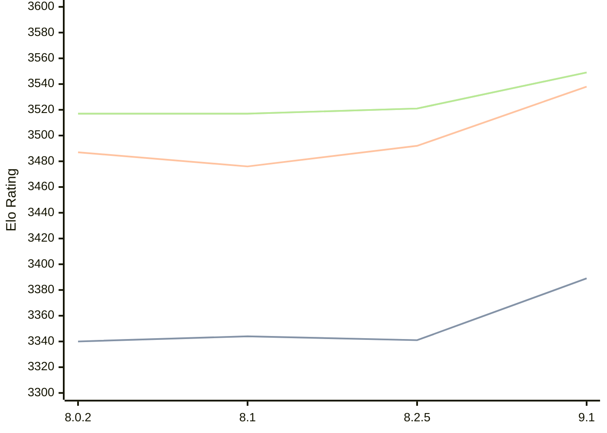

# Engine: Clover

Author: Luca Metehau

Home: https://github.com/lucametehau/CloverEngine

## Elo Ratings

| Version | Published | STC 8.0+0.08s  | LTC 60.0+0.60s | VLTC 2m24s+1.12s | Comment |
| --- | --- | --- | --- | --- | --- |
| 9.1 | 2025-09-14 | 3389(+48) | 3538(+46) | 3549(+28) |  |
| 8.2.5 | 2025-07-14 | 3341(-3) | 3492(+16) | 3521(+4) |  |
| 8.1 | 2024-12-03 | 3344(+4) | 3476(-11) | 3517(0) |  |
| 8.0.2 | 2024-09-05 | 3340(+new) | 3487(+new) | 3517(+new) |  |
| 7.1 | 2024-08-11 |  |  |  |  |
 | | | cElo (∆ prev) | cElo (∆ prev) | cElo (∆ prev) | 

<a href="https://github.com/computer-chess-index/cci/issues/new?template=submit-version.yml&title=[VERSION]+Clover+<version>&body=###%20Engine%20name%0AClover%0A%0A###%20Version%0A9.1" target="_blank">Submit new version</a>

 Test Conditions:

GUI/CLI: <a href=https://github.com/cutechess/cutechess target="_blank">Cute-Chess</a> 
Elo Calculation: <a href=https://www.remi-coulom.fr/Bayesian-Elo/ target="_blank">Bayesian-Elo</a> 
CPU: Intel(R) Core(TM) i5-7500T 2.70GHz 
Opening book: 8_moves_v3 
\* STC: 8.0+0.08s, LTC: 60.0+0.60s, VLTC: 2m24s+1.12s

 Lists:
Ratings: <a href=https://github.com/computer-chess-index/cci/blob/main/lists/CCIRatings.csv target="_blank">Complete list</a>

Generated: 2026-09-06 06:23:33

## Ratings Verlauf

## Detailed Evaluation Results

| Version | Time Control | Elo  | Range +/- | Matches | Score | Average Opponent Elo | Draws |
| --- | --- | --- | --- | --- | --- | --- | --- |
| 9.1 | VLTC (2m24s+1.12s) | 3549 | 22 | 486 | 50% | 3551 | 89% |
| 9.1 | LTC (60.0+0.60s) | 3538 | 21 | 508 | 50% | 3538 | 89% |
| 9.1 | STC (8.0+0.08s) | 3389 | 19 | 706 | 50% | 3386 | 75% |
| --- | --- | --- | --- | --- | --- | --- | --- |
| 8.2.5 | VLTC (2m24s+1.12s) | 3521 | 32 | 220 | 51% | 3517 | 91% |
| 8.2.5 | LTC (60.0+0.60s) | 3492 | 32 | 236 | 49% | 3499 | 81% |
| 8.2.5 | STC (8.0+0.08s) | 3341 | 31 | 254 | 49% | 3349 | 73% |
| --- | --- | --- | --- | --- | --- | --- | --- |
| 8.1 | VLTC (2m24s+1.12s) | 3517 | 14 | 1160 | 50% | 3514 | 84% |
| 8.1 | LTC (60.0+0.60s) | 3476 | 14 | 1176 | 50% | 3478 | 83% |
| 8.1 | STC (8.0+0.08s) | 3344 | 15 | 1124 | 51% | 3340 | 73% |
| --- | --- | --- | --- | --- | --- | --- | --- |
| 8.0.2 | VLTC (2m24s+1.12s) | 3517 | 18 | 748 | 51% | 3484 | 84% |
| 8.0.2 | LTC (60.0+0.60s) | 3487 | 19 | 676 | 51% | 3479 | 83% |
| 8.0.2 | STC (8.0+0.08s) | 3340 | 20 | 680 | 55% | 3212 | 66% |
| --- | --- | --- | --- | --- | --- | --- | --- |