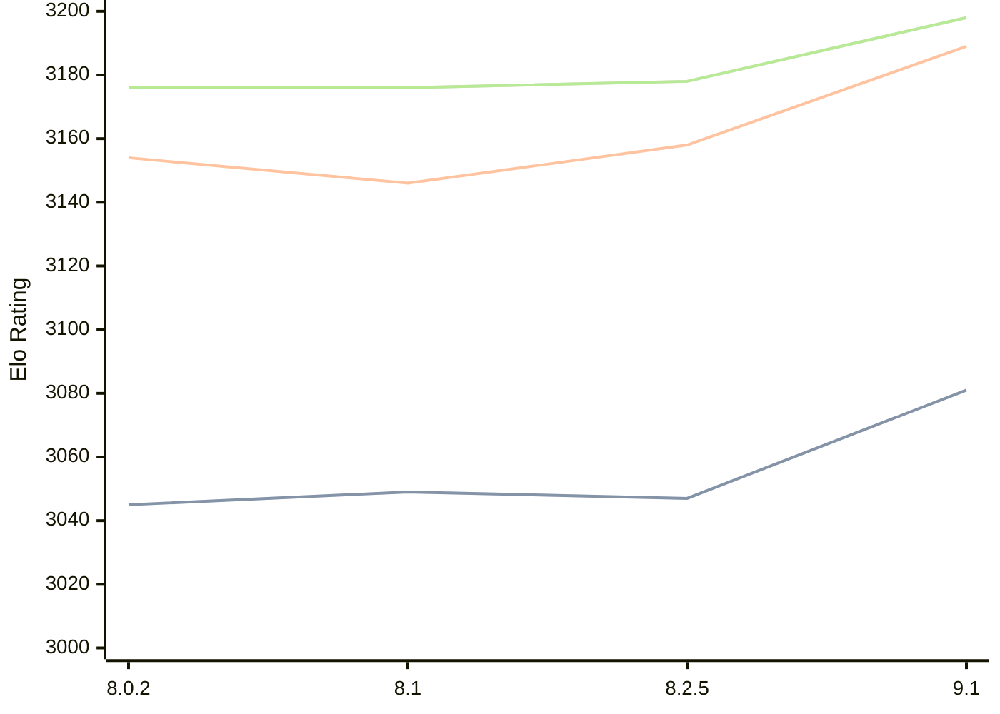

# Engine: Clover

Author: Luca Metehau

Home: https://github.com/lucametehau/CloverEngine

## Ratings nach Version

| Version | Published | STC 8.0+0.08s  | LTC 60.0+0.60s | VLTC 2m24s+1.12s | Comment |
| --- | --- | --- | --- | --- | --- |
| 9.1 | 2025-09-14 | 3081(+new) | 3189(+new) | 3198(+new) |  |
| 9.0 | 2025-08-19 |  |  |  |  |
| 8.2.5 | 2025-07-14 | 3047(+new) | 3158(+new) | 3178(+new) |  |
| 8.2.1 | 2025-07-12 |  |  |  |  |
| 8.2 | 2025-07-11 |  |  |  |  |
| 8.1 | 2024-12-03 | 3049(+4) | 3146(-8) | 3176(0) |  |
| 8.0.2 | 2024-09-05 | 3045(+new) | 3154(+new) | 3176(+new) |  |
| 8.0 | 2024-09-02 |  |  |  |  |
| 7.1 | 2024-08-11 |  |  |  |  |
| 7.0 | 2024-07-24 |  |  |  |  |
| 6.2 | 2024-06-10 |  |  |  |  |
| 6.1 | 2023-12-12 |  |  |  |  |
| 6.0 | 2023-08-11 |  |  |  |  |
| 5.0 | 2023-06-24 |  |  |  |  |
| 4.1 | 2023-05-15 |  |  |  |  |
| 4.0 | 2023-04-13 |  |  |  |  |
| 3.3.1 | 2023-02-17 |  |  |  |  |
| 3.3 | 2023-02-12 |  |  |  |  |
| 3.2.1 | 2022-12-13 |  |  |  |  |
| 3.2.0 | 2022-12-10 |  |  |  |  |
| 3.1 | 2022-03-26 |  |  |  |  |
| 3.0 | 2022-01-23 |  |  |  |  |
| 2.4 | 2021-07-14 |  |  |  |  |
| 2.3.1 | 2021-05-19 |  |  |  |  |
| 2.3 | 2021-05-18 |  |  |  |  |
| 2.2 | 2021-05-04 |  |  |  |  |
| 2.1.3 | 2021-05-01 |  |  |  |  |
| 2.1.2.1 | 2021-04-26 |  |  |  |  |
| 2.1.2 | 2021-04-25 |  |  |  |  |
| 2.1.1.3 | 2021-04-24 |  |  |  |  |
| 2.1.1.1 | 2021-04-23 |  |  |  |  |
| 2.1.1.1 | 2021-04-23 |  |  |  |  |
| 2.1 | 2021-04-22 |  |  |  |  |
 | | | cElo (∆ prev) | cElo (∆ prev) | cElo (∆ prev) | 

 Test Conditions:

GUI/CLI: <a href=https://github.com/cutechess/cutechess target="_blank">Cute-Chess</a> 
Elo Calculation: <a href=https://www.remi-coulom.fr/Bayesian-Elo/ target="_blank">Bayesian-Elo</a> 
CPU: Intel(R) Core(TM) i5-7500T 2.70GHz 
Opening book: 8_moves_v3 
\* STC: 8.0+0.08s, LTC: 60.0+0.60s, VLTC: 2m24s+1.12s

 Lists:
Ratings: <a href=https://github.com/computer-chess-index/cci/blob/main/lists/CCIRatings.csv target="_blank">Complete list</a>

Generated: 2026-02-23 06:23:10

## Ratings Verlauf

⬛ STC (8.0+0.08s) &nbsp;&nbsp; 🟧 LTC (60.0+0.60s) &nbsp;&nbsp; 🟩 VLTC (2m24s+1.12s)

